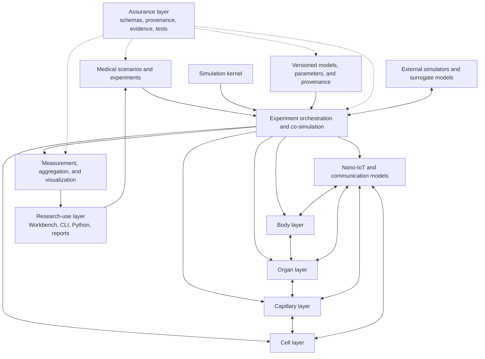

<!--
SPDX-FileCopyrightText: 2026 MEHLISSA contributors
SPDX-License-Identifier: CC-BY-4.0
-->

# Roadmap for a New MEHLISSA Generation

**As of:** 3 September 2026

**Strategic objective:** Implement the MEHLISSA vision described in the
dissertation as a reproducible, modularly coupled, and scientifically
validatable multiscale simulation platform

**Baseline analysis:** [MEHLISSA – current-state analysis](IST_ANALYSE.md)

## 1. Purpose of the roadmap

The new MEHLISSA generation should implement the dissertation vision as fully
as possible:

- whole-body transport in the human bloodstream;
- organ-specific vascular and perfusion models;
- capillary beds, substance exchange, and local molecular communication;
- nanodevice–cell and intracellular models;
- a nano-IoT system comprising nanodevices, gateways, a BAN, and external control;
- medical scenarios from monitoring and localization to treatment and a digital twin.

This roadmap treats the dissertation as the architectural north star. Where a
direct microscopic simulation is physically or computationally unrealistic,
the vision is implemented through hybrid multiscale models.

The roadmap is deliberately divided into dependent milestones and quality
gates. Time estimates are indicative for a small research team and should be
re-estimated after the foundation phase using measured development velocity.

MEHLISSA is the integrated platform formed by three complementary aspects:

1. the **scientific simulation stack** of body, organ, capillary, cell, and
   communication models;
2. the **research-use layer** of Workbench, command line, reports, campaigns,
   Python APIs, and notebooks; and
3. the **assurance layer** of schemas, typed units, provenance, evidence
   boundaries, verification, validation, reviews, and CI.

Milestones M0-M7 and delivery packages UX-1 through UX-6 remain useful records
of how those aspects were implemented. They are not separate products and UX is
not an optional addition to the scientific platform.

### 1.1 How to read roadmap and artifact labels

MEHLISSA keeps short identifiers because they make requirements, code, tests,
and evidence traceable. A reader must not need prior project knowledge to
understand them. User-facing reports and guides therefore expand a label at its
first relevant occurrence and state what the associated artifact or workflow
does.

| Label | Meaning |
|---|---|
| `M0` through `M8` | Sequential milestone gates. For example, `M7` is the first complete fingerprinting software demonstrator, while the future `M8` gate concerns a governed research digital twin. |
| `M7.4` | An implementation increment within a milestone. Here it means the fourth M7 increment: concentration- and receptor-binding-based fingerprint detection. |
| `Level A` through `Level E` | Functional realism levels inside the fingerprinting scenario, not separate simulation runs: historical timing baseline; mechanistic detection; explicit tile assembly; executed communication; and sensitivity/misclassification analysis. |
| `P0` through `P3` | Roadmap priority tiers, not completion states: indispensable foundation; dissertation core; research-platform expansion; and long-term vision. |
| `UX-1` through `UX-6` | Delivery packages that built MEHLISSA's integral research-use layer, ordered from one-command execution to the graphical Workbench 1.0. |
| run | One reproducible execution of an experiment or scenario. Labels such as “A run” or “B run” must not be used unless that document defines the distinction in plain language. |

This expansion rule also applies to domain abbreviations such as FP9, BVS,
BAN, ODE, and SSA. Specialist documents may use the short form after defining
it once; overview documents must additionally explain why the concept matters
to the workflow.

## 2. Guiding principles

### 2.1 The four layers remain independent models

The body, organ, capillary, and cell layers must not again be mixed in a central
class. Each layer receives:

- its own state model;
- its own spatial and temporal scales;
- a defined input and output interface;
- its own validation data;
- interchangeable model variants.

### 2.2 Scenarios compose models; they do not modify the kernel

Fingerprinting, CAR-T, liquid biopsy, endocrinology, and metastasis treatment
are implemented as scenario packages. They configure and connect existing
models but add no scenario-specific `if` blocks to the simulation kernel.

### 2.3 Hybrid multiscale modeling instead of complete individual-object simulation

Biologically realistic scales cannot all be represented as individual C++
objects. Therefore:

- Nanodevices and rare cells may be modeled as agents.
- Large cell populations are modeled as populations, compartments, or stochastic counting processes.
- Depending on the question, molecules are represented as concentration fields, reaction networks, particle samples, or analytical channel models.
- Detailed capillary and cell models are activated only in selected regions of interest.
- Surrogates may replace external detailed models if their origin, validity scope, and error are documented.

### 2.4 Scientific reproducibility is a core feature

Every simulation run must be completely reconstructable, including:

- software and model versions;
- input data and checksums;
- parameters and units;
- seeds and random-stream mapping;
- active model variants;
- hardware and runtime information;
- result and validation metadata.

### 2.5 Validation is incremental and scenario-specific

MEHLISSA is initially a research and hypothesis-testing platform. Clinical
predictions may be claimed only after the respective model has been calibrated
and validated independently.

### 2.6 Performance follows a validated model

Correctness, reproducibility, and profiling precede parallelization.
Optimization is measured against defined benchmarks and must not change
scientific results in an uncontrolled way.

### 2.7 Model complexity is not scientific realism

A more detailed model, another organ, a larger population, or a graphical view
does not by itself increase physiological validity. A realism claim advances
only when the intended use and validity domain are explicit, model and data
versions are frozen, calibration and validation evidence are separated,
predeclared comparisons pass, and uncertainty and transfer limits are reported.

## 3. Target architecture



### 3.1 Simulation kernel

The kernel provides only general simulation services:

- monotonic simulation time with a clear resolution;
- event queue and defined synchronization points;
- optional fixed or adaptive integration steps;
- deterministic named random streams;
- component lifecycle;
- safe object and resource management;
- checkpointing and resumption;
- observer and measurement interfaces;
- error handling and termination conditions;
- later, parallel execution.

The kernel knows neither aldosterone nor cancer cells, fingerprints, or special
vessel IDs.

### 3.2 Shared model interfaces

All layers use a small set of versioned exchange objects. At minimum:

| Exchange object | Purpose |
|---|---|
| `EntityTransfer` | transfer a nanodevice, particle, or rare-cell agent between models |
| `PopulationTransfer` | transfer large populations or flows without individual objects |
| `PhysiologicalState` | pressure, flow, perfusion, activity, temperature, and other states |
| `MolecularSignal` | concentration, amount, release rate, or message event |
| `DetectionEvent` | marker or fingerprint detection, including uncertainty |
| `ActuationCommand` | drug release, activation, or nanodevice control |
| `Measurement` | simulated measurement at a gateway, wearable, laboratory, or imaging system |
| `ModelEvidence` | origin, validity scope, and uncertainty of a model assumption |

Every exchange object has explicit units, a timestamp, spatial context, and
model provenance.

### 3.3 Time coupling

The layers operate at different time scales. A conservative co-simulation is
planned:

1. The orchestrator defines the next synchronization window.
2. Every layer integrates or simulates its state up to that time.
3. Transfers and events are exchanged at layer boundaries.
4. Invariants such as mass, particle count, and temporal order are checked.
5. If coupling error is too large, the window can be reduced or the run terminated.

External simulators can be connected through the same mechanism.

## 4. Target repository structure and current mapping

Phase 0 selected C++20, CMake, and vcpkg. The active repository already
contains the kernel, model families, scenarios, applications, benchmarks,
versioned data, and documentation shown below. Some target responsibilities,
especially general external adapters, validation studies, and reusable tools,
currently remain inside model-, scenario-, benchmark-, or documentation-specific
directories and may be separated as they grow. The logical target structure is:

```text
apps/                   command line, services, and optional user interfaces
core/                   simulation time, events, RNG, components, checkpoints
models/
  body/                 whole-body circulation and systemic physiology
  organ/                organ-specific models
  capillary/            capillary beds, exchange, and local channels
  cell/                 cell, receptor, and reaction models
  communication/        nano-IoT, gateway, BAN, and external communication
scenarios/
  fingerprinting/
  monitoring/
  liquid_biopsy/
  endocrine_avs/
  cart/
  metastasis/
adapters/               NetTAS, SimVascular, CFD, channel, and cell simulators
data/
  schemas/              versioned data schemas
  body_models/
  organ_models/
  parameters/
validation/             reference data, comparison runs, and scientific tests
benchmarks/             performance and scaling benchmarks
tools/                  conversion, inspection, and result analysis
docs/                   architecture, models, roadmap, and user guides
legacy/                 frozen references to MEHLISSA 1.x and 2.0
```

## 5. Development phases and milestones

### Phase 0 – Project charter and architecture decisions

**Indicative period:** 0–2 months

**Objective:** Binding domain and technical framework for the new generation

**Status on 26 August 2026:** M0 is complete and accepted as passed in the
[M0 gate review](m0/M0_GATE_REVIEW.md). Binding artifacts are the
[system requirements](requirements/SYSTEM_REQUIREMENTS.md),
[traceability matrix](requirements/TRACEABILITY_MATRIX.md),
[fingerprinting reference scenario](requirements/FINGERPRINTING_SCENARIO.md),
[Architecture Decision Records](architecture/README.md),
[license/data inventory](m0/LICENSE_AND_DATA_INVENTORY.md), and
[partner inventory](m0/VALIDATION_AND_DATA_PARTNERS.md). ADR-0007 defines
MPL-2.0 for independent Next code, GPL-2.0-only for legacy and direct ports, and
CC-BY-4.0 for new original documentation and approved original data. Rights
reviews for existing data are tracked per artifact as release gates and do not
block M1.

#### Tasks

- Translate the dissertation into traceable domain requirements.
- Clearly distinguish “vision,” “already validated function,” and “research hypothesis.”
- Define target users: model developers, communication researchers, biologists, physicians, and students.
- Define supported operating modes: local experiments, batch/HPC, and interactive exploration.
- Make the technology decision:
  - retain or restructure C++ as the high-performance kernel;
  - provide a Python API for experiments and analysis;
  - consider an alternative kernel only after a prototype comparison.
- Clarify licensing and contributor rules.
- Tag legacy revisions and archive them unchanged.
- Create the first Architecture Decision Records.
- Define model validity, experiment reproducibility, and release quality.

#### Deliverables

- [system requirements document](requirements/SYSTEM_REQUIREMENTS.md);
- [architecture principles and decision records](architecture/README.md);
- prioritized scenario catalog;
- documented technology decision;
- [data and license inventory](m0/LICENSE_AND_DATA_INVENTORY.md);
- initial risk and research-question list.

#### Gate M0

- The four layers and their responsibilities are defined as binding.
- It is decided which parts of 2.0 are adopted, rewritten, or retained only as references.
- Fingerprinting is the first vertical demonstrator.
- No new scenario logic is added to the legacy kernel.
- The per-file and per-artifact licensing model is accepted and technically implemented.

### Phase 1 – Trustworthy technical foundation

**Indicative period:** 1–4 months

**Objective:** A small, reproducible, and tested simulation kernel

#### Tasks

- establish a clean out-of-source build;
- support Linux, Windows, and at least one CI compiler;
- automate license-boundary checks and add a contributor guide;
- fix existing time, geometry, RNG, injection, and memory defects;
- remove global state or move it explicitly into a `SimulationContext`;
- introduce type-safe units for time, length, speed, concentration, and amount;
- implement named and reproducible random streams;
- create a versioned scenario and experiment format with a schema;
- introduce structured logs, error codes, and experiment manifests;
- build unit and property tests for kernel invariants;
- specify checkpoint and snapshot formats;
- enable static analysis, sanitizers, and formatting checks in CI.

#### Mandatory tests

- Time advances strictly monotonically with correct subsecond resolution.
- A particle moves at most once per simulation instant.
- 3D distances and vessel lengths match analytical values.
- The same seed and configuration produce identical results.
- Different named random streams are independently reproducible.
- Object lifetimes produce no reference cycles or double destruction.
- Invalid configurations are rejected before simulation begins.

#### Gate M1 – “Trustworthy Kernel”

- The complete CI build is green.
- Kernel test coverage and critical invariants are documented.
- A deterministic minimal experiment can be reproduced bit-identically or tolerance-identically on two platforms.
- No medical scenario class resides in the kernel.

### Phase 2 – Body layer 2.0 as a validated transport model

**Indicative period:** 3–8 months

**Objective:** Reimplement today's strongest layer robustly

#### Tasks

- model the vascular network as a validated directed graph;
- support coherent, non-contiguous IDs;
- introduce a versioned vascular schema containing:
  - geometry and coordinate system;
  - vessel type;
  - length and diameter;
  - cross section and volume;
  - flow or perfusion;
  - successors and transition model;
  - data source, uncertainty, and validity scope;
- migrate the existing 1995 data set without loss;
- resolve vessel 9 and further graph/probability invariants;
- drive velocities and transitions from data instead of hard-coded type values;
- support multiple flow models:
  - simple compartment model;
  - virtual laminar flows;
  - later imported CFD/streamline models;
- model injection and extraction as general events;
- model gateways as measurement sites, not yet as network protocols;
- make complete trajectories, samples, and aggregates configurable;
- reproduce reference runs from the BVS distribution studies;
- automatically verify mass conservation and stationary distribution.

#### Body states

The new body layer should already prepare dynamic states:

- rest;
- physical exercise;
- orthostasis/posture;
- changed heart rate;
- organ-specific perfusion change.

Literature-based parameter sets are sufficient initially. Coupled circulatory
models can follow later.

#### Gate M2 – “Validated Body Layer”

- The 1995 model is schema-validated and fully documented.
- BVS and dissertation results are reproduced within defined tolerances or deviations are explained.
- Particle, flow, and transition invariants are tested automatically.
- A new body model can be loaded without code changes.
- Output can be aggregated and bounded for large experiments.

### Phase 3 – Co-simulation framework and organ layer

**Indicative period:** 6–12 months

**Objective:** First genuine coupling between whole-body and regional models

**Current implementation status:** M3 is complete. The versioned
`ModelComponent` boundary, body adapter, identity-conserving coarse,
three-region-surrogate, and literature-parameterized pulmonary 0D variants,
lossless typed population/substance/flow endpoints, and a shared programmatic
scenario switch are implemented. Schema-validated executable lung definitions
preserve validity, evidence, sources, uncertainty, derivations, and optional
external-data axes/units/provenance. The 0D candidate executes mean pressure,
flow, PVR, compliance, transit, and right/left perfusion for a healthy adult at
rest in the supine position. M3.8 adds independent aggregate validation with a
source-separation guard, a scope-matched supine comparison, and an invasive
rest/exercise crosscheck. M3.9 adds a bounded, independently calibrated
flow-dependent PVR/compliance variant and repeats the untouched Bentley stress
test. M3.10 adds the subject-level multipoint schema, immutable-model evaluator,
trajectory metrics, synthetic-evidence guard, and a reviewed acquisition plan.
M3.11 adds immediate no-refit validation against four published, independent
Kovacs/Wolsk population series (255 healthy volunteers, 18 stages). M3.12 adds
a separate Kane-calibrated, bounded age multiplier on PVR. The immutable
validation result improves from 10/18 to 14/18 stages: the older stratum reaches
5/5, the middle stratum remains 5/5, and the young stratum remains incomplete
at 1/5. M3.13 identifies the young resting PVR level—not the already-supported
flow exponent or BSA conversion—as the dominant discrepancy. An invasive
Kovacs 2012 calibration yields an immutable v4 candidate; all 15 stages in the
disjoint Wolsk cohort agree without refitting. Kovacs 2009 is excluded from the
counted v4 result because its literature corpus overlaps the calibration
review. M3.14 adds a structurally distinct Linehan pressure-distensible v5
candidate, using a separately reported healthy distensibility coefficient and
preserving the resting equilibrium by deriving zero-pressure resistance. Its
locked Wolsk result is 11/15: both younger strata pass 5/5, while the older
stratum passes only 1/5. The negative comparison is retained, so empirical v4
remains the stronger population reference and v5 the structural experiment.
M3.15 tests a smaller independently calibrated refinement: Reeves' invasive
older aggregate lowers `alpha` from 0.020 to 0.015 mmHg^-1 at age 60. Against
the still-frozen Wolsk stages, older RMSE improves from 5.411 to 4.603 mmHg,
but agreement remains 1/5 older and 11/15 overall. V6 therefore narrows the
mechanistic question without superseding v4 or resolving the anatomical gap.
M3.16 introduces a distinct five-lobe parallel 0D implementation. It retains
v4's aggregate law exactly, derives fixed lobe fractions from a clearly labeled
DE-CT PBV proxy, and routes individual entities through one deterministic lobe
bed. M3.17 independently evaluates all five executable shares against normal
V/Q SPECT/CT: both attenuation reconstructions pass the declared lobe, RMSE,
and right-lung criteria without refitting. The fixed normal-supine regional
reference is therefore qualified; dynamic redistribution, posture/activity
response, patient-specific geometry, and disease states remain open.
M3.18 adds a schema-validated end-to-end comparison in which one body graph,
route, seed, injection, and conserved payload run unchanged through the coarse
compartment and five-lobe v7 model. Both preserve 25/25 identities and all
typed payloads; their model-specific 2.0 s and 6.4 s transit times are reported
rather than forced to agree. M3.19 adds a schema-validated historical FP9 timer
replay at the experiment layer. It reproduces first lung localization at 25 s,
message activation at 40.99 s, and the published 209/91 s end-to-end report
times for 1,000/10,000 collectors without fingerprint- or lung-specific kernel
logic.
Participant-level validation remains a higher-resolution follow-up.
Anatomical refinement, transforming exchange, general experiment composition,
continuous/regional activity physiology, and regional exercise redistribution
remain later refinements; see [M3 evidence](m3/README.md).

The formal [M3 gate review](m3/M3_GATE_REVIEW.md) passes the milestone: lossless
coupling, interchangeable coarse and five-lobe models, sourced pulmonary 0D
physiology, independent aggregate/population/regional comparisons, the shared
coarse/detailed scenario, and the neutral historical FP9 timing chain are all
executable. Continuous and dynamic regional physiology, participant-level
measured validation, and full biological fingerprinting remain explicitly
scoped follow-up work rather than hidden M3 failures.

#### Tasks

- implement a generic `ModelComponent` interface;
- define entry and exit points between a body vessel and an organ model;
- implement conservative transfer of agents, populations, and substance flows;
- introduce organ-specific parameter and state models;
- model at least one reference organ in detail;
- prototype an import pipeline for BodyParts3D/SimVascular data;
- make geometry, axis, and unit conversion reproducible;
- define a surrogate for CFD flow fields;
- couple activity and perfusion changes through `PhysiologicalState`;
- implement organ localization and an organ gateway as interchangeable models.

#### Choice of reference organ

The **lung** was selected for the first complete path
([ADR-0006](architecture/adr/0006-lung-reference-organ.md)). It is represented
in the fingerprinting scenario, is traversed during every complete circulation,
and has accessible pulmonary SimVascular/VMR reference cases. The initial model
scope is pulmonary circulation; respiratory mechanics and gas exchange follow
as separate variants. Selection used these criteria:

- availability of anatomical data;
- availability of perfusion data;
- relevance to fingerprinting and later treatment scenarios;
- manageable modeling effort.

#### Gate M3 – “Body–Organ Coupling”

- An agent can move reproducibly from the body graph into an organ model and back.
- Flow, populations, and substance amounts are conserved across the layer boundary.
- The organ has an independent, interchangeable model implementation.
- A coarse compartment and more detailed organ model can be used with the same scenario.

### Phase 4 – Capillary layer and molecular channels

**Indicative period:** 9–18 months

**Objective:** Model local microcirculation, substance exchange, and communication

#### Tasks

- introduce capillary beds as parameterizable graph, compartment, or network models;
- distinguish arterioles, capillaries, and venules;
- represent capillary density, diameter, length, transit time, and hematocrit;
- model precapillary sphincters and activity-dependent perfusion;
- define exchange among blood, endothelium, interstitium, and cell;
- prepare retention, adhesion, and extravasation of nanodevices;
- provide local positions and residence times;
- implement interfaces for molecular channel models;
- connect existing models such as BiNS2, BNSim2, N3Sim, or analytical models through adapters where available and licensable;
- investigate cluster formation and multi-hop communication;
- derive higher-level abstractions such as reachability, runtime, and success distributions.

#### Current progress

M4.1 establishes an independent, versioned capillary component with explicit
arteriole, capillary, and venule regions. A strict schema connects a synthetic
software-test card to executable state; entity identity and population,
substance-amount, and volume-flow payloads cross the component without loss.
Total and perfused parallel-path counts are validated but do not yet drive flow
redistribution. M4.2 adds a generic four-port organ-capillary coupler with
pending-delivery queues, explicit outstanding-ownership ledgers, and completed
entity and conserved-payload round trips across compatible host steps. The
first Gate M4 statement is therefore executable at the synthetic
software-contract level, while physiological qualification remains open. M4.3
replaces prescribed transit with schema-versioned SI geometry and one total
flow: typed operations derive single and total cross-section, continuity
velocity, and regional transit, while the capillary vessel count is bound to
the perfused-path count. The synthetic v2 card is internally consistent but is
not physiological evidence. M4.4 now adds a strict
recruitment overlay: aggregate precapillary sphincter groups open and close at
exact scheduled times, and each profile declares either fixed total flow or a
simplified equal-path fixed-pressure-drop surrogate. In-flight progress is
distance based, so state changes are stable across compatible host steps. The
synthetic schedule verifies the mechanism but does not qualify sphincter
physiology. M4.5 adds an optional exchange overlay that partitions a typed
substance amount among outgoing blood, endothelium, interstitium, and cell,
rejects an unbalanced result, and preserves the complete organ-capillary-organ
ownership route. Its staged fractions are synthetic, instantaneous, and not a
physiological transport model. The second Gate M4 statement is therefore
executable at the software-contract level. M4.6 adds current axial entity
positions, exact residence accumulated in all three regions, and an optional
strict profile that converts capillary residence into normalized competing
pass-through, retention, adhesion, and extravasation likelihoods. These are
bounded, drainable observations: the entity still returns unchanged because a
terminal or tissue ownership contract does not yet exist. The synthetic rates
verify the mechanism but are not physiological parameters. M4.7 adds the first
organ-specific capillary reference candidate: a strict schema connects human
functional and morphometric pulmonary evidence to an equivalent geometry,
preserves parameter-level uncertainty and derivation, and enforces
volume-flow-transit closure without treating equivalent path counts as anatomy.
Its small, non-joint cohorts and numerical boundary regions make it a qualified
candidate, not physiological validation. M4.8 adds a typed, implementation-
neutral molecular-channel request and response, a strict evidence-scoped
profile, and an analytical free-diffusion implementation. Its first reference
request derives local scale and a residence ceiling from the pulmonary card,
while all signal and receiver parameters remain synthetic. The third Gate M4
statement is therefore executable at the software-contract level. Comparison
with an independent implementation follows in M4.9: a deterministic Brownian
endpoint adapter implements the same channel interface, exposes Monte Carlo
diagnostics, and passes predeclared minimum-count, standardized-error, and
relative-error gates against the analytical pulmonary-bound request. CAP-006 is
therefore complete at the software-contract level. M4.10 adds explicit
fixed-step Brownian paths, bounded trace retention, reflecting-box software
support, and an executable 8-to-32-step verification against receiver-fraction
and `6Dt` displacement gates. M4.11 adds the mesoscopic resolution: a
conservative radial finite-volume field with explicit degradation and absorbing-
boundary loss, complete spatial output, and an executable 128-to-256-shell
comparison against the same analytical request. M4.12 adds the conservative
state-changing disposition contract: named-stream sampling maps M4.6 outcomes
to organ return or a retryable acknowledged terminal owner, preserving every ID
across 100, 250, and 500 ms host steps. M4.13 adds the richer shared comparison:
an analytical advected Gaussian, 200,000 deterministic endpoint particles, and
256-to-512-cell conservative fields use the same M4.7-bound equivalent radius
and flow, diffusion, bulk reaction, and surface-to-volume wall sink. All
statistical, refinement, boundary, and amount-balance gates pass, while the
kinetics remain explicitly synthetic and cross-section averaged. The formal
[M4 gate review](m4/M4_GATE_REVIEW.md) passes all four milestone statements at
the software-contract level. Anatomical networks, hematocrit, physiological
kinetics, external solver adapters, and independent biological validation stay
explicitly open as post-gate research rather than hidden acceptance claims.
M4 is closed and M5 is the next implementation phase. See
[M4 evidence](m4/README.md),
[ADR-0021](architecture/adr/0021-versioned-capillary-bed-baseline.md), and
[ADR-0022](architecture/adr/0022-organ-capillary-round-trip-coupling.md), and
[ADR-0023](architecture/adr/0023-dimension-safe-capillary-continuity.md), and
[ADR-0024](architecture/adr/0024-dynamic-capillary-recruitment.md), and
[ADR-0025](architecture/adr/0025-balanced-capillary-exchange.md),
[ADR-0026](architecture/adr/0026-non-state-changing-capillary-entity-observation.md), and
[ADR-0027](architecture/adr/0027-evidence-qualified-equivalent-pulmonary-capillary-card.md), and
[ADR-0028](architecture/adr/0028-interchangeable-molecular-channel-contract.md), and
[ADR-0029](architecture/adr/0029-deterministic-brownian-particle-comparison.md), and
[ADR-0030](architecture/adr/0030-trajectory-resolving-brownian-channel.md), and
[ADR-0031](architecture/adr/0031-radial-finite-volume-molecular-channel.md), and
[ADR-0032](architecture/adr/0032-conservative-terminal-entity-ownership.md), and
[ADR-0033](architecture/adr/0033-shared-axial-advection-reaction-case.md).

#### Model variants

At least three resolutions should be provided:

1. **Surrogate:** distributions of transit, detection, and communication times.
2. **Mesoscopic:** capillary network with populations and concentration fields.
3. **Detailed:** particle/channel simulation in a small region of interest.

#### Gate M4 – “Capillary Communication”

- A nanodevice can leave an organ, traverse a capillary bed, and return.
- Substance exchange conserves mass and is unit-consistent.
- At least one molecular channel model is connected through a stable interface.
- The detailed model and surrogate are compared against the same reference cases.

### Phase 5 – Cell layer

**Indicative period:** 12–24 months

**Objective:** Couple biomarker detection, drug release, and cell response

**Current progress (M5 complete):** The independent cell-layer library now
provides a strict, evidence-scoped receptor-ligand profile and an exact
reversible one-to-one binding implementation for a constant ligand reservoir.
It reports conserved free/bound receptor amounts, occupancy, and first threshold
crossing through a stable request/response boundary. The checked case is a
synthetic software-verification reference, not a qualified biological model.
M5.2 now connects a time-scoped extracellular amount/volume snapshot from the
M4 capillary/tissue boundary to that cell response through a separate adapter,
without making either layer depend on the other's implementation. The
non-consuming synthetic reference makes a retained interstitial oxygen amount
trigger the checked receptor response and therefore satisfies the first M5 gate
statement at the software-contract level. Time-dependent tissue kinetics and
biological parameter qualification remain open; later increments below address
the remaining technical gate statements. M5.3 adds a separate bounded RK4 model
for prescribed piecewise-constant ligand trajectories. It converges to the
independent M5.1 constant-input solution and matches a segment-wise analytical
pulse with onset, threshold crossing, withdrawal, and dissociation. The trajectory remains a synthetic
external reservoir rather than a dynamic M4 field or an intracellular network.
M5.4 adds exact finite-receptor Gillespie SSA, named per-cell streams,
population distributions, analytical binomial-moment checks, and a declared
synthetic false-positive/false-negative experiment. Its rates are software-test
results, not diagnostic claims.
M5.5 adds a conserved receptor-to-messenger-to-effector network implemented
from one strict profile as both bounded RK4 and exact SSA. A fixed ODE reference
and a 1,000-cell named-stream population comparison verify the internal response
contract without claiming biological pathway validity.
M5.6 converts a consistent response event into a versioned nanodevice activation
and analytically transfers a synthetic payload through device, extracellular,
and intracellular owners with exact amount balance. Spatial diffusion, binding,
therapeutic response, and biological qualification remain open.
M5.7 maps the resulting intracellular amount to a bounded synthetic effect and
an irreversible apoptosis-commitment state, then returns that transition
through a neutral, versioned higher-layer event. The complete path is a
software-verification reference; pharmacodynamic calibration, pathway kinetics,
population heterogeneity, and an executable scenario consumer remain open.
M5.8 adds an exact cohort-compressed population response whose work and retained
output scale with cohort count rather than represented cell count. A strict
one-trillion-cell reference, count-scale invariant, predeclared response
sensitivities, evidence qualification, validity comparison, mandatory English
User Guide impact review, and formal gate review close M5 at the synthetic
software-contract level. Biological and external validation remain later
versioned research rather than implied gate evidence.
See [M5 implementation evidence](m5/README.md),
[the M5.2 hand-off](m5/CAPILLARY_CELL_SIGNAL_HANDOFF.md),
[the M5.3 time-varying baseline](m5/TIME_VARYING_RECEPTOR_BINDING.md),
[the M5.4 stochastic baseline](m5/STOCHASTIC_RECEPTOR_BINDING.md),
[the M5.5 intracellular network](m5/INTRACELLULAR_RESPONSE_NETWORK.md),
[the M5.6 conservative drug delivery](m5/CONSERVATIVE_DRUG_DELIVERY.md),
[the M5.7 apoptosis response](m5/APOPTOSIS_AND_HIGHER_LAYER_FEEDBACK.md),
[the M5.8 population validity guide](m5/POPULATION_SCALE_AND_VALIDITY.md),
[the M5 evidence qualification](m5/M5_EVIDENCE_QUALIFICATION.md),
[the M5 gate review](m5/M5_GATE_REVIEW.md),
[ADR-0034](architecture/adr/0034-analytical-receptor-ligand-baseline.md),
[ADR-0035](architecture/adr/0035-non-consuming-capillary-cell-signal-handoff.md),
[ADR-0036](architecture/adr/0036-time-varying-receptor-ligand-ode.md),
[ADR-0037](architecture/adr/0037-stochastic-receptor-binding-and-population-classification.md),
[ADR-0038](architecture/adr/0038-shared-intracellular-ode-ssa-network.md),
[ADR-0039](architecture/adr/0039-conservative-nanodevice-release-and-uptake.md),
[ADR-0040](architecture/adr/0040-synthetic-apoptosis-and-higher-layer-feedback.md), and
[ADR-0041](architecture/adr/0041-cohort-compressed-apoptosis-population.md).

#### Tasks

- define a general receptor/ligand model;
- model binding, dissociation, and detection thresholds;
- introduce cell and tissue compartments;
- connect reaction networks through ODE, SSA, or external simulators;
- model biomarker release and concentration trajectories;
- implement nanodevice activation and drug release;
- couple drug uptake, signaling pathway, and cell response;
- implement apoptosis as the first complete cell-response model;
- provide population-based models for large cell counts;
- record model provenance, calibration range, and uncertainty.

#### Working implementation sequence

1. ~~Independent analytical receptor-ligand contract and synthetic reference.~~
   Complete in M5.1.
2. ~~Capillary/tissue-to-cell signal hand-off with explicit compartment, time,
   unit, and conservation semantics.~~ Complete in M5.2.
3. ~~Time-dependent ODE binding compared with the M5.1 constant-reservoir
   limit.~~ Complete in M5.3 with an additional analytical pulse reference.
4. ~~Stochastic single-cell binding plus population distributions and detection
   error experiments.~~ Complete in M5.4 with exact SSA, named streams,
   analytical moment checks, and declared synthetic FP/FN gates.
5. ~~Executable intracellular signaling network with a shared reference.~~
   Complete in M5.5 with identical ODE/SSA topology, fixed ODE values, and a
   predeclared stochastic population comparison.
6. ~~Nanodevice activation, conservative drug release, and cellular uptake.~~
   Complete in M5.6 with a threshold-derived activation signal, analytical
   release/uptake chain, explicit ownership, and exact amount balance.
7. ~~Apoptosis as the first complete response with higher-layer feedback.~~
   Complete in M5.7 with a stable synthetic Hill response, irreversible
   commitment state, neutral cell-state event, and silent viable-state gate.
8. ~~Population-scale variant, evidence qualification, User Guide review, and
   formal M5 gate review.~~ Complete in M5.8 with an exact cohort-compressed
   one-trillion-cell reference, explicit single/population scopes, predeclared
   response sensitivities, qualified evidence, and formal gate acceptance.

#### Gate M5 – “Cell Response”

- A molecular signal from the capillary model can trigger a cell reaction.
- A cell model can return a measurable event or state change to higher layers.
- Receptor binding and the reaction network are tested against analytical or external reference data.
- Single-cell and population variants have documented validity scopes.
- The English User Guide has passed its gate-impact review and reflects the new
  cell experiments, access paths, interpretation limits, and evidence links.

### Phase 6 – Nano-IoT, gateway, and external communication

**Indicative period:** 12–24 months, partly in parallel with Phase 5

**Objective:** Complete the dissertation's communication vision

#### Tasks

- model nanodevice capabilities and resources;
- define local message types and communication events;
- connect molecular communication at capillary level with a logical message layer;
- implement cluster, relay, and multi-hop strategies;
- define the gateway as an active model with nano and micro communication;
- simulate or connect a BAN and external device through adapters;
- implement uplink for measurements and downlink for activation commands;
- measure latency, energy, error rate, noise, and capacity;
- optionally reconnect communication models to ns-3 or another network simulator without making physiological models dependent on it;
- prepare security, miscontrol, and failure scenarios.

#### Working implementation sequence

1. ~~Versioned nanodevice type, capability, payload, target, resource,
   lifecycle, and local-message contracts.~~ Complete in M6.1 with an
   independent IoT library, strict profiles, and a checked locator-to-collector
   endpoint hand-off.
2. ~~Molecular-detection-to-message adapter and interchangeable one-hop link
   with explicit delivery result and communication metrics.~~ Complete in M6.2
   with a neutral M5 adapter, scheduled reference link, explicit delivery/drop
   result, and separate count/byte/latency/loss/error/energy metrics.
3. ~~Cluster, relay, and bounded multi-hop strategies.~~ Complete in M6.3 with
   a strict directed-cluster profile, deterministic fewest-hop and
   lowest-latency selection, bounded immediate store-and-forward relays, and
   aggregated per-hop results and communication metrics.
4. ~~Active nano/micro gateway with measurement uplink and command downlink.~~
   Complete in M6.4 with a resource-bounded local gateway endpoint, a versioned
   network-neutral measurement boundary, and checked translation plus routed
   delivery of a versioned command to a local actuator.
5. ~~BAN and external analysis/control-station adapters, including a closed
   command-to-device path.~~ Complete in M6.5 with versioned frames,
   replaceable BAN transport, a stateful station with explicit allow/deny
   policy, causal measurement-to-command return checks, and a routed reference
   delivery to a local actuator.
6. ~~Optional external network-simulator adapter without physiological model
   dependencies.~~ Complete in M6.6 with a versioned metadata-only
   request/response contract, typed and JSON client boundaries, strict identity
   and validity checks, and mapping into the unchanged BAN result/metric API.
7. ~~Failure/security experiments, User Guide impact review, and formal Gate M6
   review.~~ Complete in M6.7 with a strict twelve-case synthetic resilience
   profile, fail-closed production-boundary tests, explicit security non-claims,
   an English User Guide impact review, and formal gate acceptance.

#### Gate M6 – “End-to-End Nano-IoT”

**Status:** passed on 1 September 2026; see the
[formal M6 gate review](m6/M6_GATE_REVIEW.md).

- A simulated molecular detection produces a traceable external measurement.
- An external control command can reach a nanodevice or drug release.
- Communication and physiology models can be exchanged independently.
- Communication metrics are reported separately from biological results.
- The English User Guide has passed its gate-impact review and reflects the new
  Nano-IoT experiments, access paths, interpretation limits, and evidence links.

### Phase 7 – First complete multilayer demonstrator: fingerprinting

**Indicative period:** 9–18 months, building on M3 and at least an early M4/M5 variant

**Objective:** End-to-end workflow across all layers

#### Reference workflow

1. Nanolocators and nanocollectors are injected into a defined vessel.
2. The body layer transports them to the target organ.
3. The organ model transfers them to a capillary bed.
4. Fingerprint gene products and a disease marker are provided as concentrations or stochastic binding targets.
5. A nanolocator detects the required combination and releases tiles.
6. A NetTAS-based surrogate or detailed model determines message assembly.
7. A nanocollector collects the message.
8. Return transport leads to the wrist gateway.
9. Gateway and BAN produce an external measurement containing tissue, marker, and uncertainty information.

#### Incremental realism

- **Level A:** Existing timer logic as a reproducible baseline.
- **Level B:** Concentration- and binding-based fingerprint detection.
- **Level C:** Explicit tile release and assembly surrogate.
- **Level D:** Local communication and gateway model.
- **Level E:** Sensitivity, robustness, and misclassification analysis.

#### Implemented increments

1. **M7.1 – Level-A composition contract (complete):** an independent
   fingerprinting scenario package, strict schema, and typed composer select
   exactly one artifact for every required M2–M6 role; validate all selected
   definitions against their schemas; enforce FP9/lung/timer/cohort identity;
   and preserve a canonical ten-stage causal order. Only the historical timer
   executes at this increment. See
   [M7 implementation status](m7/README.md),
   [the composition contract](m7/LEVEL_A_COMPOSITION_CONTRACT.md), and
   [ADR-0049](architecture/adr/0049-scenario-owned-fingerprinting-composition.md).
2. **M7.2 – scenario coordinator (complete):** typed loading of the selected
   M2–M6 stack, actual initialization and advancement of the physiological
   components, and one deterministic ten-stage identity-preserving trace with
   an explicit model/timer/surrogate evidence basis.
3. **M7.3 – result contract (complete):** strict versioned result schema,
   artifact and schema SHA-256 manifest, component execution state, causal
   trace, validity limitations, and byte-stable repeated serialization.
4. **M7.4 – Level-B detection (complete):** concentration-driven analytical
   receptor binding, threshold-crossing detection event, trace replacement,
   and a below-threshold negative control. Parameters remain a synthetic
   interface surrogate rather than an FP9-specific proteomic calibration.
5. **M7.5 – Level-C assembly (complete):** nine explicit FP9 tile identities,
   an all-required-tiles assembly rule, historical-duration qualification, and
   an incomplete-assembly negative control.
6. **M7.6 – Level-D communication (complete):** executed locator-collector and
   collector-gateway paths, active-gateway publication, BAN delivery, external
   station reception, and separated communication timing/energy metrics. The
   gateway endpoint is now an explicit thirteenth manifest artifact.
7. **M7.7 – Level-E analysis (complete):** deterministic labelled
   concentration/exposure cases, all four classification outcomes, sensitivity,
   specificity, false-positive/false-negative rates, and 95% Wilson intervals.
   The holistic runner writes one strict, byte-stable Levels A-E result 2.0.0.

#### Validation

- Reproduce the mapping of the nine existing MEHLISSA organs.
- Use localization, assembly, and collection times from the dissertation as a baseline.
- Do not artificially rescale deviations from new models to published values; explain them.
- Investigate effects of nanodevice count, injection site, perfusion, concentration, and binding affinity.
- Report false-positive and false-negative detection.

#### Gate M7 – “Holistic Vertical Slice”

- The workflow functions without scenario-specific changes to the kernel or layers.
- Every layer can be replaced with a simpler or more detailed variant.
- The complete run is reproducible with a manifest, seeds, data versions, and result report.
- Uncertainty and validity limitations are reported with the result.
- The English User Guide has passed its gate-impact review and provides the
  complete guided fingerprinting workflow with runnable paths and evidence links.

**Status:** passed on 2 September 2026 for the reproducible research-software
demonstrator; no clinical or physiological-validation claim. See the
[formal M7 gate review](m7/M7_GATE_REVIEW.md).

#### Integrated research-use capabilities and delivery record

`UX` means user experience and identifies the delivery history of MEHLISSA's
research-use layer. These packages converted the initial developer-facing
demonstrator into the supported commands, reports, campaign tools, Python
interfaces, notebooks, and Workbench 1.0. Their accepted outputs are integral
platform capabilities, not a separate future program. They improve access,
reproducibility, and interpretation but do not by themselves increase
physiological or clinical validity.

| Package | Plain-language objective | Principal deliverables | Status |
|---|---|---|---|
| **UX-1 - One-command M7 scenario execution** | Let a researcher validate and run the complete fingerprinting demonstrator without writing C++ or invoking a test binary. | `scenario list`, `scenario validate`, `scenario run`, and `result summarize`; reuse of the existing M7 composer and runtime; unique run directory; result, provenance, log, and concise summary; positive and negative CLI tests. | passed on 2 September 2026; all 280 local Windows/MSVC tests and GitHub Windows/MSVC, Linux/GCC, and Linux/Clang analysis/sanitizer jobs pass |
| **UX-2 - Model and example discovery** | Make available models, examples, parameters, evidence, and limitations discoverable from the application. | `model list`, `model describe`, filtered example listing, safe copying, and a strict versioned catalog with semantic integrity checks. | passed on 2 September 2026; all 281 local Windows/MSVC tests and GitHub Windows/MSVC, Linux/GCC, and Linux/Clang analysis/sanitizer jobs pass |
| **UX-3 - Human-readable and HTML result report** | Allow results to be inspected and shared without manually reading JSON. | concise terminal report, stable tabular exports, self-contained HTML report, evidence and non-claim section, and links to complete machine-readable results. | passed on 2 September 2026; all 284 current tests and GitHub Windows/MSVC, Linux/GCC, and Linux/Clang analysis/sanitizer jobs pass in grouped CI run 33668850496 |
| **UX-4 - Derived experiments and campaigns** | Let researchers create controlled variants, replicates, and parameter studies without editing source code. | safe parameter overrides, immutable derived manifests, seed/replicate plans, sweeps, paired comparisons, aggregate campaign results, and sensitivity hooks. | passed on 2 September 2026; six-run reference campaign, all 284 current tests, and all supported jobs pass in grouped CI run 33668850496 |
| **UX-5 - Python API and notebooks** | Make MEHLISSA accessible to common scientific-analysis workflows. | stable Python bindings or process API, result readers, example notebooks, plotting, and campaign analysis while retaining the C++ contracts as the implementation authority. | passed on 2 September 2026; process client, version-guarded readers, optional plotting, two notebooks, all 284 current tests, and all supported jobs pass in grouped CI run 33668850496 |
| **UX-6 - Graphical research workbench** | Provide guided scenario editing and interactive result exploration on top of stable interfaces. | schema-driven editor, validation feedback, run control, comparison views, provenance display, and uncertainty-aware visualization. | passed and published as Workbench 1.0.0 on 3 September 2026; all UX-6.1 through UX-6.8 acceptance evidence and all 286 tests pass on the exact release commit in CI run 33745263319 |

##### UX-6 delivery sequence

UX-6 was delivered through independently reviewable increments. The graphical
workbench is a client of the accepted command and Python process APIs; it
must not create a second simulation implementation, bypass schema validation,
or weaken reproducibility and interpretation boundaries.

The table retains the purpose and acceptance evidence of each increment while
reporting the final published state consistently. Commit
`5821c7358f490c1c92e9ec79eaed783f80851297` passes Windows/MSVC, Linux/GCC, and
Linux/Clang analysis/sanitizer jobs in CI run 33745263319.

| Increment | Plain-language objective | Principal deliverables | Acceptance evidence | Status |
|---|---|---|---|---|
| **UX-6.1 - Product scope, workflows, and technical foundation** | Decide what the first workbench must support and select a maintainable implementation approach before building screens. | named user roles; prioritized end-to-end workflows; low-fidelity screen designs; desktop/local-web technology evaluation; architecture decision record; threat, privacy, and accessibility baseline; thin executable prototype calling a read-only discovery command. | reviewed scope and architecture decision; prototype lists catalog content through an existing MEHLISSA interface; no simulation logic is duplicated. | passed and included in Workbench 1.0; see the [product foundation](ux/UX6_1_PRODUCT_AND_TECHNICAL_FOUNDATION.md) and [ADR-0050](architecture/adr/0050-local-browser-research-workbench.md) |
| **UX-6.2 - Guided scenario workspace** | Let a researcher create, open, inspect, and save a scenario without editing raw JSON. | model and example selection; schema-derived fields; units, descriptions, defaults, evidence, and limitations beside each parameter; explicit unsaved-change handling; source JSON view; non-overwriting save-as workflow. | a curated scenario can be opened, changed, saved, reopened, and shown to retain the intended schema-valid values; unknown or unsupported fields cannot be silently discarded. | passed and included in Workbench 1.0; see the [workspace contract](ux/UX6_2_GUIDED_SCENARIO_WORKSPACE.md) |
| **UX-6.3 - Validation and corrective feedback** | Explain configuration problems at the field and document level before a run starts. | live structural and semantic validation; field-level messages linked to stable error codes; cross-file dependency checks; actionable repair guidance; warning/error distinction; validation summary suitable for sharing. | positive and negative fixtures produce the same validity decision as the accepted CLI; every rejected field is locatable and the workbench cannot start an invalid run. | passed and included in Workbench 1.0; see the [validation contract](ux/UX6_3_VALIDATION_AND_CORRECTIVE_FEEDBACK.md) |
| **UX-6.4 - Run and campaign control** | Start and monitor individual scenarios and controlled campaigns from one workspace. | explicit run plan and confirmation; output-location selection; progress and stage display; cancellation with preserved evidence; campaign, replicate, sweep, and paired-comparison controls; bounded log view; links to retained manifests and outputs. | a reference scenario and the six-run UX-4 campaign complete through existing APIs; seeds, manifests, logs, outputs, failures, and cancellation states remain traceable and reproducible. | passed and included in Workbench 1.0; see the [run-control contract](ux/UX6_4_RUN_AND_CAMPAIGN_CONTROL.md) |
| **UX-6.5 - Result dashboard and comparison** | Make completed results understandable without manually opening JSON or CSV files. | concise outcome dashboard; stage timing and case tables; side-by-side run comparison; campaign grouping and paired differences; drill-through to authoritative JSON and UX-3 reports; clear missing/failed-run treatment. | dashboard values are checked against accepted result readers and fixtures; comparisons never treat missing or failed runs as observations. | passed and included in Workbench 1.0; see the [dashboard contract](ux/UX6_5_RESULT_DASHBOARD_AND_COMPARISON.md) |
| **UX-6.6 - Provenance, evidence, and interpretation boundaries** | Keep the origin and valid interpretation of every displayed result visible. | provenance panel for versions, seeds, hashes, manifests, models, and input files; evidence and licence links; limitations and maturity labels; persistent non-clinical notice; exportable audit summary. | all provenance fields round-trip from accepted artifacts; altered hashes and incomplete evidence are visibly flagged; the interface cannot imply patient-specific or clinical validity. | passed and included in Workbench 1.0; see the [audit contract](ux/UX6_6_PROVENANCE_EVIDENCE_AND_INTERPRETATION.md) |
| **UX-6.7 - Sensitivity, uncertainty, visualization, and export** | Support defensible visual exploration of parameter effects and uncertainty. | distributions and intervals for replicates; sweep and paired-difference plots; sensitivity views using declared campaign hooks; units and sample counts on every chart; accessible palettes; reproducible figure, table, and analysis-data export. | plotted and exported values match the Python/result-reader calculations; uncertainty is distinguished from deterministic variation and unsupported inference is not fabricated. | passed and included in Workbench 1.0; see the [analysis and export contract](ux/UX6_7_SENSITIVITY_UNCERTAINTY_VISUALIZATION_AND_EXPORT.md) |
| **UX-6.8 - Usability, accessibility, packaging, and release acceptance** | Turn the integrated workbench into a dependable entry point for researchers and contributors. | task-based usability review; keyboard and screen-reader checks; responsive error recovery; installation and launch packaging for supported platforms; example workspace; developer extension notes; updated User Guide, Roadmap, architecture guide, status brief, and PDF. | representative novice and expert workflows pass documented acceptance tests; supported CI, packaging smoke tests, documentation review, and a clean-install exercise pass. | passed and published as Workbench 1.0.0; see the [release-acceptance contract](ux/UX6_8_RELEASE_ACCEPTANCE.md); 286/286 tests and all supported CI jobs pass |

The packages were implemented in dependency order. Future work on any
research-use interface must preserve deterministic execution and existing
result contracts, pass all supported CI jobs, and include an explicit
documentation-impact review.

For every future UX or other user-visible delivery package, the following three
living documents must be updated together:

1. this Roadmap, including package status and the next work item;
2. the English [User Guide](USER_GUIDE.md), including commands, expected
   outputs, terminology, troubleshooting, and interpretation limits; and
3. the English [Project Status and Collaboration Brief](PROJECT_STATUS_AND_COLLABORATION_BRIEF.md),
   followed by regeneration and visual verification of its shareable PDF.

The review must also expand any newly introduced shorthand or artifact name in
plain language at first use. A package is not documentation-complete while one
of these updates is missing.

### Phase 8 – Further medical scenarios

**Indicative period:** from 15 months, depending on the respective gates

**Objective:** Demonstrate platform utility through independent scenario packages

#### 8.1 Continuous monitoring

- generic biomarker and baseline model;
- personalized thresholds;
- sensor and gateway model;
- time-dependent concentration changes;
- false-positive and false-negative alerts;
- return channel for confirmation or activation.

#### 8.2 Liquid biopsy

- release model for cfDNA/ctDNA;
- degradation, half-life, and organ clearance;
- population-based molecular transport;
- sampling and detection model;
- comparison with real blood-sample probabilities;
- sensitivity analysis for tumor burden and detection radius.

#### 8.3 Endocrinology and AVS

- rebuild the complete endocrine model as a scenario;
- version the correct 104-vessel/organ model;
- unambiguously separate adrenal glands, adrenal veins, and IVC;
- model secretion rates, pulsatility, degradation, and clearance;
- couple advection and diffusion consistently with physics;
- implement sampling as a measurement model;
- do not scale simulation results to values that will later be used for validation;
- calibrate and validate against independent AVS data.

#### 8.4 CAR-T

- fix existing implementation defects;
- implement the mathematical reference model separately;
- use cell populations instead of billions of individual agents;
- use agent-based cells only for local microenvironments;
- define interactions correctly in space and time;
- couple tumor, healthy T-cell, and CAR-T populations;
- investigate treatment parameters and uncertainty systematically.

#### 8.5 Metastasis prevention as the capstone

This scenario should become the most comprehensive implementation of the dissertation:

1. tumor and cell-detachment model;
2. entry into the local capillary;
3. whole-body transport of a circulating tumor cell;
4. detection by nanodevices;
5. molecular communication;
6. localized drug release;
7. receptor binding and intracellular signaling cascade;
8. apoptosis or survival;
9. external report to the gateway and treatment system.

This scenario begins only when M2 through M6 each provide at least one
validated model variant.

### Phase 9 – Personalization and digital twin

**Indicative period:** from 20–36 months

**Objective:** Move from generic body models to patient-specific simulations

#### Tasks

- define a canonical patient-parameter and anatomy model;
- import imaging and segmented vascular models;
- make the SimVascular/CFD pipeline production-ready;
- connect vital signs, laboratory values, and wearable data;
- calibrate personal parameters from observations;
- determine model uncertainty and identifiability;
- run treatment options as reproducible experiment variants;
- update simulation results with real follow-up measurements;
- account for data protection, consent, pseudonymization, and data provenance;
- clearly distinguish a research twin, decision support, and a clinical medical device.

#### Maturity levels

1. **Geometrically personalized:** individual anatomy.
2. **Physiologically personalized:** individual perfusion and vital parameters.
3. **Biochemically personalized:** individual marker and reaction parameters.
4. **Dynamic twin:** updates from continuous measurements.
5. **Treatment twin:** prospective treatment variants, only after independent validation.

#### Gate M8 – “Research Digital Twin”

- Patient-specific inputs are versioned, verifiable, and compliant with data protection.
- Calibration and validation data are separate.
- Uncertainty is reported quantitatively.
- Without regulatory review, the platform makes no clinical decision claim.
- The English User Guide has passed its gate-impact review and states the
  personalized workflows, governance requirements, interpretation limits, and
  evidence links.

### Phase 10 – Scaling, HPC, and large experiments

**Indicative period:** continuous after M2, intensive work after M7

**Objective:** Run large scenarios efficiently without losing model fidelity

#### Prioritized measures

1. Reduce and aggregate output volume.
2. Profile CPU, memory, and I/O.
3. Change data layout from object-centric to cache-friendly structures.
4. Replace large populations with counting or compartment models.
5. Use spatial indices for local interactions.
6. Treat event-sparse regions with larger time steps.
7. Parallelize independent experiments and replicates.
8. Parallelize organs or graph partitions where coupling invariants remain conserved.
9. Use GPU or distributed execution only for demonstrably suitable kernels.
10. Use surrogates with documented error for repeated parameter studies.

#### Benchmark classes

- BVS distribution with 6,359 and 63,590 nanodevices;
- fingerprinting with 1,000/10,000 devices;
- CAR-T reference benchmark from the 2.0 paper;
- population-based variants with biologically scaled cell counts;
- multi-organ co-simulation;
- ensemble and sensitivity runs.

Performance improvements are accepted only when reference results remain
within defined numerical and statistical tolerances.

## 6. Cross-cutting programs

### 6.1 Data, units, and provenance

Every data set must record:

- schema and data version;
- unit and coordinate system;
- source and literature reference;
- creation and conversion steps;
- uncertainty and population context;
- valid model variants;
- checksum and license.

CSV can remain an interchange format but should be complemented by versioned
schemas and, where appropriate, a more efficient runtime format.

### 6.2 Validation strategy

Validation follows a pyramid:

1. **Software tests:** parsers, time, geometry, RNG, and memory.
2. **Numerical tests:** convergence, stability, and conservation laws.
3. **Component tests:** vessel, organ, capillary, channel, and cell.
4. **Comparison with analytical solutions:** simple flow, diffusion, and reaction cases.
5. **Reproduction of published MEHLISSA results.**
6. **Comparison with independent simulation models.**
7. **Comparison with physiological and experimental data.**
8. **Wet-lab and, eventually, clinical validation.**

Calibration and validation use separate data. Subsequent scaling to a target is
calibration and must not simultaneously be reported as validation.

### 6.3 Uncertainty and sensitivity

Every medical scenario requires:

- parameter ranges rather than individual constants only;
- global or local sensitivity analysis;
- uncertainty propagation;
- confidence or credible intervals;
- analysis of structural model uncertainty;
- documented limits of transferability.

### 6.4 Scientific qualification and realism

**Objective:** Increase the evidence-supported validity of existing models and
scenarios before equating additional complexity with realism.

The current platform deliberately contains different evidence levels. The
pulmonary 0D and five-lobe models have the strongest independent aggregate and
regional comparisons. The pulmonary capillary candidate is
literature-parameterized but not jointly validated. The body and FP9 timing
paths reproduce historical references. Molecular-channel and cell mechanisms
have analytical or numerical verification, while current cellular,
communication, fingerprint-biology, and classification parameters remain
predominantly synthetic.

The first cross-platform qualification foundation is now implemented in the
[Evidence and Validity Baseline](publication/EVIDENCE_AND_VALIDITY_BASELINE.md):
a schema-validated matrix covers all six current executable model families,
records 18 source roles, separates calibration from validation, and binds
units, ranges, uncertainty, licences, validity, blockers, and artifacts. The
[Paper 1 technical protocol](publication/PAPER1_TECHNICAL_EXPERIMENT_PROTOCOL_V2.md)
and [measurement report](publication/PAPER1_TECHNICAL_MEASUREMENTS.md) apply
that discipline to the platform/methods release candidate. This completes the
inventory baseline; it does not complete the scientific qualification of each
model family.

Every scientific qualification package follows this sequence:

1. state one bounded intended-use claim and its population, physiological
   state, inputs, outputs, resolution, and exclusions;
2. freeze the model, schema, parameter set, source versions, and checksums;
3. inventory every parameter as measured, literature-derived, calibrated,
   assumed, or sensitivity-only, with units, uncertainty, licence, and validity
   scope;
4. acquire calibration and independent validation data under explicit reuse
   terms and prevent source overlap;
5. predeclare comparison metrics, tolerances, negative controls, and the policy
   for partial or failed results;
6. calibrate only on the calibration set, then execute the locked model against
   validation data without refitting;
7. quantify parameter, numerical, observational, and structural uncertainty and
   perform local or global sensitivity analysis;
8. integrate only explicitly qualified model variants into a reference scenario
   and test whether cross-layer outputs remain valid; and
9. advance to participant-level, wet-lab, or clinical evidence only with the
   necessary governance and without broadening the claim beyond the data.

The prioritized qualification sequence from the Workbench 1.0 baseline is:

| Package | Principal work | Exit evidence |
|---|---|---|
| ~~Evidence and validity baseline~~ | **Completed for the six current executable families:** maintain the schema-validated inventory as models, parameters, outputs, and claims change. | The version 1.0.0 matrix, bibliography, source-role audit, negative tests, and Paper 1 claim registry pass in CI. |
| Pulmonary and capillary qualification | **PCQ-1.1 through PCQ-1.5a complete locally:** [design v0.1.0 and amendment v0.2.0](qualification/PULMONARY_CAPILLARY_QUALIFICATION_PROTOCOL.md) freeze candidates, claims, source roles, observation models, numeric gates, and precision rules; [rights-aware ingress](qualification/PCQ1_DATA_INGRESS.md) adds the safe data boundary; the [uncertainty and identifiability report](qualification/PCQ1_UNCERTAINTY_IDENTIFIABILITY.md) covers all six uncertainty classes and nine endpoints; the [repository-first data audit](qualification/PCQ1_REPOSITORY_FIRST_DATA_AUDIT.md) verifies target availability and five non-equivalent alternatives without opening participant files or changing source roles; and the [request/waiting-period package](qualification/PCQ1_DATA_REQUEST_PACKAGE.md) supplies governed drafts plus an outcome-blind implementation plan. | Design through repository-audit checkers pass without participant outcomes. No request has been sent and no drop-in primary repository dataset was found; scientific exit still requires governed access, PCQ-1.6 no-refit source-disjoint execution, and PCQ-1.7 independent review retaining negative and partial findings. |
| Biological cell-model qualification | **BCQ-1.1 through BCQ-1.7 complete locally:** selection and licence screening, prospective COPASI reproduction, a disclosed replay amendment, the full external-solver archive, a [typed MEHLISSA protocol](qualification/BCQ1_MEHLISSA_QUALIFICATION_PROTOCOL.md), and the [completion result](qualification/BCQ1_MEHLISSA_QUALIFICATION_RESULT.md) now cover exact source identities, all 18 states, deterministic RK4, all-state cross-engine comparison, convergence, source invariants, 525/526 structural scope, average-cell population limits, local sensitivities, negative controls, archive integrity, and bounded review. | Present result: one named published average-cell mechanism is computationally qualified inside MEHLISSA; the worst normalized cross-engine result uses 2.31% of its frozen limit. Publication-curve alignment, a reusable population ensemble, external human attestation, and biological, endothelial, patient, or clinical qualification remain explicitly blocked. |
| Dynamic capillary-tissue-cell coupling | **DCCQ-1.1 and DCCQ-1.2 complete:** the [qualification plan](qualification/DCCQ1_QUALIFICATION_PLAN.md) freezes the intended use, seven-owner amount ledger, evidence levels, gates, controls, and uncertainty classes; the [source screen](qualification/DCCQ1_EVIDENCE_SOURCE_SCREEN.md) selects human VEGF-A165a/VEGFR2 trafficking in primary HUVECs with NRP1 explicit. Four candidates, ten artifacts, five evidence roles, source units, and rights are machine checked. CC-BY publication material is usable with attribution; the exact linked repository has no explicit licence and cannot be copied. HUVEC is endothelial in-vitro evidence, not lung physiology, and the best independent kinetic challenge uses engineered HEK293T cells. | Current exit: target, sources, unit convertibility, data roles, and rights boundaries are fixed, not the equations or dynamic coupling. Scientific exit still requires DCCQ-1.3 through DCCQ-1.7: a pre-output reduced-equation/SI/evaluation protocol, typed consumptive implementation, balance/convergence/timing qualification, uncertainty and source-disjoint comparison, and independent bounded review. |
| Externally validated medical reference scenario | Select a measurable, data-accessible case such as pulmonary passage, biomarker sampling, or adrenal venous sampling; freeze the complete protocol before evaluation. | End-to-end outputs are compared with independent experimental or physiological observations, including negative or partial outcomes. |
| Participant-specific research model | Add identifiable parameter estimation, longitudinal validation, privacy, consent, and governance only after the generic components are qualified. | Gate M8 criteria are met without implying unreviewed clinical decision support. |

An additional organ such as kidney can be developed after the evidence and
validity baseline, but it initially broadens platform scope rather than
increasing realism. It counts as scientific qualification only after the same
calibration, independent-validation, uncertainty, and validity-domain workflow
has been completed.

### 6.5 Experiment and result format

A run produces at least:

- `experiment.yaml` or an equivalent validated manifest;
- `provenance.json` containing versions, seeds, and checksums;
- structured measurement and aggregate files;
- optional compressed trajectories;
- validation report;
- performance report;
- machine-readable summary for later comparison runs.

### 6.6 Visualization and user tools

Visualization is decoupled from simulation and reads standardized result
formats. Workbench 1.0 already provides reader-backed scenario and campaign
dashboards, comparison views, provenance/evidence audit, descriptive replicate,
sweep, and paired-difference plots, exact-value tables, and source-bound
JSON/CSV/SVG export.

Further scientific visualization remains planned for:

- 3D vascular and organ view;
- temporal particle and population distribution;
- heatmaps and flow display;
- layer switching among body, organ, and capillary;
- signal, concentration, and gateway time series;
- comparison of larger ensembles and model families;
- qualified uncertainty propagation and structural-uncertainty views; and
- reproducible publication figures at study scale.

BVS-Vis can serve as a UX and feature reference but should not determine the
internal data model.

### 6.7 Documentation

Required document types:

- architecture overview and decision records;
- model description per layer;
- data dictionary and unit system;
- scenario specification;
- validation report;
- user and developer guides;
- reproducible tutorials;
- publication and citation guidance;
- changelog and release notes.

The English User Guide, Roadmap, and Project Status and Collaboration Brief are
mandatory maintenance evidence. Every future formal M-gate review and every
future UX or other user-visible delivery review must inspect and, where applicable, update their
covered-software metadata, capability and non-claim lists, conceptual model,
experiment catalog, decision aid, guided examples, runnable paths, expected
outputs, interpretation limits, glossary, troubleshooting, and links to gate
and validation evidence. The shareable PDF must be regenerated and visually
checked after its Markdown source changes. If a milestone or UX package has no
user-visible effect, its review must record an explicit no-impact decision. A
gate or package is not documentation-complete until this review is recorded.

All overview documents must define milestone, priority, realism-level,
workflow, and domain abbreviations at first use. Internal identifiers may be
retained for traceability, but unexplained labels such as “A run”, “B run”, or
`P2` are not acceptable in contributor-facing prose.

Requirement reviews must maintain two independent status dimensions in the
Traceability Matrix: functional implementation maturity and verification/
validation evidence maturity. A software-complete model may remain
evidence-partial, especially when physiological, biological, participant-level,
or experimental qualification is still open. Gate completion must not collapse
these dimensions into a single status.

### 6.8 Supported development platforms and CI

Platform support is part of reproducibility and contributor access, not a
separate user-interface product. The accepted Windows/MSVC, Linux/GCC, and
Linux/Clang paths are extended by a native macOS/Apple Clang source build.

The macOS package comprises:

- native CMake configure, build, and test presets using the pinned vcpkg
  baseline;
- automatic Workbench discovery of the resulting command-line executable;
- a required GitHub job on the explicitly pinned `macos-15` ARM64 runner;
- the complete CTest and isolated Python-package acceptance suite; and
- synchronized User Guide, Development Guide, architecture, requirements, and
  status documentation.

This package intentionally does not include a `.app` bundle, installer,
universal binary, signing, notarization, downloadable executable, or update
service. Its acceptance criterion is a complete green macOS/Apple Clang job for
the implementation commit. That criterion is satisfied by
[CI run 33956456353](https://github.com/RegineWendt/MEHLISSA/actions/runs/33956456353).
Intel Macs remain source-compatible candidates but are not CI-qualified by the
initial ARM64 job.

## 7. Prioritization

### Priority P0 – indispensable

- Phase 0 and Phase 1;
- correct time, geometry, RNG, and memory management;
- tests, CI, units, and experiment manifests;
- clear separation of kernel and scenarios;
- versioned vascular schema;
- reproducible BVS baseline.

### Priority P1 – core of the dissertation

- validated body layer;
- organ and co-simulation interface;
- first capillary and cell models;
- basic nano-IoT path;
- fingerprinting as a complete vertical demonstrator.

### Priority P2 – expansion of the research platform

- evidence and validity baseline across existing models and scenarios;
- pulmonary, capillary, and biological cell-model qualification;
- one externally validated medical reference scenario;
- monitoring and liquid biopsy;
- endocrine/AVS scenario;
- population-based CAR-T model;
- multiple organ models;
- external simulator adapters;
- advanced scientific visualization beyond the Workbench 1.0 baseline.

### Priority P3 – long-term vision

- comprehensive metastasis scenario;
- patient-specific anatomy and physiology;
- dynamic digital twin;
- large ensemble and HPC simulations;
- clinical validation and, where appropriate, a regulatory path.

## 8. Indicative sequence from the current baseline

| Horizon | Focus | Expected result |
|---|---|---|
| Completed by 3 September 2026 | M0-M7 scientific/runtime capabilities and UX-1 through UX-6 research-use delivery | Integrated reproducible platform and Workbench 1.0 |
| Completed by 5 September 2026 | Native macOS/Apple Clang source build and pinned ARM64 CI | Same simulator and Workbench workflow available to macOS contributors without an application bundle; accepted in CI run 33956456353 |
| Current qualification cycles | PCQ-1 pulmonary-capillary work is access-pending after its outcome-blind design and outreach package; BCQ-1.1 through BCQ-1.7 are complete with a typed no-refit MEHLISSA mechanism, COPASI cross-engine agreement, structural and sensitivity checks, an explicit average-cell decision, and a bounded close-out review | Existing mechanisms gain bounded, independently testable scientific claims without forcing human-data access to block public-model work; one published average-cell mechanism is computationally qualified, while publication-series, population, external-review, biological, patient, and clinical gates remain visible rather than overclaimed |
| Following scenario cycle | Dynamic capillary-tissue-cell coupling and one externally validated medical reference scenario | First end-to-end result compared with independent physiological or experimental observations |
| Platform expansion | Additional organs beginning with kidney, further medical scenarios, larger ensembles, and advanced visualization | Generalization beyond the lung/FP9 demonstrator without weakening evidence rules |
| Long term | Participant-specific anatomy and physiology, longitudinal updates, HPC, and governance | Gate M8 research digital twin and scaled research studies |

This sequence assumes a continuously available multidisciplinary team. Without
biological, medical, and experimental partners, technical models can be built
but not robustly validated medically.

## 9. Roles and expertise

The vision requires at least the following expertise:

- simulation architecture and software engineering;
- numerical methods and co-simulation;
- hemodynamics and vascular modeling;
- molecular communication;
- cell biology and pharmacology;
- bioinformatics and proteomics;
- medical scenario expertise;
- statistics, sensitivity, and uncertainty quantification;
- visualization and research data management;
- eventually, data-protection and regulatory expertise.

Not every role must be filled permanently by a separate person. Every model
released, however, must have a named person responsible for its domain review.

## 10. Principal risks and mitigations

| Risk | Mitigation |
|---|---|
| The vision is again implemented as monolithic code | Make layer interfaces and architecture gates binding |
| Too many scenarios are developed too early | Prioritize fingerprinting as the first vertical path |
| Unrealistic individual-object counts | Use hybrid agent, population, and field models |
| Performance optimization changes results | Use a reference suite and statistical tolerances |
| Experimental data is missing | Document validity limitations and plan partners and external data early |
| Calibration is interpreted as validation | Use separate data sets and independent validation reports |
| Patient specificity is understood only geometrically | Use an incremental digital-twin maturity model |
| External simulators create dependencies | Use stable adapters and surrogates with documented error |
| Data and units become inconsistent | Use versioned schemas, type-safe units, and CI checks |
| Research code is not reproducible | Use manifests, seeds, containers/build recipes, and archived reference runs |

## 11. Delivery record and next work packages

The following packages are derived directly from this roadmap:

1. ~~Capture requirements from Chapters 4–6 of the dissertation as a numbered catalog.~~ Complete: [system requirements](requirements/SYSTEM_REQUIREMENTS.md).
2. ~~Prepare the architecture decision “MEHLISSA Next based on 2.0 versus a new kernel” through a small spike.~~ Complete: [ADR-0001](architecture/adr/0001-new-kernel-and-legacy-policy.md).
3. ~~Tag legacy versions and document current buildability.~~ Complete: tag `legacy-baseline-2026-08-26` and [development documentation](DEVELOPMENT.md).
4. ~~Create a minimal new kernel with correct time, 3D geometry, and RNG.~~ Complete and verified in CI on MSVC, GCC, and Clang.
5. ~~Migrate and validate the 1995 vascular model into a versioned schema.~~ Complete in M2.2.
6. ~~Build the BVS reference run as the first automated scientific regression test.~~ Complete in M2.4.
7. ~~Define the scenario format and experiment manifest.~~ Complete: versioned experiment manifest, provenance, run log, and checkpoint contract in M1.
8. ~~Formulate fingerprinting requirements and the dissertation baseline as a vertical specification.~~ Complete: [fingerprinting reference scenario](requirements/FINGERPRINTING_SCENARIO.md).
9. ~~Select the reference organ for the first body–organ coupling.~~ Complete: lung, documented in [ADR-0006](architecture/adr/0006-lung-reference-organ.md).
10. ~~Identify required biological and experimental partners or data sources.~~ Complete: [data gaps and validation partners](m0/VALIDATION_AND_DATA_PARTNERS.md).
11. ~~Expand the English User Guide into a two-level guide for researchers and
    first-time users.~~ Complete: the [User Guide](USER_GUIDE.md) now begins
    with a non-technical purpose and non-claim statement, mental model, eight
    guided experiment families, first-experiment decision aid, and glossary.
    The updated M0–M4 installation and model workflows remain as Part II, and
    the gate-maintenance rule above requires review after every future M-gate.
12. ~~Define the complete M7 fingerprinting artifact-selection and stage-order
    contract.~~ Complete across M7.1-M7.7: strict composition, typed runtime,
    artifact-hashed results, concentration-based detection, explicit tiles,
    executed communication, and sensitivity/misclassification analysis.
13. ~~Implement UX-1, one-command M7 scenario execution.~~ Implemented and
    accepted: discoverable CLI validation, execution, and
    result-summary commands reuse the existing M7 APIs; each invocation writes
    a unique result/provenance/log/summary directory; the automated workflow
    covers help, listing, all-artifact validation, invalid input, execution,
    and re-summarization. All 280 local Windows/MSVC tests and GitHub CI run
    33620386319 pass across Windows/MSVC, Linux/GCC, and Linux/Clang with
    formatting, clang-tidy, AddressSanitizer, and UndefinedBehaviorSanitizer.
14. ~~Implement UX-2, model and example discovery.~~ Implemented and accepted:
    a schema-valid catalog describes five model families and ten
    curated examples; `model list`, `model describe`, filtered `example list`,
    and fail-safe `example copy` expose parameters, evidence, limitations, and
    licensed starter files. Semantic checks reject duplicate IDs, unknown model
    references, missing assets, and paths outside the repository. The full 281
    local Windows/MSVC tests and GitHub CI run 33628859417 pass across
    Windows/MSVC, Linux/GCC, and Linux/Clang with formatting, clang-tidy,
    AddressSanitizer, and UndefinedBehaviorSanitizer.
15. ~~Implement UX-3, human-readable and HTML result reporting.~~ Implemented
    and accepted: `result report` validates the complete result and
    writes a non-overwriting six-file bundle with plain text, three stable CSV
    tables, dependency-free HTML, evidence hashes, limitations, an explicit
    clinical non-claim, and the bundled authoritative JSON.
16. ~~Implement UX-4, derived experiments and campaigns.~~ Implemented and
    accepted: strict campaign and result schemas, an allow-listed
    `run.collector_count` override, retained derived manifests, deterministic
    replicate plans, same-seed paired comparisons, one-dimensional sweeps,
    aggregate JSON/CSV output with hashes, and explicit descriptive sensitivity
    hooks. The six-run reference campaign passes.
17. ~~Implement UX-5, Python API and notebooks.~~ Implemented and accepted: a
    standard-library process client delegates to the C++ application;
    version-guarded readers expose scenario and campaign analysis; Matplotlib is
    optional; and two licensed notebooks cover a first run and campaign analysis.
    All 284 local Windows/MSVC tests pass.
18. ~~Complete grouped cross-platform acceptance for UX-3 through UX-5.~~ All
    284 tests pass on Windows/MSVC and Linux/GCC; Linux/Clang also passes
    formatting, clang-tidy, AddressSanitizer, and UndefinedBehaviorSanitizer in
    GitHub CI run 33668850496.
19. ~~Deliver the integrated MEHLISSA Workbench 1.0 research-use layer
    (UX-6.1 through UX-6.8).~~ Complete and published in commit
    `5821c7358f490c1c92e9ec79eaed783f80851297`: guided scenario editing,
    authoritative validation, run and campaign control, result dashboards,
    comparison, provenance and evidence review, descriptive sensitivity and
    uncertainty views, reproducible export, accessibility, packaging, and
    release acceptance. All 286 tests and all supported jobs pass in GitHub CI
    run 33745263319. See the [UX delivery index](ux/README.md) and
    [Workbench 1.0 release acceptance](ux/UX6_8_RELEASE_ACCEPTANCE.md).
20. ~~Establish the scientific evidence and validity baseline.~~ Complete:
    the schema-validated version 1.0.0 matrix covers all six current executable
    families, 18 sources and source-role audits, calibration/validation
    separation, units, uncertainty, validity, blockers, linked artifacts,
    human documentation, bibliography, and negative CI tests.
21. ~~Lock and execute the Paper 1 technical platform protocol.~~ Complete:
    protocol v2.0.0 was committed before measurements; the frozen 112-attempt
    RQ4 campaign, small repeated M7 resource/replay study, and CLI/Python/
    Workbench parity check are archived with negative controls and a retained
    invalid setup attempt. See the
    [technical measurement report](publication/PAPER1_TECHNICAL_MEASUREMENTS.md).
22. ~~Assemble the Paper 1 platform/methods release candidate.~~ Complete for
    review: source commit/export, protocol, evidence matrix, complete raw
    archives, analysis scripts, claim registry, hashes, and collaborator
    handoff are bound under candidate `paper1-platform-methods-rc1-20260903`.
    Suggested tag `paper1-platform-methods-rc1` is not created; no DOI or final
    release is implied.
23. ~~Complete native macOS/Apple Clang source-build acceptance.~~ The
    configure, build, test, Workbench discovery, documentation, and pinned
    ARM64 GitHub job are accepted by
    [CI run 33956456353](https://github.com/RegineWendt/MEHLISSA/actions/runs/33956456353).
    No `.app` package is part of this item.
24. Qualify pulmonary and capillary physiology. Use subject-level or otherwise
    joint data where possible, separate calibration from validation, predeclare
    metrics and tolerances, and quantify parameter and structural uncertainty.
    - ~~PCQ-1.1 establish the qualification design.~~ Complete locally: the
      [PCQ-1 protocol](qualification/PULMONARY_CAPILLARY_QUALIFICATION_PROTOCOL.md)
      and machine record freeze two candidate hashes, four independent tracks,
      six primary endpoints, no-refit and source-disjointness rules, six
      uncertainty classes, seven negative controls, and a non-clinical claim
      boundary before new validation outcomes.
    - ~~PCQ-1.2 screen and rank evidence sources.~~ Complete locally: a
      [thirteen-candidate register](qualification/PCQ1_EVIDENCE_SOURCE_SCREEN.md)
      ranks all four tracks, records access, rights, jointness, uncertainty,
      source overlap and public outcome exposure, corrects PVDOMICS from a
      presumed healthy invasive fallback to an ineligible primary source under
      its published protocol, and prepares a D'Souza flow-volume request.
    - ~~PCQ-1.3 commit the selected sources, observation models, sample-size
      rationale, and numeric tolerances before outcome access.~~ Complete
      locally: [amendment v0.2.0](qualification/PCQ1_PRE_OUTCOME_AMENDMENT.md)
      freezes four guarded source roles, eight observation models, sample and
      precision floors, six primary numeric gates, 90% equivalence intervals,
      missingness and reporting rules, and explicit access/observation-model
      blockers without opening participant-level outcomes.
    - ~~PCQ-1.4 implement strict data adapters.~~ Complete locally:
      [rights-aware ingress](qualification/PCQ1_DATA_INGRESS.md) validates an
      authorization/provenance manifest before any data read, requires measured
      records outside Git inside an explicit quarantine root, normalizes four
      families, emits metadata only, and rejects unsafe synthetic or measured
      inputs through outcome-blind tests.
    - ~~PCQ-1.5 quantify uncertainty and identifiability.~~ Complete locally:
      [the outcome-blind report](qualification/PCQ1_UNCERTAINTY_IDENTIFIABILITY.md)
      represents all six classes and nine endpoints, separates structural
      spread from probability, converges seven local sensitivities, exposes
      rank-deficient combinations, and keeps global variance analysis and
      whole-pulmonary transit blocked where evidence inputs are unavailable.
    - ~~PCQ-1.5a audit repositories before requesting data.~~ Complete locally:
      the [repository-first data audit](qualification/PCQ1_REPOSITORY_FIRST_DATA_AUDIT.md)
      binds the unchanged source register, checks five intended studies and
      five repository-backed alternatives, distinguishes availability from
      physiological eligibility, and records that no newly located participant
      file was opened. No drop-in primary source was found; D'Souza and Arizona
      remain the first contacts, followed by Bailey and conditionally Lassen.
      The [data-request and waiting-period package](qualification/PCQ1_DATA_REQUEST_PACKAGE.md)
      now supplies the four reviewable drafts, keeps Lassen feasibility-only,
      and identifies source-neutral evaluator, reporting, governance, and
      observation-model work that can proceed before replies. It is not a
      record that any request was sent or access granted.
    - PCQ-1.6 and PCQ-1.7 run the frozen no-refit evaluation and publish an
      independently reviewed qualification report including every partial,
      blocked, and failed finding.
25. Qualify at least one biological cell-model variant. Replace synthetic-only
    biological behavior with an evidence-backed, calibrated, independently
    tested variant while retaining the current synthetic model as a software
    regression fixture. **BCQ-1 is complete with a bounded computational
    outcome:** the published source-calibrated average-cell mechanism is now
    implemented and cross-engine qualified, while missing publication-series,
    population, and external-review evidence correctly prevent a biological-
    qualification claim.
    - ~~BCQ-1.1 select and license-screen the first public model family.~~
      Complete locally: the
      [four-candidate screen](qualification/BCQ1_BIOLOGICAL_CELL_MODEL_SELECTION.md)
      selects minimal Kallenberger CD95L-CD95-caspase-8 artifacts
      `BIOMD0000000523` and `BIOMD0000000524`, freezes their CC0 source
      commits and SBML hashes, distinguishes the original publication's
      CD95-HeLa fitting from wild-type HeLa prediction, and retains the
      average-cell, same-evidence-family, article-rights, and non-clinical
      boundaries. At the BCQ-1.1 decision point, no external model had been
      imported or executed.
    - ~~BCQ-1.2 freeze the prospective no-refit reproduction protocol before
      execution.~~ Complete locally in the
      [BCQ-1.2 protocol](qualification/BCQ1_REPRODUCTION_PROTOCOL.md): the
      parent/source hashes, complete source cases, COPASI 4.46 Build 300 with
      LSODA, unresolved-unit guard, `0`-to-`240`/`0.25` model-native grid,
      four observables, primary/replay/tightened runs, numerical and invariant
      gates, ten negative controls, result archive, and no-refit/failure rules
      are frozen before a first trajectory. This proves protocol discipline,
      not reproduction or biological evidence.
    - ~~BCQ-1.3 independently reproduce the frozen SBML artifacts with an
      external solver and retain all deviations from the declared references.~~
      Complete locally in the
      [BCQ-1.3 result](qualification/BCQ1_EXTERNAL_SOLVER_REPRODUCTION.md):
      COPASI 4.46 Build 300 executed six unchanged-source trajectories with
      961 points each. Nine unblocked computational gates and ten negative
      controls pass. The exact-zero v1 replay failure, prospective v1.1
      amendment, stalled/setup attempts, and final complete archive are
      retained. Quantitative publication alignment remains blocked, unit
      semantics remain unresolved-model-native, and this does not yet change
      the M5 `software_test_surrogate` classification.
    - ~~BCQ-1.4 map only declared inputs, states, time/unit semantics, and
      outputs through a typed M5 adapter without refitting or rewriting the
      source mechanism.~~ Complete locally: the typed adapter locks both source
      cases, `CD95L=16.6`, 18 states, four observables, unresolved units, and a
      separate 13-reaction equation layer.
    - ~~BCQ-1.5 compare external-solver and MEHLISSA results, test numerical
      convergence, and use 525/526 only as a same-publication structural
      sensitivity pair.~~ Complete locally: all 34,596 state/time comparisons
      pass the prospective MEHLISSA/COPASI limit, deterministic replays are
      byte-identical, RK4 step halving is stable, and 525/526 are confined to
      their verified 19-reaction same-family structural role.
    - ~~BCQ-1.6 add population/uncertainty behavior only if the ensemble
      distributions and reuse basis can be reproduced; otherwise preserve the
      average-cell limitation explicitly.~~ Complete locally with the latter
      outcome: no reusable joint protein distribution was established, so no
      population is invented; all 88 local sensitivity step checks pass as
      diagnostics only.
    - ~~BCQ-1.7 complete independent scientific, licence, code-to-equation,
      archive, claim, User Guide, Roadmap, and status review.~~ Complete locally
      with a runner-independent checker and explicit blocked findings. External
      human attestation, publication-curve alignment, the population ensemble,
      and biological qualification remain unavailable and are not converted
      into pass claims.
26. Implement and qualify dynamic capillary-tissue-cell coupling through the
    **Dynamic Capillary-Tissue-Cell Qualification (DCCQ-1)** programme.
    Introduce explicit time-dependent exchange and feedback, conservation
    checks, and sensitivity analysis across the coupling boundary.
    - ~~DCCQ-1.1 freeze the bounded intended use and audit whether current M4,
      M5, transport, and BCQ components are eligible for dynamic reuse.~~
      Complete locally in the
      [DCCQ-1 plan](qualification/DCCQ1_QUALIFICATION_PLAN.md): six baselines
      are hash-bound; the existing homogeneous snapshot remains a
      non-consuming regression; the qualified CD95 mechanism remains blocked
      from SI dynamic input by its fixed stimulus, unresolved units, and
      average-HeLa context; and a seven-owner amount ledger, eight gates, five
      evidence levels, six uncertainty classes, and ten negative controls are
      machine checked. This is prospective design, not a dynamic result.
    - ~~DCCQ-1.2 select and licence-screen one named ligand-receptor-cell-context
      target plus alternatives. Freeze exact public artifacts, compatible
      units, calibration and validation roles, uncertainty, and reuse rights;
      reassess VEGF-A/VEGFR without preselecting it.~~ Complete locally in the
      [DCCQ-1.2 source screen](qualification/DCCQ1_EVIDENCE_SOURCE_SCREEN.md).
      Human VEGF-A165a/VEGFR2 trafficking in primary HUVECs is selected, with
      NRP1 explicit. Four candidates, ten artifacts, and five evidence sources
      are machine checked. The source units are convertible but not SI-frozen;
      the linked code repository is unlicensed and excluded from reuse; HUVEC
      data are not pulmonary evidence; and condition-matched independent HUVEC
      time-series validation remains blocked.
    - **DCCQ-1.3 next:** freeze a reduced MEHLISSA-native state equation set,
      explicit SI conversion, NRP1 structural choice, parameter roles,
      synchronization,
      reference cases, metrics, numerical limits, negative controls, archive,
      and partial/failure policy before inspecting dynamic output.
    - DCCQ-1.4 implement a typed dynamic tissue and consumptive cell coupling
      in which blood-free, endothelial-free, interstitial-free,
      receptor-bound, internalized, cleared/degraded, and outlet amounts have
      one owner each and feedback is delayed to a declared synchronization
      boundary.
    - DCCQ-1.5 execute balance, analytical limiting-case, convergence, causal
      timing, replay, and cross-method or cross-engine qualification while
      retaining all partial and failed attempts.
    - DCCQ-1.6 quantify numerical, parameter, structural, observational, and
      synchronization uncertainty, establish identifiability, and compare
      with source-disjoint time-resolved evidence without refitting when such
      evidence is reusable; otherwise retain the evidence block explicitly.
    - DCCQ-1.7 complete runner-independent scientific, licence, code,
      archive, claim, Requirements Matrix, User Guide, Roadmap, status brief,
      PDF, and external human review and issue only the bounded conclusion the
      evidence supports.
27. Validate one complete medical reference scenario externally. Freeze the
    scenario and model versions, run the full injection-to-measurement path,
    compare against independent data, and publish a reproducible validation
    report with a bounded claim and explicit limitations.
28. Expand organs, scenarios, scale, and the M8 platform only after the same
    qualification workflow is in place. A kidney model remains a strong next
    organ candidate, but its scientific maturity must be reported separately
    from its software integration maturity.

## 12. Definition of long-term success

The new MEHLISSA generation does not fulfill the dissertation merely because
classes named Body, Organ, Capillary, and Cell exist. Success means:

- the four layers can be validated independently at appropriate resolutions;
- states and entities are exchanged traceably between them;
- a medical scenario completes the full path from injection through biological detection to an external measurement or treatment;
- detailed and abstracted models are interchangeable;
- realistic scales become feasible through multiscale and population models;
- every run is reproducible;
- uncertainty and validity limitations are part of the result;
- new medical scenarios can be added without changing the simulation kernel;
- personalization can progress incrementally from anatomy to physiology and biochemistry;
- supported research-use interfaces expose the scientific capabilities without
  creating a second source of model truth;
- evidence, provenance, uncertainty, maturity, and interpretation boundaries
  remain visible from configuration through exported results.

This transforms MEHLISSA from a collection of valuable research prototypes into
the holistic simulation architecture envisioned in the dissertation.
