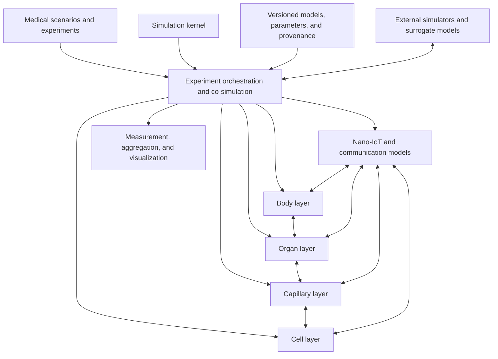

<!--
SPDX-FileCopyrightText: 2026 MEHLISSA contributors
SPDX-License-Identifier: CC-BY-4.0
-->

# Roadmap for a New MEHLISSA Generation

**As of:** 27 August 2026

**Strategic objective:** Implement the MEHLISSA vision described in the
dissertation as a reproducible, modularly coupled, and scientifically
validatable multiscale simulation platform

**Baseline analysis:** [MEHLISSA – current-state analysis](IST_ANALYSE.md)

## 1. Purpose of the roadmap

The new MEHLISSA generation should implement the dissertation vision as fully
as possible:

- whole-body transport in the human bloodstream;
- organ-specific vascular and perfusion models;
- capillary beds, substance exchange, and local molecular communication;
- nanodevice–cell and intracellular models;
- a nano-IoT system comprising nanodevices, gateways, a BAN, and external control;
- medical scenarios from monitoring and localization to treatment and a digital twin.

This roadmap treats the dissertation as the architectural north star. Where a
direct microscopic simulation is physically or computationally unrealistic,
the vision is implemented through hybrid multiscale models.

The roadmap is deliberately divided into dependent milestones and quality
gates. Time estimates are indicative for a small research team and should be
re-estimated after the foundation phase using measured development velocity.

## 2. Guiding principles

### 2.1 The four layers remain independent models

The body, organ, capillary, and cell layers must not again be mixed in a central
class. Each layer receives:

- its own state model;
- its own spatial and temporal scales;
- a defined input and output interface;
- its own validation data;
- interchangeable model variants.

### 2.2 Scenarios compose models; they do not modify the kernel

Fingerprinting, CAR-T, liquid biopsy, endocrinology, and metastasis treatment
are implemented as scenario packages. They configure and connect existing
models but add no scenario-specific `if` blocks to the simulation kernel.

### 2.3 Hybrid multiscale modeling instead of complete individual-object simulation

Biologically realistic scales cannot all be represented as individual C++
objects. Therefore:

- Nanodevices and rare cells may be modeled as agents.
- Large cell populations are modeled as populations, compartments, or stochastic counting processes.
- Depending on the question, molecules are represented as concentration fields, reaction networks, particle samples, or analytical channel models.
- Detailed capillary and cell models are activated only in selected regions of interest.
- Surrogates may replace external detailed models if their origin, validity scope, and error are documented.

### 2.4 Scientific reproducibility is a core feature

Every simulation run must be completely reconstructable, including:

- software and model versions;
- input data and checksums;
- parameters and units;
- seeds and random-stream mapping;
- active model variants;
- hardware and runtime information;
- result and validation metadata.

### 2.5 Validation is incremental and scenario-specific

MEHLISSA is initially a research and hypothesis-testing platform. Clinical
predictions may be claimed only after the respective model has been calibrated
and validated independently.

### 2.6 Performance follows a validated model

Correctness, reproducibility, and profiling precede parallelization.
Optimization is measured against defined benchmarks and must not change
scientific results in an uncontrolled way.

## 3. Target architecture



### 3.1 Simulation kernel

The kernel provides only general simulation services:

- monotonic simulation time with a clear resolution;
- event queue and defined synchronization points;
- optional fixed or adaptive integration steps;
- deterministic named random streams;
- component lifecycle;
- safe object and resource management;
- checkpointing and resumption;
- observer and measurement interfaces;
- error handling and termination conditions;
- later, parallel execution.

The kernel knows neither aldosterone nor cancer cells, fingerprints, or special
vessel IDs.

### 3.2 Shared model interfaces

All layers use a small set of versioned exchange objects. At minimum:

| Exchange object | Purpose |
|---|---|
| `EntityTransfer` | transfer a nanodevice, particle, or rare-cell agent between models |
| `PopulationTransfer` | transfer large populations or flows without individual objects |
| `PhysiologicalState` | pressure, flow, perfusion, activity, temperature, and other states |
| `MolecularSignal` | concentration, amount, release rate, or message event |
| `DetectionEvent` | marker or fingerprint detection, including uncertainty |
| `ActuationCommand` | drug release, activation, or nanodevice control |
| `Measurement` | simulated measurement at a gateway, wearable, laboratory, or imaging system |
| `ModelEvidence` | origin, validity scope, and uncertainty of a model assumption |

Every exchange object has explicit units, a timestamp, spatial context, and
model provenance.

### 3.3 Time coupling

The layers operate at different time scales. A conservative co-simulation is
planned:

1. The orchestrator defines the next synchronization window.
2. Every layer integrates or simulates its state up to that time.
3. Transfers and events are exchanged at layer boundaries.
4. Invariants such as mass, particle count, and temporal order are checked.
5. If coupling error is too large, the window can be reduced or the run terminated.

External simulators can be connected through the same mechanism.

## 4. Planned repository structure

The exact language and build technology are decided in Phase 0. The domain
structure should be approximately:

```text
apps/                   command line, services, and optional user interfaces
core/                   simulation time, events, RNG, components, checkpoints
models/
  body/                 whole-body circulation and systemic physiology
  organ/                organ-specific models
  capillary/            capillary beds, exchange, and local channels
  cell/                 cell, receptor, and reaction models
  communication/        nano-IoT, gateway, BAN, and external communication
scenarios/
  fingerprinting/
  monitoring/
  liquid_biopsy/
  endocrine_avs/
  cart/
  metastasis/
adapters/               NetTAS, SimVascular, CFD, channel, and cell simulators
data/
  schemas/              versioned data schemas
  body_models/
  organ_models/
  parameters/
validation/             reference data, comparison runs, and scientific tests
benchmarks/             performance and scaling benchmarks
tools/                  conversion, inspection, and result analysis
docs/                   architecture, models, roadmap, and user guides
legacy/                 frozen references to MEHLISSA 1.x and 2.0
```

## 5. Development phases and milestones

### Phase 0 – Project charter and architecture decisions

**Indicative period:** 0–2 months

**Objective:** Binding domain and technical framework for the new generation

**Status on 26 August 2026:** M0 is complete and accepted as passed in the
[M0 gate review](m0/M0_GATE_REVIEW.md). Binding artifacts are the
[system requirements](requirements/SYSTEM_REQUIREMENTS.md),
[traceability matrix](requirements/TRACEABILITY_MATRIX.md),
[fingerprinting reference scenario](requirements/FINGERPRINTING_SCENARIO.md),
[Architecture Decision Records](architecture/README.md),
[license/data inventory](m0/LICENSE_AND_DATA_INVENTORY.md), and
[partner inventory](m0/VALIDATION_AND_DATA_PARTNERS.md). ADR-0007 defines
MPL-2.0 for independent Next code, GPL-2.0-only for legacy and direct ports, and
CC-BY-4.0 for new original documentation and approved original data. Rights
reviews for existing data are tracked per artifact as release gates and do not
block M1.

#### Tasks

- Translate the dissertation into traceable domain requirements.
- Clearly distinguish “vision,” “already validated function,” and “research hypothesis.”
- Define target users: model developers, communication researchers, biologists, physicians, and students.
- Define supported operating modes: local experiments, batch/HPC, and interactive exploration.
- Make the technology decision:
  - retain or restructure C++ as the high-performance kernel;
  - provide a Python API for experiments and analysis;
  - consider an alternative kernel only after a prototype comparison.
- Clarify licensing and contributor rules.
- Tag legacy revisions and archive them unchanged.
- Create the first Architecture Decision Records.
- Define model validity, experiment reproducibility, and release quality.

#### Deliverables

- [system requirements document](requirements/SYSTEM_REQUIREMENTS.md);
- [architecture principles and decision records](architecture/README.md);
- prioritized scenario catalog;
- documented technology decision;
- [data and license inventory](m0/LICENSE_AND_DATA_INVENTORY.md);
- initial risk and research-question list.

#### Gate M0

- The four layers and their responsibilities are defined as binding.
- It is decided which parts of 2.0 are adopted, rewritten, or retained only as references.
- Fingerprinting is the first vertical demonstrator.
- No new scenario logic is added to the legacy kernel.
- The per-file and per-artifact licensing model is accepted and technically implemented.

### Phase 1 – Trustworthy technical foundation

**Indicative period:** 1–4 months

**Objective:** A small, reproducible, and tested simulation kernel

#### Tasks

- establish a clean out-of-source build;
- support Linux, Windows, and at least one CI compiler;
- automate license-boundary checks and add a contributor guide;
- fix existing time, geometry, RNG, injection, and memory defects;
- remove global state or move it explicitly into a `SimulationContext`;
- introduce type-safe units for time, length, speed, concentration, and amount;
- implement named and reproducible random streams;
- create a versioned scenario and experiment format with a schema;
- introduce structured logs, error codes, and experiment manifests;
- build unit and property tests for kernel invariants;
- specify checkpoint and snapshot formats;
- enable static analysis, sanitizers, and formatting checks in CI.

#### Mandatory tests

- Time advances strictly monotonically with correct subsecond resolution.
- A particle moves at most once per simulation instant.
- 3D distances and vessel lengths match analytical values.
- The same seed and configuration produce identical results.
- Different named random streams are independently reproducible.
- Object lifetimes produce no reference cycles or double destruction.
- Invalid configurations are rejected before simulation begins.

#### Gate M1 – “Trustworthy Kernel”

- The complete CI build is green.
- Kernel test coverage and critical invariants are documented.
- A deterministic minimal experiment can be reproduced bit-identically or tolerance-identically on two platforms.
- No medical scenario class resides in the kernel.

### Phase 2 – Body layer 2.0 as a validated transport model

**Indicative period:** 3–8 months

**Objective:** Reimplement today's strongest layer robustly

#### Tasks

- model the vascular network as a validated directed graph;
- support coherent, non-contiguous IDs;
- introduce a versioned vascular schema containing:
  - geometry and coordinate system;
  - vessel type;
  - length and diameter;
  - cross section and volume;
  - flow or perfusion;
  - successors and transition model;
  - data source, uncertainty, and validity scope;
- migrate the existing 1995 data set without loss;
- resolve vessel 9 and further graph/probability invariants;
- drive velocities and transitions from data instead of hard-coded type values;
- support multiple flow models:
  - simple compartment model;
  - virtual laminar flows;
  - later imported CFD/streamline models;
- model injection and extraction as general events;
- model gateways as measurement sites, not yet as network protocols;
- make complete trajectories, samples, and aggregates configurable;
- reproduce reference runs from the BVS distribution studies;
- automatically verify mass conservation and stationary distribution.

#### Body states

The new body layer should already prepare dynamic states:

- rest;
- physical exercise;
- orthostasis/posture;
- changed heart rate;
- organ-specific perfusion change.

Literature-based parameter sets are sufficient initially. Coupled circulatory
models can follow later.

#### Gate M2 – “Validated Body Layer”

- The 1995 model is schema-validated and fully documented.
- BVS and dissertation results are reproduced within defined tolerances or deviations are explained.
- Particle, flow, and transition invariants are tested automatically.
- A new body model can be loaded without code changes.
- Output can be aggregated and bounded for large experiments.

### Phase 3 – Co-simulation framework and organ layer

**Indicative period:** 6–12 months

**Objective:** First genuine coupling between whole-body and regional models

**Current implementation status:** M3 is active. The versioned
`ModelComponent` boundary, body adapter, identity-conserving coarse,
three-region-surrogate, and literature-parameterized pulmonary 0D variants,
lossless typed population/substance/flow endpoints, and a shared programmatic
scenario switch are implemented. Schema-validated executable lung definitions
preserve validity, evidence, sources, uncertainty, derivations, and optional
external-data axes/units/provenance. The 0D candidate executes mean pressure,
flow, PVR, compliance, transit, and right/left perfusion for a healthy adult at
rest in the supine position. M3.8 adds independent aggregate validation with a
source-separation guard, a scope-matched supine comparison, and an invasive
rest/exercise crosscheck. M3.9 adds a bounded, independently calibrated
flow-dependent PVR/compliance variant and repeats the untouched Bentley stress
test. M3.10 adds the subject-level multipoint schema, immutable-model evaluator,
trajectory metrics, synthetic-evidence guard, and a reviewed acquisition plan.
M3.11 adds immediate no-refit validation against four published, independent
Kovacs/Wolsk population series (255 healthy volunteers, 18 stages). M3.12 adds
a separate Kane-calibrated, bounded age multiplier on PVR. The immutable
validation result improves from 10/18 to 14/18 stages: the older stratum reaches
5/5, the middle stratum remains 5/5, and the young stratum remains incomplete
at 1/5. M3.13 identifies the young resting PVR level—not the already-supported
flow exponent or BSA conversion—as the dominant discrepancy. An invasive
Kovacs 2012 calibration yields an immutable v4 candidate; all 15 stages in the
disjoint Wolsk cohort agree without refitting. Kovacs 2009 is excluded from the
counted v4 result because its literature corpus overlaps the calibration
review. M3.14 adds a structurally distinct Linehan pressure-distensible v5
candidate, using a separately reported healthy distensibility coefficient and
preserving the resting equilibrium by deriving zero-pressure resistance. Its
locked Wolsk result is 11/15: both younger strata pass 5/5, while the older
stratum passes only 1/5. The negative comparison is retained, so empirical v4
remains the stronger population reference and v5 the structural experiment.
M3.15 tests a smaller independently calibrated refinement: Reeves' invasive
older aggregate lowers `alpha` from 0.020 to 0.015 mmHg^-1 at age 60. Against
the still-frozen Wolsk stages, older RMSE improves from 5.411 to 4.603 mmHg,
but agreement remains 1/5 older and 11/15 overall. V6 therefore narrows the
mechanistic question without superseding v4 or resolving the anatomical gap.
M3.16 introduces a distinct five-lobe parallel 0D implementation. It retains
v4's aggregate law exactly, derives fixed lobe fractions from a clearly labeled
DE-CT PBV proxy, and routes individual entities through one deterministic lobe
bed. The anatomical implementation gap is substantially reduced; independent
regional validation, dynamic redistribution, and geometry remain open.
Participant-level validation remains a higher-resolution follow-up.
Anatomical refinement, transforming exchange, general experiment composition,
continuous/regional activity physiology, and regional exercise redistribution
remain open; see [M3 working plan](m3/README.md).

The formal [M3 gate review](m3/M3_GATE_REVIEW.md) therefore keeps the milestone
open: the software coupling candidate, first literature-parameterized 0D
reference candidate, independent aggregate validation, and bounded
rest/exercise 0D adaptation, bounded age conditioning, invasive young-adult
resistance refinement, a pressure-distensible alternative, and its
age-conditioned sensitivity are verified, the
subject-level analysis path is software-verified, and published population
multipoint validation has produced a qualified 15/15 result against the
calibration-disjoint Wolsk cohort. Anatomical
regional validation, continuous and regional physiology, and the executable historical
FP9 baseline remain closure evidence.

#### Tasks

- implement a generic `ModelComponent` interface;
- define entry and exit points between a body vessel and an organ model;
- implement conservative transfer of agents, populations, and substance flows;
- introduce organ-specific parameter and state models;
- model at least one reference organ in detail;
- prototype an import pipeline for BodyParts3D/SimVascular data;
- make geometry, axis, and unit conversion reproducible;
- define a surrogate for CFD flow fields;
- couple activity and perfusion changes through `PhysiologicalState`;
- implement organ localization and an organ gateway as interchangeable models.

#### Choice of reference organ

The **lung** was selected for the first complete path
([ADR-0006](architecture/adr/0006-lung-reference-organ.md)). It is represented
in the fingerprinting scenario, is traversed during every complete circulation,
and has accessible pulmonary SimVascular/VMR reference cases. The initial model
scope is pulmonary circulation; respiratory mechanics and gas exchange follow
as separate variants. Selection used these criteria:

- availability of anatomical data;
- availability of perfusion data;
- relevance to fingerprinting and later treatment scenarios;
- manageable modeling effort.

#### Gate M3 – “Body–Organ Coupling”

- An agent can move reproducibly from the body graph into an organ model and back.
- Flow, populations, and substance amounts are conserved across the layer boundary.
- The organ has an independent, interchangeable model implementation.
- A coarse compartment and more detailed organ model can be used with the same scenario.

### Phase 4 – Capillary layer and molecular channels

**Indicative period:** 9–18 months

**Objective:** Model local microcirculation, substance exchange, and communication

#### Tasks

- introduce capillary beds as parameterizable graph, compartment, or network models;
- distinguish arterioles, capillaries, and venules;
- represent capillary density, diameter, length, transit time, and hematocrit;
- model precapillary sphincters and activity-dependent perfusion;
- define exchange among blood, endothelium, interstitium, and cell;
- prepare retention, adhesion, and extravasation of nanodevices;
- provide local positions and residence times;
- implement interfaces for molecular channel models;
- connect existing models such as BiNS2, BNSim2, N3Sim, or analytical models through adapters where available and licensable;
- investigate cluster formation and multi-hop communication;
- derive higher-level abstractions such as reachability, runtime, and success distributions.

#### Model variants

At least three resolutions should be provided:

1. **Surrogate:** distributions of transit, detection, and communication times.
2. **Mesoscopic:** capillary network with populations and concentration fields.
3. **Detailed:** particle/channel simulation in a small region of interest.

#### Gate M4 – “Capillary Communication”

- A nanodevice can leave an organ, traverse a capillary bed, and return.
- Substance exchange conserves mass and is unit-consistent.
- At least one molecular channel model is connected through a stable interface.
- The detailed model and surrogate are compared against the same reference cases.

### Phase 5 – Cell layer

**Indicative period:** 12–24 months

**Objective:** Couple biomarker detection, drug release, and cell response

#### Tasks

- define a general receptor/ligand model;
- model binding, dissociation, and detection thresholds;
- introduce cell and tissue compartments;
- connect reaction networks through ODE, SSA, or external simulators;
- model biomarker release and concentration trajectories;
- implement nanodevice activation and drug release;
- couple drug uptake, signaling pathway, and cell response;
- implement apoptosis as the first complete cell-response model;
- provide population-based models for large cell counts;
- record model provenance, calibration range, and uncertainty.

#### Gate M5 – “Cell Response”

- A molecular signal from the capillary model can trigger a cell reaction.
- A cell model can return a measurable event or state change to higher layers.
- Receptor binding and the reaction network are tested against analytical or external reference data.
- Single-cell and population variants have documented validity scopes.

### Phase 6 – Nano-IoT, gateway, and external communication

**Indicative period:** 12–24 months, partly in parallel with Phase 5

**Objective:** Complete the dissertation's communication vision

#### Tasks

- model nanodevice capabilities and resources;
- define local message types and communication events;
- connect molecular communication at capillary level with a logical message layer;
- implement cluster, relay, and multi-hop strategies;
- define the gateway as an active model with nano and micro communication;
- simulate or connect a BAN and external device through adapters;
- implement uplink for measurements and downlink for activation commands;
- measure latency, energy, error rate, noise, and capacity;
- optionally reconnect communication models to ns-3 or another network simulator without making physiological models dependent on it;
- prepare security, miscontrol, and failure scenarios.

#### Gate M6 – “End-to-End Nano-IoT”

- A simulated molecular detection produces a traceable external measurement.
- An external control command can reach a nanodevice or drug release.
- Communication and physiology models can be exchanged independently.
- Communication metrics are reported separately from biological results.

### Phase 7 – First complete multilayer demonstrator: fingerprinting

**Indicative period:** 9–18 months, building on M3 and at least an early M4/M5 variant

**Objective:** End-to-end workflow across all layers

#### Reference workflow

1. Nanolocators and nanocollectors are injected into a defined vessel.
2. The body layer transports them to the target organ.
3. The organ model transfers them to a capillary bed.
4. Fingerprint gene products and a disease marker are provided as concentrations or stochastic binding targets.
5. A nanolocator detects the required combination and releases tiles.
6. A NetTAS-based surrogate or detailed model determines message assembly.
7. A nanocollector collects the message.
8. Return transport leads to the wrist gateway.
9. Gateway and BAN produce an external measurement containing tissue, marker, and uncertainty information.

#### Incremental realism

- **Level A:** Existing timer logic as a reproducible baseline.
- **Level B:** Concentration- and binding-based fingerprint detection.
- **Level C:** Explicit tile release and assembly surrogate.
- **Level D:** Local communication and gateway model.
- **Level E:** Sensitivity, robustness, and misclassification analysis.

#### Validation

- Reproduce the mapping of the nine existing MEHLISSA organs.
- Use localization, assembly, and collection times from the dissertation as a baseline.
- Do not artificially rescale deviations from new models to published values; explain them.
- Investigate effects of nanodevice count, injection site, perfusion, concentration, and binding affinity.
- Report false-positive and false-negative detection.

#### Gate M7 – “Holistic Vertical Slice”

- The workflow functions without scenario-specific changes to the kernel or layers.
- Every layer can be replaced with a simpler or more detailed variant.
- The complete run is reproducible with a manifest, seeds, data versions, and result report.
- Uncertainty and validity limitations are reported with the result.

### Phase 8 – Further medical scenarios

**Indicative period:** from 15 months, depending on the respective gates

**Objective:** Demonstrate platform utility through independent scenario packages

#### 8.1 Continuous monitoring

- generic biomarker and baseline model;
- personalized thresholds;
- sensor and gateway model;
- time-dependent concentration changes;
- false-positive and false-negative alerts;
- return channel for confirmation or activation.

#### 8.2 Liquid biopsy

- release model for cfDNA/ctDNA;
- degradation, half-life, and organ clearance;
- population-based molecular transport;
- sampling and detection model;
- comparison with real blood-sample probabilities;
- sensitivity analysis for tumor burden and detection radius.

#### 8.3 Endocrinology and AVS

- rebuild the complete endocrine model as a scenario;
- version the correct 104-vessel/organ model;
- unambiguously separate adrenal glands, adrenal veins, and IVC;
- model secretion rates, pulsatility, degradation, and clearance;
- couple advection and diffusion consistently with physics;
- implement sampling as a measurement model;
- do not scale simulation results to values that will later be used for validation;
- calibrate and validate against independent AVS data.

#### 8.4 CAR-T

- fix existing implementation defects;
- implement the mathematical reference model separately;
- use cell populations instead of billions of individual agents;
- use agent-based cells only for local microenvironments;
- define interactions correctly in space and time;
- couple tumor, healthy T-cell, and CAR-T populations;
- investigate treatment parameters and uncertainty systematically.

#### 8.5 Metastasis prevention as the capstone

This scenario should become the most comprehensive implementation of the dissertation:

1. tumor and cell-detachment model;
2. entry into the local capillary;
3. whole-body transport of a circulating tumor cell;
4. detection by nanodevices;
5. molecular communication;
6. localized drug release;
7. receptor binding and intracellular signaling cascade;
8. apoptosis or survival;
9. external report to the gateway and treatment system.

This scenario begins only when M2 through M6 each provide at least one
validated model variant.

### Phase 9 – Personalization and digital twin

**Indicative period:** from 20–36 months

**Objective:** Move from generic body models to patient-specific simulations

#### Tasks

- define a canonical patient-parameter and anatomy model;
- import imaging and segmented vascular models;
- make the SimVascular/CFD pipeline production-ready;
- connect vital signs, laboratory values, and wearable data;
- calibrate personal parameters from observations;
- determine model uncertainty and identifiability;
- run treatment options as reproducible experiment variants;
- update simulation results with real follow-up measurements;
- account for data protection, consent, pseudonymization, and data provenance;
- clearly distinguish a research twin, decision support, and a clinical medical device.

#### Maturity levels

1. **Geometrically personalized:** individual anatomy.
2. **Physiologically personalized:** individual perfusion and vital parameters.
3. **Biochemically personalized:** individual marker and reaction parameters.
4. **Dynamic twin:** updates from continuous measurements.
5. **Treatment twin:** prospective treatment variants, only after independent validation.

#### Gate M8 – “Research Digital Twin”

- Patient-specific inputs are versioned, verifiable, and compliant with data protection.
- Calibration and validation data are separate.
- Uncertainty is reported quantitatively.
- Without regulatory review, the platform makes no clinical decision claim.

### Phase 10 – Scaling, HPC, and large experiments

**Indicative period:** continuous after M2, intensive work after M7

**Objective:** Run large scenarios efficiently without losing model fidelity

#### Prioritized measures

1. Reduce and aggregate output volume.
2. Profile CPU, memory, and I/O.
3. Change data layout from object-centric to cache-friendly structures.
4. Replace large populations with counting or compartment models.
5. Use spatial indices for local interactions.
6. Treat event-sparse regions with larger time steps.
7. Parallelize independent experiments and replicates.
8. Parallelize organs or graph partitions where coupling invariants remain conserved.
9. Use GPU or distributed execution only for demonstrably suitable kernels.
10. Use surrogates with documented error for repeated parameter studies.

#### Benchmark classes

- BVS distribution with 6,359 and 63,590 nanodevices;
- fingerprinting with 1,000/10,000 devices;
- CAR-T reference benchmark from the 2.0 paper;
- population-based variants with biologically scaled cell counts;
- multi-organ co-simulation;
- ensemble and sensitivity runs.

Performance improvements are accepted only when reference results remain
within defined numerical and statistical tolerances.

## 6. Cross-cutting programs

### 6.1 Data, units, and provenance

Every data set must record:

- schema and data version;
- unit and coordinate system;
- source and literature reference;
- creation and conversion steps;
- uncertainty and population context;
- valid model variants;
- checksum and license.

CSV can remain an interchange format but should be complemented by versioned
schemas and, where appropriate, a more efficient runtime format.

### 6.2 Validation strategy

Validation follows a pyramid:

1. **Software tests:** parsers, time, geometry, RNG, and memory.
2. **Numerical tests:** convergence, stability, and conservation laws.
3. **Component tests:** vessel, organ, capillary, channel, and cell.
4. **Comparison with analytical solutions:** simple flow, diffusion, and reaction cases.
5. **Reproduction of published MEHLISSA results.**
6. **Comparison with independent simulation models.**
7. **Comparison with physiological and experimental data.**
8. **Wet-lab and, eventually, clinical validation.**

Calibration and validation use separate data. Subsequent scaling to a target is
calibration and must not simultaneously be reported as validation.

### 6.3 Uncertainty and sensitivity

Every medical scenario requires:

- parameter ranges rather than individual constants only;
- global or local sensitivity analysis;
- uncertainty propagation;
- confidence or credible intervals;
- analysis of structural model uncertainty;
- documented limits of transferability.

### 6.4 Experiment and result format

A run produces at least:

- `experiment.yaml` or an equivalent validated manifest;
- `provenance.json` containing versions, seeds, and checksums;
- structured measurement and aggregate files;
- optional compressed trajectories;
- validation report;
- performance report;
- machine-readable summary for later comparison runs.

### 6.5 Visualization and user tools

Visualization is decoupled from simulation and reads standardized result
formats. Planned capabilities are:

- 3D vascular and organ view;
- temporal particle and population distribution;
- heatmaps and flow display;
- layer switching among body, organ, and capillary;
- signal, concentration, and gateway time series;
- comparison of multiple runs;
- uncertainty visualization;
- export of reproducible figures.

BVS-Vis can serve as a UX and feature reference but should not determine the
internal data model.

### 6.6 Documentation

Required document types:

- architecture overview and decision records;
- model description per layer;
- data dictionary and unit system;
- scenario specification;
- validation report;
- user and developer guides;
- reproducible tutorials;
- publication and citation guidance;
- changelog and release notes.

## 7. Prioritization

### Priority P0 – indispensable

- Phase 0 and Phase 1;
- correct time, geometry, RNG, and memory management;
- tests, CI, units, and experiment manifests;
- clear separation of kernel and scenarios;
- versioned vascular schema;
- reproducible BVS baseline.

### Priority P1 – core of the dissertation

- validated body layer;
- organ and co-simulation interface;
- first capillary and cell models;
- basic nano-IoT path;
- fingerprinting as a complete vertical demonstrator.

### Priority P2 – expansion of the research platform

- monitoring and liquid biopsy;
- endocrine/AVS scenario;
- population-based CAR-T model;
- multiple organ models;
- external simulator adapters;
- integrated result visualization.

### Priority P3 – long-term vision

- comprehensive metastasis scenario;
- patient-specific anatomy and physiology;
- dynamic digital twin;
- large ensemble and HPC simulations;
- clinical validation and, where appropriate, a regulatory path.

## 8. Indicative timeline

| Horizon | Focus | Expected result |
|---|---|---|
| 0–3 months | charter, architecture, build, tests | M0 and substantial parts of M1 |
| 3–9 months | new kernel and body layer | M1 and M2 |
| 6–12 months | co-simulation and first organ | M3 |
| 9–18 months | capillary prototype, cell prototype, fingerprinting | initial M4/M5 variants and M7 |
| 12–24 months | nano-IoT and further scenarios | M6, monitoring, AVS, CAR-T |
| 18–30 months | metastasis capstone, multiple organs | complete multilayer demonstration |
| from 24–36 months | personalization, digital twin, HPC | M8 and scaled research runs |

These periods assume a continuously available multidisciplinary team. Without
biological, medical, and experimental partners, technical models can be built
but not robustly validated medically.

## 9. Roles and expertise

The vision requires at least the following expertise:

- simulation architecture and software engineering;
- numerical methods and co-simulation;
- hemodynamics and vascular modeling;
- molecular communication;
- cell biology and pharmacology;
- bioinformatics and proteomics;
- medical scenario expertise;
- statistics, sensitivity, and uncertainty quantification;
- visualization and research data management;
- eventually, data-protection and regulatory expertise.

Not every role must be filled permanently by a separate person. Every model
released, however, must have a named person responsible for its domain review.

## 10. Principal risks and mitigations

| Risk | Mitigation |
|---|---|
| The vision is again implemented as monolithic code | Make layer interfaces and architecture gates binding |
| Too many scenarios are developed too early | Prioritize fingerprinting as the first vertical path |
| Unrealistic individual-object counts | Use hybrid agent, population, and field models |
| Performance optimization changes results | Use a reference suite and statistical tolerances |
| Experimental data is missing | Document validity limitations and plan partners and external data early |
| Calibration is interpreted as validation | Use separate data sets and independent validation reports |
| Patient specificity is understood only geometrically | Use an incremental digital-twin maturity model |
| External simulators create dependencies | Use stable adapters and surrogates with documented error |
| Data and units become inconsistent | Use versioned schemas, type-safe units, and CI checks |
| Research code is not reproducible | Use manifests, seeds, containers/build recipes, and archived reference runs |

## 11. Immediate next work packages

The following packages are derived directly from this roadmap:

1. ~~Capture requirements from Chapters 4–6 of the dissertation as a numbered catalog.~~ Complete: [system requirements](requirements/SYSTEM_REQUIREMENTS.md).
2. ~~Prepare the architecture decision “MEHLISSA Next based on 2.0 versus a new kernel” through a small spike.~~ Complete: [ADR-0001](architecture/adr/0001-new-kernel-and-legacy-policy.md).
3. ~~Tag legacy versions and document current buildability.~~ Complete: tag `legacy-baseline-2026-08-26` and [development documentation](DEVELOPMENT.md).
4. ~~Create a minimal new kernel with correct time, 3D geometry, and RNG.~~ Complete and verified in CI on MSVC, GCC, and Clang.
5. ~~Migrate and validate the 1995 vascular model into a versioned schema.~~ Complete in M2.2.
6. ~~Build the BVS reference run as the first automated scientific regression test.~~ Complete in M2.4.
7. ~~Define the scenario format and experiment manifest.~~ Complete: versioned experiment manifest, provenance, run log, and checkpoint contract in M1.
8. ~~Formulate fingerprinting requirements and the dissertation baseline as a vertical specification.~~ Complete: [fingerprinting reference scenario](requirements/FINGERPRINTING_SCENARIO.md).
9. ~~Select the reference organ for the first body–organ coupling.~~ Complete: lung, documented in [ADR-0006](architecture/adr/0006-lung-reference-organ.md).
10. ~~Identify required biological and experimental partners or data sources.~~ Complete: [data gaps and validation partners](m0/VALIDATION_AND_DATA_PARTNERS.md).

## 12. Definition of long-term success

The new MEHLISSA generation does not fulfill the dissertation merely because
classes named Body, Organ, Capillary, and Cell exist. Success means:

- the four layers can be validated independently at appropriate resolutions;
- states and entities are exchanged traceably between them;
- a medical scenario completes the full path from injection through biological detection to an external measurement or treatment;
- detailed and abstracted models are interchangeable;
- realistic scales become feasible through multiscale and population models;
- every run is reproducible;
- uncertainty and validity limitations are part of the result;
- new medical scenarios can be added without changing the simulation kernel;
- personalization can progress incrementally from anatomy to physiology and biochemistry.

This transforms MEHLISSA from a collection of valuable research prototypes into
the holistic simulation architecture envisioned in the dissertation.
