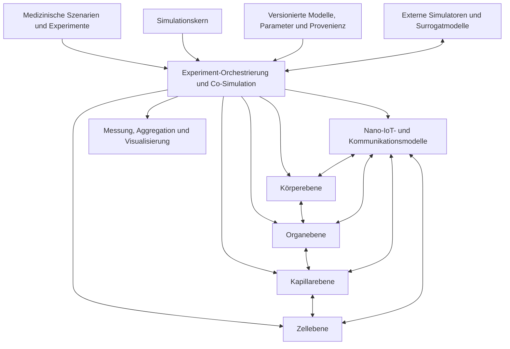

<!--
SPDX-FileCopyrightText: 2026 MEHLISSA contributors
SPDX-License-Identifier: CC-BY-4.0
-->

# Roadmap für eine neue MEHLISSA-Generation

**Stand:** 26. August 2026  
**Strategisches Ziel:** Umsetzung der in der Dissertation beschriebenen MEHLISSA-Vision als reproduzierbare, modular gekoppelte und wissenschaftlich validierbare Mehrskalen-Simulationsplattform  
**Ausgangsanalyse:** [MEHLISSA – Analyse des aktuellen Stands](IST_ANALYSE.md)

## 1. Ziel der Roadmap

Die neue MEHLISSA-Generation soll die Vision der Dissertation möglichst vollständig verwirklichen:

- Ganzkörpertransport im menschlichen Blutkreislauf;
- organspezifische Gefäß- und Perfusionsmodelle;
- Kapillarbetten, Stoffaustausch und lokale molekulare Kommunikation;
- Nanogerät-Zell- und intrazelluläre Modelle;
- ein Nano-IoT-System aus Nanogeräten, Gateways, BAN und externer Steuerung;
- medizinische Szenarien von Monitoring und Lokalisierung bis zu Therapie und Digital Twin.

Diese Roadmap interpretiert die Dissertation als architektonischen Nordstern. Wo eine direkte mikroskopische Simulation physikalisch oder rechnerisch nicht realistisch ist, wird die Vision mit hybriden Mehrskalenmodellen umgesetzt.

Die Roadmap ist absichtlich in abhängige Meilensteine und Qualitätsgates gegliedert. Zeitangaben sind Richtwerte für ein kleines Forschungsteam und sollten nach Abschluss der Fundamentphase anhand gemessener Entwicklungsgeschwindigkeit neu geschätzt werden.

## 2. Leitprinzipien

### 2.1 Die vier Ebenen bleiben eigenständige Modelle

Körper-, Organ-, Kapillar- und Zellebene dürfen nicht erneut in einer zentralen Klasse vermischt werden. Jede Ebene erhält:

- ein eigenes Zustandsmodell;
- eigene Raum- und Zeitskalen;
- eine definierte Ein- und Ausgabeschnittstelle;
- eigene Validierungsdaten;
- austauschbare Modellvarianten.

### 2.2 Szenarien komponieren Modelle, sie verändern nicht den Kern

Fingerprinting, CAR-T, Liquid Biopsy, Endokrinologie oder Metastasenbehandlung werden als Szenariopakete implementiert. Sie konfigurieren und verbinden vorhandene Modelle, fügen aber keine szenariospezifischen `if`-Blöcke in den Simulationskern ein.

### 2.3 Hybride Mehrskalenmodellierung statt vollständiger Einzelobjektsimulation

Biologisch realistische Größenordnungen können nicht als einzelne C++-Objekte repräsentiert werden. Deshalb gilt:

- Nanogeräte und seltene Zellen können agentenbasiert modelliert werden.
- Große Zellpopulationen werden als Populationen, Kompartimente oder stochastische Zählprozesse modelliert.
- Moleküle werden je nach Fragestellung als Konzentrationsfeld, Reaktionsnetz, Partikelstichprobe oder analytisches Kanalmodell dargestellt.
- Detaillierte Kapillar- und Zellmodelle werden nur in ausgewählten Regions of Interest aktiviert.
- Surrogatmodelle dürfen externe Detailmodelle ersetzen, sofern Herkunft, Gültigkeitsbereich und Fehler dokumentiert sind.

### 2.4 Wissenschaftliche Reproduzierbarkeit ist eine Kernfunktion

Jeder Simulationslauf muss vollständig rekonstruierbar sein. Dazu gehören:

- Software- und Modellversionen;
- Eingabedaten und deren Prüfsummen;
- Parameter und Einheiten;
- Seeds und Zufallsstromzuordnung;
- aktivierte Modellvarianten;
- Hardware- und Laufzeitinformationen;
- Ergebnis- und Validierungsmetadaten.

### 2.5 Validierung erfolgt schrittweise und szenariospezifisch

MEHLISSA ist zunächst eine Forschungs- und Hypothesentestplattform. Klinische Vorhersagen dürfen erst beansprucht werden, wenn das jeweilige Modell unabhängig kalibriert und validiert wurde.

### 2.6 Performance folgt einem validierten Modell

Korrektheit, Reproduzierbarkeit und Profiling kommen vor Parallelisierung. Optimiert wird nur gegen definierte Benchmarks, ohne wissenschaftliche Ergebnisse unkontrolliert zu verändern.

## 3. Zielarchitektur



### 3.1 Simulationskern

Der Kern stellt nur allgemeine Simulationsdienste bereit:

- monotone Simulationszeit mit klarer Auflösung;
- Ereigniswarteschlange und definierte Synchronisationspunkte;
- optional feste oder adaptive Integrationsschritte;
- deterministische, benannte Zufallsströme;
- Komponenten-Lebenszyklus;
- sichere Objekt- und Ressourcenverwaltung;
- Checkpointing und Wiederaufnahme;
- Beobachter- und Messschnittstellen;
- Fehlerbehandlung und Abbruchbedingungen;
- später parallele Ausführung.

Der Kern kennt weder Aldosteron noch Krebszellen, Fingerprints oder spezielle Gefäß-IDs.

### 3.2 Gemeinsame Modellschnittstellen

Alle Ebenen verwenden eine kleine Menge versionierter Austauschobjekte. Vorgesehen sind mindestens:

| Austauschobjekt | Zweck |
|---|---|
| `EntityTransfer` | Übergabe eines Nanogeräts, Partikels oder seltenen Zellagenten zwischen Modellen |
| `PopulationTransfer` | Übergabe großer Populationen oder Flüsse ohne Einzelobjekte |
| `PhysiologicalState` | Druck, Fluss, Perfusion, Aktivität, Temperatur und weitere Zustände |
| `MolecularSignal` | Konzentration, Stoffmenge, Freisetzungsrate oder Nachrichtenereignis |
| `DetectionEvent` | Erkennung eines Markers oder Fingerprints einschließlich Unsicherheit |
| `ActuationCommand` | Wirkstofffreisetzung, Aktivierung oder Steuerung eines Nanogeräts |
| `Measurement` | simulierte Messung an Gateway, Wearable, Labor oder Bildgebung |
| `ModelEvidence` | Herkunft, Gültigkeitsbereich und Unsicherheit einer Modellannahme |

Jedes Austauschobjekt besitzt explizite Einheiten, Zeitstempel, räumlichen Kontext und Modellprovenienz.

### 3.3 Zeitkopplung

Die Ebenen arbeiten auf unterschiedlichen Zeitskalen. Vorgesehen ist eine konservative Co-Simulation:

1. Der Orchestrator definiert das nächste Synchronisationsfenster.
2. Jede Ebene integriert oder simuliert ihren Zustand bis zu diesem Zeitpunkt.
3. Übergaben und Ereignisse werden an Schichtgrenzen ausgetauscht.
4. Invarianten wie Masse, Partikelzahl und Zeitordnung werden geprüft.
5. Bei zu großen Kopplungsfehlern kann das Fenster verkleinert oder ein Lauf abgebrochen werden.

Externe Simulatoren können über denselben Mechanismus angebunden werden.

## 4. Vorgesehene Repository-Struktur

Die genaue Sprache und Buildtechnik wird in Phase 0 entschieden. Die fachliche Struktur sollte ungefähr so aussehen:

```text
apps/                   Kommandozeile, Dienste und optionale Benutzeroberflächen
core/                   Simulationszeit, Events, RNG, Komponenten und Checkpoints
models/
  body/                 Ganzkörperkreislauf und systemische Physiologie
  organ/                organspezifische Modelle
  capillary/            Kapillarbetten, Austausch und lokale Kanäle
  cell/                 Zell-, Rezeptor- und Reaktionsmodelle
  communication/        Nano-IoT, Gateway, BAN und externe Kommunikation
scenarios/
  fingerprinting/
  monitoring/
  liquid_biopsy/
  endocrine_avs/
  cart/
  metastasis/
adapters/               NetTAS, SimVascular, CFD, Kanal- und Zell-Simulatoren
data/
  schemas/               versionierte Datenschemata
  body_models/
  organ_models/
  parameters/
validation/             Referenzdaten, Vergleichsläufe und wissenschaftliche Tests
benchmarks/              Performance- und Skalierungsbenchmarks
tools/                   Konvertierung, Inspektion und Ergebnisanalyse
docs/                    Architektur, Modelle, Roadmap und Nutzeranleitungen
legacy/                  eingefrorene Referenzen auf MEHLISSA 1.x und 2.0
```

## 5. Entwicklungsphasen und Meilensteine

### Phase 0 – Projektauftrag und Architekturentscheidungen

**Richtwert:** 0–2 Monate  
**Ziel:** Verbindlicher fachlicher und technischer Rahmen für die neue Generation

**Arbeitsstand 26. August 2026:** M0 ist abgeschlossen und im
[M0 Gate Review](m0/M0_GATE_REVIEW.md) als bestanden abgenommen. Verbindliche
Artefakte sind die [Systemanforderungen](requirements/SYSTEM_REQUIREMENTS.md),
die [Traceability Matrix](requirements/TRACEABILITY_MATRIX.md), das
[Fingerprinting-Referenzszenario](requirements/FINGERPRINTING_SCENARIO.md), die
[Architecture Decision Records](architecture/README.md) sowie das
[Lizenz-/Daten-](m0/LICENSE_AND_DATA_INVENTORY.md) und
[Partnerinventar](m0/VALIDATION_AND_DATA_PARTNERS.md). ADR-0007 legt MPL-2.0
für unabhängigen Next-Code, GPL-2.0-only für Legacy und direkte Portierungen
sowie CC-BY-4.0 für neue eigene Dokumentation und freigegebene eigene Daten
fest. Rechteprüfungen vorhandener Daten werden artefaktbezogen als Release-Gate
geführt und blockieren M1 nicht.

#### Aufgaben

- Dissertation in nachverfolgbare fachliche Anforderungen überführen.
- „Vision“, „bereits validierte Funktion“ und „Forschungshypothese“ klar kennzeichnen.
- Zielnutzer definieren: Modellentwickler, Kommunikationsforscher, Biologen, Mediziner und Studierende.
- Unterstützte Betriebsarten festlegen: lokale Experimente, Batch/HPC, interaktive Exploration.
- Technologieentscheidung treffen:
  - C++ als Hochleistungskern beibehalten oder neu strukturieren;
  - Python-API für Experimente und Analyse;
  - alternatives Kernkonzept nur nach Prototypvergleich.
- Lizenz- und Contributor-Regeln klären.
- Legacy-Stände taggen und unverändert archivieren.
- erste Architecture Decision Records anlegen.
- Definitionen für Modellvalidität, Experimentreproduzierbarkeit und Releasequalität festlegen.

#### Ergebnisse

- [System Requirements Document](requirements/SYSTEM_REQUIREMENTS.md);
- [Architekturgrundsätze und Decision Records](architecture/README.md);
- priorisierter Szenariokatalog;
- dokumentierte Technologieentscheidung;
- [Daten- und Lizenzinventar](m0/LICENSE_AND_DATA_INVENTORY.md);
- erste Risiko- und Forschungsfragenliste.

#### Gate M0

- Die vier Ebenen und ihre Verantwortlichkeiten sind verbindlich beschrieben.
- Es ist entschieden, welche Bestandteile von 2.0 übernommen, neu geschrieben oder nur als Referenz erhalten werden.
- Der erste vertikale Demonstrator ist Fingerprinting.
- Keine neue Szenariologik wird mehr in den Legacy-Kern eingebaut.
- Das Lizenzmodell pro Datei und Artefakt ist angenommen und technisch
  umgesetzt.

### Phase 1 – Vertrauenswürdiges technisches Fundament

**Richtwert:** 1–4 Monate  
**Ziel:** Kleiner, reproduzierbarer und getesteter Simulationskern

#### Aufgaben

- sauberen Out-of-Source-Build einrichten;
- Linux, Windows und mindestens einen CI-Compiler unterstützen;
- Lizenzgrenzen automatisiert prüfen und Contributor-Anleitung ergänzen;
- bestehende Zeit-, Geometrie-, RNG-, Injektions- und Speicherfehler beheben;
- globale Zustände entfernen oder explizit in einen `SimulationContext` überführen;
- typsichere Einheiten für Zeit, Länge, Geschwindigkeit, Konzentration und Stoffmenge einführen;
- benannte und reproduzierbare Zufallsströme implementieren;
- versioniertes Szenario- und Experimentformat mit Schema erstellen;
- strukturierte Logs, Fehlercodes und Experimentmanifeste einführen;
- Unit- und Property-Tests für Kerninvarianten aufbauen;
- Checkpoint- und Snapshotformat spezifizieren;
- statische Analyse, Sanitizer und Formatprüfung in CI aktivieren.

#### Zwingende Tests

- Zeit schreitet streng monoton und mit korrekter Subsekundenauflösung fort.
- Ein Partikel wird pro Simulationszeitpunkt höchstens einmal bewegt.
- 3D-Distanzen und Gefäßlängen stimmen analytisch.
- Gleicher Seed und gleiche Konfiguration erzeugen identische Ergebnisse.
- Unterschiedliche benannte Zufallsströme sind unabhängig reproduzierbar.
- Objektlebensdauern erzeugen keine Referenzzyklen oder Double-Destruction.
- Fehlerhafte Konfigurationen werden vor Simulationsstart abgelehnt.

#### Gate M1 – „Trustworthy Kernel“

- Vollständiger CI-Build ist grün.
- Kernabdeckung durch Tests und kritische Invarianten sind dokumentiert.
- Ein deterministischer Minimalversuch kann auf zwei Plattformen bit- oder toleranzidentisch reproduziert werden.
- Keine medizinische Szenarioklasse befindet sich im Kern.

### Phase 2 – Körperebene 2.0 als validiertes Transportmodell

**Richtwert:** 3–8 Monate  
**Ziel:** Die heute stärkste Ebene neu und belastbar implementieren

#### Aufgaben

- Gefäßnetz als validierten gerichteten Graphen modellieren;
- zusammenhängende, nicht zwingend fortlaufende IDs unterstützen;
- versioniertes Gefäßschema mit folgenden Feldern einführen:
  - Geometrie und Koordinatensystem;
  - Gefäßtyp;
  - Länge und Durchmesser;
  - Querschnitt und Volumen;
  - Fluss beziehungsweise Perfusion;
  - Nachfolger und Übergangsmodell;
  - Datenquelle, Unsicherheit und Gültigkeitsbereich;
- den bestehenden 95er-Datensatz verlustfrei migrieren;
- Gefäß 9 und weitere Graph-/Wahrscheinlichkeitsinvarianten klären;
- Geschwindigkeiten und Übergänge vom Datensatz statt von hart codierten Typwerten steuern;
- mehrere Strömungsmodelle unterstützen:
  - einfaches Kompartimentmodell;
  - virtuelle laminare Ströme;
  - später importierte CFD-/Streamline-Modelle;
- Injektion und Entnahme als allgemeine Ereignisse modellieren;
- Gateways als Messorte, noch nicht als Netzwerkprotokoll, modellieren;
- Ausgabe von vollständigen Trajektorien, Stichproben und Aggregaten konfigurierbar machen;
- Referenzläufe der BVS-Verteilungsstudien reproduzieren;
- Massenerhaltung und stationäre Verteilung automatisch prüfen.

#### Körperzustände

Bereits die neue Körperebene sollte dynamische Zustände vorbereiten:

- Ruhe;
- körperliche Belastung;
- Orthostase/Körperhaltung;
- veränderte Herzfrequenz;
- organspezifische Perfusionsänderung.

Zunächst genügen literaturbasierte Parametersätze. Später können gekoppelte Kreislaufmodelle folgen.

#### Gate M2 – „Validated Body Layer“

- 95er-Modell ist schema-validiert und vollständig dokumentiert.
- BVS- und Dissertationsergebnisse sind innerhalb festgelegter Toleranzen reproduziert oder Abweichungen sind erklärt.
- Partikel-, Fluss- und Übergangsinvarianten sind automatisiert getestet.
- Ein neues Körpermodell kann ohne Codeänderung geladen werden.
- Ausgaben sind für große Experimente aggregierbar und begrenzbar.

### Phase 3 – Co-Simulationsrahmen und Organebene

**Richtwert:** 6–12 Monate  
**Ziel:** Erstmals echte Kopplung zwischen Ganzkörper- und Regionalmodell

#### Aufgaben

- generische `ModelComponent`-Schnittstelle implementieren;
- Ein- und Austrittspunkte zwischen Körpergefäß und Organmodell definieren;
- konservative Übergabe von Agenten, Populationen und Stoffflüssen umsetzen;
- organspezifische Parameter- und Zustandsmodelle einführen;
- mindestens ein Referenzorgan detailliert modellieren;
- Importpipeline für BodyParts3D/SimVascular-Daten prototypisieren;
- Geometrie-, Achsen- und Einheitenkonvertierung reproduzierbar machen;
- ein Surrogat für CFD-Flussfelder definieren;
- Aktivitäts- und Perfusionsänderungen über `PhysiologicalState` koppeln;
- Organlokalisierung und Organ-Gateway als austauschbare Modelle umsetzen.

#### Wahl des Referenzorgans

Für den ersten vollständigen Pfad wurde die **Lunge** gewählt ([ADR-0006](architecture/adr/0006-lung-reference-organ.md)). Sie ist im Fingerprinting-Szenario repräsentiert, wird bei jedem vollständigen Kreislauf passiert und besitzt zugängliche pulmonale SimVascular-/VMR-Referenzfälle. Der erste Modellumfang ist der pulmonale Blutkreislauf; Atemmechanik und Gasaustausch folgen als getrennte Modellvarianten. Die Entscheidung wurde anhand folgender Kriterien getroffen:

- Verfügbarkeit anatomischer Daten;
- Verfügbarkeit von Perfusionsdaten;
- Relevanz für Fingerprinting und spätere Therapieszenarien;
- überschaubarem Modellierungsaufwand.

#### Gate M3 – „Body–Organ Coupling“

- Ein Agent kann reproduzierbar vom Körpergraphen in ein Organmodell und zurück wechseln.
- Fluss, Populationen und Stoffmengen bleiben über die Schichtgrenze erhalten.
- Das Organ besitzt eine eigene, austauschbare Modellimplementierung.
- Ein grobes Kompartiment- und ein detaillierteres Organmodell können mit demselben Szenario verwendet werden.

### Phase 4 – Kapillarebene und molekulare Kanäle

**Richtwert:** 9–18 Monate  
**Ziel:** Lokale Mikrozirkulation, Stoffaustausch und Kommunikation modellieren

#### Aufgaben

- Kapillarbetten als parametrisierbare Graph-, Kompartiment- oder Netzwerkmodelle einführen;
- Arteriolen, Kapillaren und Venolen unterscheiden;
- Kapillardichte, Durchmesser, Länge, Transitzeit und Hämatokrit abbilden;
- präkapilläre Sphinkter und aktivitätsabhängige Perfusion modellieren;
- Austausch zwischen Blut, Endothel, Interstitium und Zelle definieren;
- Retention, Adhäsion und Extravasation von Nanogeräten vorbereiten;
- lokale Positionen und Aufenthaltszeiten bereitstellen;
- Schnittstellen für molekulare Kanalmodelle implementieren;
- vorhandene Modelle wie BiNS2, BNSim2, N3Sim oder analytische Modelle über Adapter anbinden, sofern verfügbar und lizenzierbar;
- Clusterbildung und Multi-Hop-Kommunikation untersuchen;
- obere Abstraktionen ableiten, etwa Erreichbarkeits-, Laufzeit- und Erfolgsverteilungen.

#### Modellvarianten

Mindestens drei Auflösungen sollten vorgesehen werden:

1. **Surrogat:** Verteilungen für Transit-, Detektions- und Kommunikationszeiten.
2. **Mesoskopisch:** Kapillarnetz mit Populationen und Konzentrationsfeldern.
3. **Detailliert:** Partikel-/Kanalsimulation in einer kleinen Region of Interest.

#### Gate M4 – „Capillary Communication“

- Ein Nanogerät kann ein Organ verlassen, ein Kapillarbett durchqueren und zurückgegeben werden.
- Stoffaustausch ist massenerhaltend und einheitenkonsistent.
- Mindestens ein molekulares Kanalmodell ist über eine stabile Schnittstelle angebunden.
- Detailliertes Modell und Surrogat werden gegen dieselben Referenzfälle verglichen.

### Phase 5 – Zellebene

**Richtwert:** 12–24 Monate  
**Ziel:** Biomarkererkennung, Wirkstofffreisetzung und Zellantwort koppeln

#### Aufgaben

- allgemeines Rezeptor-/Ligandenmodell definieren;
- Bindung, Dissoziation und Detektionsschwellen modellieren;
- Zell- und Gewebekompartimente einführen;
- Reaktionsnetze über ODE, SSA oder externe Simulatoren anbinden;
- Biomarkerfreisetzung und Konzentrationsverläufe modellieren;
- Nanogerät-Aktivierung und Wirkstofffreisetzung implementieren;
- Wirkstoffaufnahme, Signalweg und Zellantwort koppeln;
- Apoptose als erstes vollständiges Zellantwortmodell implementieren;
- populationsbasierte Modelle für große Zellzahlen vorsehen;
- Modellprovenienz, Kalibrierbereich und Unsicherheit erfassen.

#### Gate M5 – „Cell Response“

- Ein molekulares Signal aus dem Kapillarmodell kann eine Zellreaktion auslösen.
- Ein Zellmodell kann ein messbares Ereignis oder eine Zustandsänderung an höhere Ebenen zurückgeben.
- Rezeptorbindung und Reaktionsnetz sind gegen analytische oder externe Referenzdaten getestet.
- Einzelzell- und Populationsvariante besitzen dokumentierte Gültigkeitsbereiche.

### Phase 6 – Nano-IoT, Gateway und externe Kommunikation

**Richtwert:** 12–24 Monate, teilweise parallel zu Phase 5  
**Ziel:** Die Kommunikationsvision der Dissertation vervollständigen

#### Aufgaben

- Fähigkeiten und Ressourcen von Nanogeräten modellieren;
- lokale Nachrichtentypen und Kommunikationsereignisse definieren;
- molekulare Kommunikation auf Kapillarebene mit logischer Nachrichtenebene verbinden;
- Cluster-, Relay- und Multi-Hop-Strategien implementieren;
- Gateway als aktives Modell mit Nano- und Mikrokommunikation definieren;
- BAN und externes Gerät simulieren oder über Adapter anbinden;
- Uplink für Messungen und Downlink für Aktivierungsbefehle umsetzen;
- Latenz, Energie, Fehlerrate, Rauschen und Kapazität messen;
- Kommunikationsmodelle optional wieder an ns-3 oder einen anderen Netzwerksimulator anbinden, ohne die physiologischen Modelle davon abhängig zu machen;
- Sicherheits-, Fehlsteuerungs- und Ausfallszenarien vorbereiten.

#### Gate M6 – „End-to-End Nano-IoT“

- Eine simulierte molekulare Erkennung erzeugt eine nachvollziehbare externe Messung.
- Ein externer Steuerbefehl kann ein Nanogerät oder eine Wirkstofffreisetzung erreichen.
- Kommunikations- und Physiologiemodelle können unabhängig ausgetauscht werden.
- Kommunikationsmetriken werden getrennt von biologischen Ergebnissen ausgewiesen.

### Phase 7 – Erster vollständiger Mehrschicht-Demonstrator: Fingerprinting

**Richtwert:** 9–18 Monate, aufbauend auf M3 und mindestens einer frühen M4/M5-Variante  
**Ziel:** Durchgängiger Ablauf über alle Ebenen

#### Referenzablauf

1. Nanolokatoren und Nanokollektoren werden in ein definiertes Gefäß injiziert.
2. Die Körperebene transportiert sie zum Zielorgan.
3. Das Organmodell übergibt sie an ein Kapillarbett.
4. Fingerprint-Genprodukte und ein Krankheitsmarker werden als Konzentrationen beziehungsweise stochastische Bindungsziele bereitgestellt.
5. Ein Nanolokator detektiert die erforderliche Kombination und setzt Tiles frei.
6. Ein NetTAS-basiertes Surrogat oder Detailmodell bestimmt die Nachrichtenbildung.
7. Ein Nanokollektor nimmt die Nachricht auf.
8. Der Rücktransport führt zum Handgelenk-Gateway.
9. Gateway und BAN erzeugen eine externe Messung mit Gewebe-, Marker- und Unsicherheitsinformation.

#### Stufenweiser Realismus

- **Stufe A:** Bestehende Timerlogik als reproduzierbare Baseline.
- **Stufe B:** Konzentrations- und bindungsbasierte Fingerprinterkennung.
- **Stufe C:** explizite Tile-Freisetzung und Assembly-Surrogat.
- **Stufe D:** lokales Kommunikations- und Gatewaymodell.
- **Stufe E:** Sensitivitäts-, Robustheits- und Fehlklassifikationsanalyse.

#### Validierung

- Zuordnung der neun bestehenden MEHLISSA-Organe reproduzieren.
- Lokalisations-, Assembly- und Erfassungszeiten aus der Dissertation als Baseline verwenden.
- Abweichungen neuer Modelle nicht künstlich auf die publizierten Werte skalieren, sondern erklären.
- Einfluss von Nanogerätezahl, Injektionsort, Perfusion, Konzentration und Bindungsaffinität untersuchen.
- falsch-positive und falsch-negative Erkennung ausweisen.

#### Gate M7 – „Holistic Vertical Slice“

- Der Ablauf funktioniert ohne szenariospezifische Änderungen an Kern oder Ebenen.
- Jede Ebene kann durch eine einfachere oder detailliertere Variante ersetzt werden.
- Der gesamte Lauf ist mit Manifest, Seeds, Datenversionen und Ergebnisbericht reproduzierbar.
- Unsicherheiten und Gültigkeitsgrenzen werden zusammen mit dem Ergebnis ausgegeben.

### Phase 8 – Weitere medizinische Szenarien

**Richtwert:** ab 15 Monaten, abhängig von den jeweiligen Gates  
**Ziel:** Plattformnutzen durch unabhängige Szenariopakete nachweisen

#### 8.1 Kontinuierliches Monitoring

- generisches Biomarker- und Baseline-Modell;
- personalisierte Schwellenwerte;
- Sensor- und Gatewaymodell;
- zeitabhängige Konzentrationsänderungen;
- falsch-positive und falsch-negative Alarme;
- Rückkanal für Bestätigung oder Aktivierung.

#### 8.2 Liquid Biopsy

- Freisetzungsmodell für cfDNA/ctDNA;
- Abbau, Halbwertszeit und Organ-Clearance;
- populationsbasierter Molekültransport;
- Probenahme- und Detektionsmodell;
- Vergleich mit realen Blutprobenwahrscheinlichkeiten;
- Sensitivitätsanalyse für Tumorlast und Detektionsradius.

#### 8.3 Endokrinologie und AVS

- Endokrinmodell vollständig neu als Szenario aufbauen;
- korrektes 104er-Gefäß-/Organmodell versionieren;
- Nebennieren, Nebennierenvenen und IVC eindeutig trennen;
- Sekretionsraten, Pulsatilität, Abbau und Clearance modellieren;
- Advektion und Diffusion physikalisch konsistent koppeln;
- Sampling als Messmodell implementieren;
- keine Skalierung der Simulationsergebnisse auf die später zu validierenden Zielwerte;
- gegen unabhängige AVS-Daten kalibrieren und validieren.

#### 8.4 CAR-T

- bestehende Implementierungsfehler beheben;
- mathematisches Referenzmodell separat implementieren;
- Zellpopulationen statt realistischer Milliarden Einzelagenten verwenden;
- agentenbasierte Zellen nur für lokale Mikroumgebungen einsetzen;
- Interaktionen räumlich und zeitlich korrekt definieren;
- Tumor-, gesunde T- und CAR-T-Populationen koppeln;
- Therapieparameter und Unsicherheit systematisch untersuchen.

#### 8.5 Metastasenprävention als Capstone

Dieses Szenario soll die umfassendste Umsetzung der Dissertation werden:

1. Tumor- und Zellablösungsmodell;
2. Eintritt in die lokale Kapillare;
3. Ganzkörpertransport einer zirkulierenden Tumorzelle;
4. Detektion durch Nanogeräte;
5. molekulare Kommunikation;
6. lokalisierte Wirkstofffreisetzung;
7. Rezeptorbindung und intrazelluläre Signalkaskade;
8. Apoptose oder Überleben;
9. externe Meldung an Gateway und Behandlungssystem.

Dieses Szenario beginnt erst, wenn M2 bis M6 jeweils mindestens eine validierte Modellvariante bereitstellen.

### Phase 9 – Personalisierung und Digital Twin

**Richtwert:** ab 20–36 Monaten  
**Ziel:** Von generischen Körpermodellen zu patientenspezifischen Simulationen

#### Aufgaben

- kanonisches Patientenparameter- und Anatomiemodell definieren;
- Bildgebung und segmentierte Gefäßmodelle importieren;
- SimVascular-/CFD-Pipeline produktionsreif machen;
- Vitalparameter, Laborwerte und Wearable-Daten anbinden;
- persönliche Parameter aus Beobachtungen kalibrieren;
- Modellunsicherheit und Identifizierbarkeit bestimmen;
- Therapieoptionen als reproduzierbare Experimentvarianten ausführen;
- Simulationsergebnisse mit realen Folgemessungen aktualisieren;
- Datenschutz, Einwilligung, Pseudonymisierung und Datenprovenienz berücksichtigen;
- klar zwischen Forschungszwilling, Entscheidungsunterstützung und klinischem Medizinprodukt unterscheiden.

#### Reifestufen

1. **Geometrisch personalisiert:** individuelle Anatomie.
2. **Physiologisch personalisiert:** individuelle Perfusion und Vitalparameter.
3. **Biochemisch personalisiert:** individuelle Marker- und Reaktionsparameter.
4. **Dynamischer Twin:** Aktualisierung durch fortlaufende Messungen.
5. **Therapie-Twin:** prospektive Therapievarianten, erst nach unabhängiger Validierung.

#### Gate M8 – „Research Digital Twin“

- Patientenspezifische Eingaben sind versioniert, prüfbar und datenschutzkonform.
- Kalibrier- und Validierungsdaten sind getrennt.
- Unsicherheit wird quantitativ ausgegeben.
- Die Plattform erhebt ohne regulatorische Prüfung keinen klinischen Entscheidungsanspruch.

### Phase 10 – Skalierung, HPC und große Experimente

**Richtwert:** kontinuierlich nach M2, intensive Arbeit nach M7  
**Ziel:** Große Szenarien effizient ausführen, ohne Modelltreue zu verlieren

#### Priorisierte Maßnahmen

1. Ausgabevolumen reduzieren und aggregieren.
2. Profile für CPU, Speicher und I/O erstellen.
3. Datenlayout von objektzentriert auf cachefreundliche Strukturen umstellen.
4. große Populationen durch Zähl- oder Kompartimentmodelle ersetzen.
5. räumliche Indizes für lokale Interaktionen verwenden.
6. ereignisarme Bereiche mit größeren Zeitschritten behandeln.
7. unabhängige Experimente und Replikate parallelisieren.
8. Organe oder Graphpartitionen parallelisieren, wenn Kopplungsinvarianten erhalten bleiben.
9. GPU- oder verteilte Ausführung nur für nachweislich geeignete Kernel einsetzen.
10. Surrogatmodelle mit dokumentiertem Fehler für wiederholte Parameterstudien verwenden.

#### Benchmarkklassen

- BVS-Verteilung mit 6.359 und 63.590 Nanogeräten;
- Fingerprinting mit 1.000/10.000 Geräten;
- CAR-T-Referenzbenchmark aus dem 2.0-Paper;
- populationsbasierte Varianten mit biologisch skalierten Zellzahlen;
- Mehrorgan-Co-Simulation;
- Ensemble- und Sensitivitätsläufe.

Performanceverbesserungen werden nur akzeptiert, wenn Referenzergebnisse innerhalb definierter numerischer und statistischer Toleranzen bleiben.

## 6. Querschnittsprogramme

### 6.1 Daten, Einheiten und Provenienz

Für jeden Datensatz werden verpflichtend gespeichert:

- Schema- und Datenversion;
- Einheit und Koordinatensystem;
- Quelle und Literaturreferenz;
- Erstellungs- und Konvertierungsschritte;
- Unsicherheit und Populationsbezug;
- gültige Modellvarianten;
- Prüfsumme und Lizenz.

CSV kann als Austauschformat erhalten bleiben, sollte aber durch versionierte Schemata und gegebenenfalls ein effizienteres Laufzeitformat ergänzt werden.

### 6.2 Validierungsstrategie

Die Validierung folgt einer Pyramide:

1. **Softwaretests:** Parser, Zeit, Geometrie, RNG und Speicher.
2. **Numerische Tests:** Konvergenz, Stabilität und Erhaltungssätze.
3. **Komponententests:** Gefäß, Organ, Kapillare, Kanal und Zelle.
4. **Vergleich mit analytischen Lösungen:** einfache Fluss-, Diffusions- und Reaktionsfälle.
5. **Reproduktion publizierter MEHLISSA-Ergebnisse.**
6. **Vergleich mit unabhängigen Simulationsmodellen.**
7. **Vergleich mit physiologischen und experimentellen Daten.**
8. **Wetlab- und langfristig klinische Validierung.**

Kalibrierung und Validierung verwenden getrennte Daten. Eine nachträgliche Skalierung auf den Zielwert gilt als Kalibrierung und darf nicht zugleich als Validierung berichtet werden.

### 6.3 Unsicherheit und Sensitivität

Jedes medizinische Szenario benötigt:

- Parameterbereiche statt nur einzelner Konstanten;
- globale oder lokale Sensitivitätsanalyse;
- Unsicherheitsfortpflanzung;
- Konfidenz- oder Credible-Intervalle;
- Analyse struktureller Modellunsicherheit;
- dokumentierte Grenzen der Übertragbarkeit.

### 6.4 Experiment- und Ergebnisformat

Ein Lauf erzeugt mindestens:

- `experiment.yaml` oder äquivalentes validiertes Manifest;
- `provenance.json` mit Versionen, Seeds und Prüfsummen;
- strukturierte Mess- und Aggregatdateien;
- optional komprimierte Trajektorien;
- Validierungsbericht;
- Performancebericht;
- maschinenlesbare Zusammenfassung für spätere Vergleichsläufe.

### 6.5 Visualisierung und Nutzerwerkzeuge

Die Visualisierung wird von der Simulation entkoppelt und liest standardisierte Ergebnisformate. Geplant sind:

- 3D-Gefäß- und Organansicht;
- zeitliche Partikel- und Populationsverteilung;
- Heatmaps und Flussdarstellung;
- Schichtwechsel zwischen Körper, Organ und Kapillare;
- Signal-, Konzentrations- und Gateway-Zeitreihen;
- Vergleich mehrerer Läufe;
- Unsicherheitsdarstellung;
- Export reproduzierbarer Abbildungen.

BVS-Vis kann als UX- und Funktionsreferenz dienen, sollte aber nicht das interne Datenmodell bestimmen.

### 6.6 Dokumentation

Erforderliche Dokumenttypen:

- Architekturübersicht und Decision Records;
- Modellbeschreibung je Ebene;
- Datenwörterbuch und Einheitensystem;
- Szenariospezifikation;
- Validierungsbericht;
- Nutzer- und Entwicklerhandbuch;
- reproduzierbare Tutorials;
- Publikations- und Zitierhinweise;
- Changelog und Release Notes.

## 7. Priorisierung

### Priorität P0 – unverzichtbar

- Phase 0 und Phase 1;
- korrekte Zeit, Geometrie, RNG und Speicherverwaltung;
- Tests, CI, Einheiten und Experimentmanifeste;
- klare Trennung von Kern und Szenarien;
- versioniertes Gefäßschema;
- reproduzierbare BVS-Baseline.

### Priorität P1 – Kern der Dissertation

- validierte Körperebene;
- Organ- und Co-Simulationsschnittstelle;
- erste Kapillar- und Zellmodelle;
- Nano-IoT-Grundpfad;
- Fingerprinting als vollständiger vertikaler Demonstrator.

### Priorität P2 – Ausbau der Forschungsplattform

- Monitoring und Liquid Biopsy;
- Endokrin-/AVS-Szenario;
- populationsbasiertes CAR-T-Modell;
- mehrere Organmodelle;
- externe Simulatoradapter;
- integrierte Ergebnisvisualisierung.

### Priorität P3 – langfristige Vision

- umfassendes Metastasenszenario;
- patientenspezifische Anatomie und Physiologie;
- dynamischer Digital Twin;
- große Ensemble- und HPC-Simulationen;
- klinische Validierung und gegebenenfalls regulatorischer Pfad.

## 8. Indikative Zeitachse

| Horizont | Schwerpunkt | Erwartetes Ergebnis |
|---|---|---|
| 0–3 Monate | Auftrag, Architektur, Build, Tests | M0 und wesentliche Teile von M1 |
| 3–9 Monate | neuer Kern und Körperebene | M1 und M2 |
| 6–12 Monate | Co-Simulation und erstes Organ | M3 |
| 9–18 Monate | Kapillarprototyp, Zellprototyp, Fingerprinting | M4/M5 in erster Variante und M7 |
| 12–24 Monate | Nano-IoT und weitere Szenarien | M6, Monitoring, AVS, CAR-T |
| 18–30 Monate | Metastasen-Capstone, mehrere Organe | vollständiger Mehrschichtnachweis |
| ab 24–36 Monaten | Personalisierung, Digital Twin, HPC | M8 und skalierte Forschungsläufe |

Die Zeiträume setzen ein kontinuierlich verfügbares multidisziplinäres Team voraus. Ohne biologische, medizinische und experimentelle Partner können technische Modelle entstehen, aber keine belastbare medizinische Validierung.

## 9. Rollen und Kompetenzen

Die Vision benötigt mindestens folgende Kompetenzen:

- Simulationsarchitektur und Software Engineering;
- numerische Methoden und Co-Simulation;
- Hämodynamik und Gefäßmodellierung;
- molekulare Kommunikation;
- Zellbiologie und Pharmakologie;
- Bioinformatik und Proteomik;
- medizinische Szenariokompetenz;
- Statistik, Sensitivität und Unsicherheitsquantifizierung;
- Visualisierung und Forschungsdatenmanagement;
- langfristig Datenschutz und regulatorische Expertise.

Nicht jede Rolle muss dauerhaft durch eine eigene Person besetzt sein. Für jedes freizugebende Modell muss aber eine fachlich verantwortliche Person benannt werden.

## 10. Größte Risiken und Gegenmaßnahmen

| Risiko | Gegenmaßnahme |
|---|---|
| Vision wird erneut als monolithischer Code umgesetzt | Schichtschnittstellen und Architecture Gates verbindlich machen |
| Zu frühe Entwicklung vieler Szenarien | Fingerprinting als ersten vertikalen Pfad priorisieren |
| Unrealistische Einzelobjektzahlen | hybride Agenten-, Populations- und Feldmodelle |
| Performanceoptimierung verändert Resultate | Referenzsuite und statistische Toleranzen |
| Fehlende experimentelle Daten | Gültigkeitsgrenzen dokumentieren, Partner und externe Daten früh einplanen |
| Kalibrierung wird als Validierung interpretiert | getrennte Datensätze und unabhängige Validierungsberichte |
| Patientenspezifität wird nur geometrisch verstanden | stufenweises Digital-Twin-Reifemodell |
| Externe Simulatoren erzeugen Abhängigkeiten | stabile Adapter und Surrogate mit dokumentiertem Fehler |
| Daten und Einheiten werden inkonsistent | versionierte Schemata, typsichere Einheiten und CI-Prüfungen |
| Forschungscode wird nicht reproduzierbar | Manifest, Seeds, Container/Build-Rezepte und archivierte Referenzläufe |

## 11. Unmittelbar nächste Arbeitspakete

Die folgenden Pakete können direkt aus dieser Roadmap abgeleitet werden:

1. ~~Anforderungen aus Kapitel 4–6 der Dissertation als nummerierten Katalog erfassen.~~ Erledigt: [Systemanforderungen](requirements/SYSTEM_REQUIREMENTS.md).
2. ~~Architekturentscheidung „MEHLISSA Next auf Basis von 2.0 versus neuer Kern“ durch einen kleinen Spike vorbereiten.~~ Erledigt: [ADR-0001](architecture/adr/0001-new-kernel-and-legacy-policy.md).
3. ~~Legacy-Versionen taggen und die aktuelle Buildbarkeit dokumentieren.~~ Erledigt: Tag `legacy-baseline-2026-08-26` und [Entwicklungsdokumentation](DEVELOPMENT.md).
4. ~~Minimalen neuen Kern mit korrekter Zeit, 3D-Geometrie und RNG erstellen.~~ Erledigt und in der CI auf MSVC, GCC und Clang geprüft.
5. 95er-Gefäßmodell in ein versioniertes Schema migrieren und validieren.
6. BVS-Referenzlauf als ersten automatischen wissenschaftlichen Regressionstest aufbauen.
7. ~~Szenarioformat und Experimentmanifest definieren.~~ Erledigt: versioniertes
   Experimentmanifest, Provenienz, Laufprotokoll und Checkpointvertrag in M1.
8. ~~Fingerprinting-Anforderungen und die Baseline aus der Dissertation als vertikale Spezifikation formulieren.~~ Erledigt: [Fingerprinting-Referenzszenario](requirements/FINGERPRINTING_SCENARIO.md).
9. ~~Referenzorgan für die erste Body–Organ-Kopplung auswählen.~~ Erledigt: Lunge, dokumentiert in [ADR-0006](architecture/adr/0006-lung-reference-organ.md).
10. ~~Benötigte biologische und experimentelle Partner beziehungsweise Datenquellen identifizieren.~~ Erledigt: [Datenlücken und Validierungspartner](m0/VALIDATION_AND_DATA_PARTNERS.md).

## 12. Definition des langfristigen Erfolgs

Die neue MEHLISSA-Generation erfüllt die Dissertation nicht allein dadurch, dass Klassen mit den Namen Body, Organ, Capillary und Cell existieren. Erfolg liegt vor, wenn:

- die vier Ebenen mit jeweils angemessener Auflösung eigenständig validierbar sind;
- Zustände und Entitäten nachvollziehbar zwischen ihnen ausgetauscht werden;
- ein medizinisches Szenario den kompletten Weg von der Injektion über biologische Erkennung bis zur externen Messung oder Therapie durchläuft;
- detaillierte und abstrahierte Modelle austauschbar sind;
- realistische Größenordnungen durch Mehrskalen- und Populationsmodelle erreichbar werden;
- jeder Lauf reproduzierbar ist;
- Unsicherheiten und Gültigkeitsgrenzen Bestandteil des Ergebnisses sind;
- neue medizinische Szenarien ohne Veränderung des Simulationskerns ergänzt werden können;
- Personalisierung schrittweise von Anatomie zu Physiologie und Biochemie erweitert werden kann.

Damit wird MEHLISSA von einer Sammlung wertvoller Forschungsprototypen zu der in der Dissertation angelegten ganzheitlichen Simulationsarchitektur.
