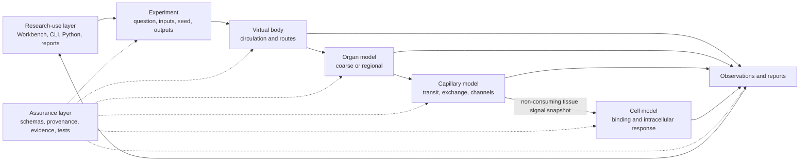

<!--
SPDX-FileCopyrightText: 2026 MEHLISSA contributors
SPDX-License-Identifier: CC-BY-4.0
-->

# MEHLISSA Next User Guide

**Guide status:** living document

**Covered platform:** accepted M0 through M7 scientific/runtime capabilities,
the complete UX-1 through UX-6 research-use layer, and MEHLISSA Research
Workbench 1.0.0

**Last updated:** 3 September 2026, after published Workbench 1.0 acceptance

This guide is the main entry point for researchers, students, and developers
who want to understand, build, inspect, or run MEHLISSA Next. Part I explains
the simulator and its experiment families without assuming C++ or simulation
expertise. Part II contains the installation, command, model, validation, and
developer workflows. Scientific derivations and architecture decisions remain
in linked specialist documents.

MEHLISSA is the integrated platform formed by its scientific simulation stack,
its research-use interfaces, and its assurance mechanisms. Milestones M0-M7
and delivery packages UX-1 through UX-6 remain useful histories of how those
capabilities were built; UX is not a separate add-on to the simulator.

Quick navigation:

- [understand the simulator](#part-i--understanding-mehlissa-and-choosing-an-experiment);
- [choose a first experiment](#6-choose-your-first-experiment);
- [install and run the software](#part-ii--technical-installation-execution-and-model-workflows); and
- [check the maintenance policy](#guide-maintenance-and-next-milestones).

### How to read project labels

Short labels connect documentation to requirements, code, tests, and data, but
they are not assumed knowledge:

| Label | Plain-language meaning |
|---|---|
| `M0` through `M8` | Milestone gates. `M7`, for example, is the accepted complete fingerprinting research-software demonstrator; the future `M8` gate concerns a governed research digital twin. |
| `M7.4` | A numbered implementation increment inside a milestone. M7.4 specifically adds concentration- and receptor-binding-based fingerprint detection. |
| `Level A` | The fingerprinting historical-timing baseline used to reproduce the dissertation's published event semantics. It is not a separate “A run”. |
| `Level B` | Mechanistic fingerprint detection based on concentration, receptor binding, and a detection threshold. |
| `Level C` | Explicit release and complete/incomplete assembly of the nine fingerprint tiles. |
| `Level D` | Executed local, gateway, body-area-network, and external-station communication. |
| `Level E` | Sensitivity, specificity, false-positive/false-negative, robustness, and misclassification analysis. |
| `P0` through `P3` | Roadmap priority tiers: indispensable foundation, dissertation core, platform expansion, and long-term vision. They do not indicate whether work has passed a gate. |
| `UX-1` through `UX-6` | Delivery packages used to build MEHLISSA's integral research-use layer: one-command execution, discovery, readable reports, experiment campaigns, Python access, and a graphical workbench. |
| run | One reproducible execution of an experiment or scenario. Any qualified label such as “baseline run” must say what makes that execution different. |

The same rule applies to domain abbreviations. `FP9` is the nine-part molecular
fingerprint used by the first complete scenario; `BVS` is the historical
BloodVoyagerS whole-body distribution reference; `BAN` is the body area
network between gateway and external station; `ODE` is an ordinary
differential-equation model; and `SSA` is a stochastic simulation algorithm.
Later sections use the short forms only after these meanings have been stated.

## Part I – Understanding MEHLISSA and choosing an experiment

### 1. What MEHLISSA is

MEHLISSA is a research simulation platform for studying how artificial
nanodevices, biological substances, and molecular signals could move and
interact across several scales of the human body. Its long-term architecture
connects four independently replaceable layers:

1. a **body layer** transports entities and substances through systemic
   circulation;
2. an **organ layer** represents organ-specific routes and physiology at a
   selected resolution;
3. a **capillary layer** represents local microcirculation, exchange, device
   residence, and molecular communication; and
4. a **cell layer** begins with independently verified receptor binding and
   threshold detection, now accepts a neutral time-scoped signal observation
   from capillary tissue, can evaluate deterministic or stochastic exposure,
   propagates receptor state into a synthetic intracellular response,
   conservatively transfers an activated device payload into a cellular
   inventory, can return a synthetic apoptosis-commitment event, and can
   aggregate that deterministic response over very large weighted cohorts.

M6 adds an independently replaceable **Nano-IoT communication plane** beside
these biological layers. M6.1 defines configured device endpoints and
traceable local messages. M6.2 translates a checked M5 detection through a
separate adapter and sends it over a replaceable local link with explicit
delivery outcomes and communication-only metrics. M6.3 composes those links
into bounded clusters with deterministic route selection and checked
store-and-forward relays. M6.4 adds an active gateway boundary for traceable
measurement publication and routed local commands. M6.5 adds replaceable BAN
transport, an external analysis/control station, an explicit allow/deny policy,
and a causally checked command return to a local actuator. M6.6 lets an optional
external network simulator determine BAN delivery, timing, and communication
energy through a versioned metadata-only boundary, without receiving biological,
measurement, or command payload content. M6.7 adds reproducible failure and
boundary-misuse experiments that distinguish accounted transport non-delivery
from fail-closed rejection while making the synthetic security scope explicit.

M7 is the first complete scenario package. Its FP9/lung declaration selects
and validates the M2-M6 stack, fixes the seed and collector cohort, and defines
the ten causal stages. The holistic runner adds concentration-based receptor
binding, explicit tiles, locator-to-station communication, and labelled
misclassification analysis. Historical timing and synthetic-interface stages
remain visibly qualified in the result.

The scientific stack is used through an integral **research-use layer**:
Workbench 1.0, the command line, reports, campaigns, the Python process and
result APIs, and notebooks. A cross-cutting **assurance layer** supplies strict
schemas, typed units, deterministic execution, provenance, evidence and licence
boundaries, tests, gate reviews, and CI. The interface and assurance layers do
not make a model biologically valid by themselves, but they make the scientific
workflows accessible, reproducible, and auditable.

The software is intended to help formulate and test computational research
hypotheses. It does not assume that one model resolution is always best. A
researcher should be able to compare a fast surrogate, a population or field
model, and a detailed particle model under the same experiment definition.

The name “entity” is deliberately general. Depending on an experiment, an
entity can stand for a nanodevice, a cell, a carrier, or another individually
tracked object. A substance amount is not an entity: it is a dimensioned
quantity that may be transported or partitioned without assigning an identity
to every molecule.

### 2. What MEHLISSA is useful for—and what it cannot claim

MEHLISSA is useful when the research question concerns one or more of the
following:

- circulation routes, transit, injection, extraction, or passive sampling;
- consequences of changing a physiological-state profile;
- comparison of alternative organ, capillary, particle, population, or field
  resolutions;
- conservation and ownership across independently implemented model layers;
- local residence, exchange, retention, adhesion, or extravasation mechanisms;
- analytical, stochastic, and numerical molecular-channel comparisons;
- reproducibility, sensitivity, uncertainty, and evidence-qualified model
  comparison; or
- eventually, complete diagnostic or therapeutic Nano-IoT workflows.

MEHLISSA is **not** currently:

- a complete virtual patient or a clinically validated digital twin;
- a medical device or a basis for diagnosis or treatment decisions;
- a geometry-resolved model of a particular person's vasculature;
- a complete representation of blood rheology, hematocrit, capillary anatomy,
  cell biology, or active external communication;
- evidence that a synthetic rate, fraction, receiver, or equivalent geometry
  is physiologically correct; or
- a guarantee that a software-verified result is biologically predictive.

Every executable scientific model therefore carries an evidence class,
validity scope, provenance, units, and limitations. A result must be
interpreted within that scope. The [M4 gate review](m4/M4_GATE_REVIEW.md), for
example, accepts capillary communication as a technical milestone while
explicitly rejecting a claim of physiological pulmonary-capillary validation.
The [M5 gate review](m5/M5_GATE_REVIEW.md) applies the same rule to the accepted
synthetic cell-response chain and explicitly does not claim biological
apoptosis or treatment validity.

### 3. The mental model

A MEHLISSA experiment separates the question being asked from the model used
to answer it:



The central concepts are:

- **Experiment:** the reproducible definition of the research question,
  selected models, inputs, time, random seeds, and requested outputs.
- **Virtual body:** a vascular transport environment. It is a computational
  model, not automatically a patient-specific anatomy.
- **Entity:** an individually identified object whose location and ownership
  must remain unambiguous.
- **Population:** an aggregate count used when individual entities are
  unnecessary or too expensive.
- **Substance:** a physical amount with explicit SI units that can be
  transported, exchanged, reacted, or measured.
- **Model component:** an independently implemented body, organ, capillary,
  cell, or communication model with named boundaries.
- **Resolution:** the abstraction level—surrogate, mesoscopic field/population,
  or detailed particle/trajectory model.
- **Observation:** a bounded record of something the simulation exposes,
  distinct from a state change.
- **Ownership:** the rule that every entity and conserved transfer belongs to
  exactly one model or acknowledged pending queue at every instant.
- **Evidence scope:** the population, state, source role, uncertainty, and
  limitations that determine what a model result may mean.

This separation makes it possible to improve one layer without embedding a
lung, capillary, or fingerprinting special case in the simulation kernel.

### 4. What you can do today

The current software can:

- validate versioned experiment manifests;
- create provenance, run-log, and checkpoint artifacts for a minimal run;
- validate arbitrary vascular graphs without recompiling;
- reproduce the canonical 95-segment dissertation graph from released legacy
  source data;
- run the deterministic M2.4 BloodVoyagerS distribution regression;
- transport identity-preserving particles through a vascular graph;
- schedule injection and extraction events;
- collect bounded trajectories, population snapshots, sample-site events, and
  passive gateway measurements;
- apply versioned rest, exercise, and posture profiles without rebuilding the
  executable;
- exchange identity-preserving entities, populations, substance amounts, and
  volume flows through a typed body–organ boundary;
- select a coarse, regional-surrogate, or literature-parameterized pulmonary
  0D implementation from a schema-validated executable model card;
- run the same body–lung–body scenario with coarse and five-lobe pulmonary
  implementations;
- traverse an independent arteriole–capillary–venule component and return to
  an organ with closed entity and payload ownership;
- change aggregate capillary recruitment while preserving in-flight progress;
- partition substance amount among blood, endothelium, interstitium, and cell
  inventories with an enforced balance;
- observe local nanodevice position and residence and optionally sample a
  conservative terminal outcome;
- compare analytical, endpoint-particle, trajectory, radial-field, and shared
  axial molecular-transport implementations;
- evaluate an independently configured reversible receptor-ligand binding case,
  including occupancy, receptor balance, and a threshold-crossing event;
- observe a retained endothelium or interstitium signal without consuming it,
  derive concentration from explicit amount and represented volume, and trigger
  the configured receptor response through a separate adapter;
- evaluate binding, threshold detection, signal withdrawal, and dissociation
  under a prescribed piecewise-constant ligand trajectory with a bounded
  numerical solver;
- propagate receptor occupancy through a conserved two-stage intracellular
  messenger/effector network using either deterministic ODE or stochastic SSA;
- convert a consistent intracellular response event into an addressed
  nanodevice activation and analytical, amount-conserving release/uptake chain;
- map intracellular amount to a bounded synthetic response and return an
  apoptosis-commitment event through a neutral higher-layer boundary;
- load versioned synthetic locator and collector nanodevice profiles;
- emit and receive a traceable local message while enforcing lifecycle, energy,
  storage, size, validity, routing, duplicate, and transmission-count rules;
- translate a causal M5 receptor detection into a traceable M6 event and
  message without coupling the cell and communication libraries;
- run the message over a replaceable one-hop link that reports delivery,
  prescribed loss, corruption, or validity expiry; and
- keep attempts, bytes, delivered latency, loss/error fractions, and
  transmitter/receiver/link energy in a communication-only metric snapshot;
- route bounded local messages through checked relays and an active gateway;
- publish a traceable measurement through a replaceable BAN adapter, evaluate
  an explicit station policy, and return an approved command to a local
  actuator with causal and replay checks;
- delegate BAN delivery outcomes, completion time, and communication energy to
  an optional external network simulator through a strict payload-free
  request/response contract;
- run twelve declared failure, miscontrol, replay, identity, capacity, and
  resource cases without unintended downstream mutation;
- validate and execute the complete FP9/lung Levels A-E workflow and retain its
  result, provenance, log, and summary;
- produce non-overwriting text, CSV, HTML, and authoritative-JSON reports;
- run controlled replicates, parameter sweeps, and same-seed comparisons;
- read and analyse scenario and campaign results through the Python API and
  licensed notebooks;
- use Workbench 1.0 for guided discovery, configuration, validation, execution,
  dashboards, comparison, provenance/evidence audit, descriptive analysis, and
  exact-value export; and
- run all accepted M0-M7 and research-use contracts in a reproducible
  cross-platform test suite.

MEHLISSA provides several integrated access routes for different research and
development needs:

| Access route | Suitable uses | Examples |
|---|---|---|
| Workbench 1.0 | guided use by new and experienced researchers | discover, edit, validate, run, inspect, compare, audit, analyse, and export the supported FP9/lung scenario and campaign |
| command line | scriptable, transparent execution without C++ | validation, discovery, minimal and BVS workflows, body-state application, complete M7 execution, reporting, and campaigns |
| Python API and notebooks | reproducible analysis and integration with research workflows | accepted process execution, versioned result readers, grouped campaign analysis, optional plots, and two notebooks |
| reference and benchmark drivers | reproduce accepted scientific and numerical comparisons | pulmonary validation, coarse/five-lobe comparison, molecular-channel comparisons, historical FP9 timing, and benchmark campaigns |
| C++ component APIs | extend or compose models and advanced workflows | organ-capillary round trip, cell and communication models, external-simulator adapters, and direct scenario composition |
| automated tests | audit contracts and reproduce acceptance evidence | focused milestone filters, negative controls, deterministic replay, conservation, identity, static analysis, and sanitizers |

The access route says how an experiment is run, not how scientifically valid it
is. A Workbench or CLI result can still use synthetic assumptions; a focused
C++ workflow can still be a strong software reference.

The M4-to-M5 connection is currently a non-consuming, spatially uniform snapshot
at an exact synchronization time. M5.3 can accept a prescribed time-varying
trajectory, but M4 does not yet generate that trajectory dynamically. The
software does not yet model tissue depletion, spatial drug diffusion or binding,
biologically calibrated pharmacodynamics or mechanistic apoptosis, biological
cell heterogeneity, a spatially or physically qualified communication channel,
a calibrated BAN protocol, authenticated or clinically authorized control, or
a participant-specific virtual body. The complete fingerprinting workflow is
implemented as a research-software demonstrator, but its historical and
synthetic mechanisms do not establish biological or clinical validity. M6
currently provides synthetic scheduled local and BAN links, not calibrated
loss, error, energy, range, throughput, or capacity models.

### 5. Experiment families and guided examples

Each example below starts with a research question. The technical links lead
to runnable commands, checked data, or focused component tests in Part II.

#### 5.1 Injection and systemic circulation

| Question element | Guided example |
|---|---|
| research question | How does the injection site influence the distribution of transported entities in the canonical vascular model? |
| inputs | BVS95 body model, injection vessel, entity count, simulation duration, master seed |
| workflow | run the deterministic BVS reference experiment or define a smaller synthetic transport case |
| outputs | active and extracted counts, vessel distributions, optional trajectories and observations, conservation totals |
| interpretation | compare distributions only after checking exact injected = active + extracted balance and the model's schematic geometry |
| limitations | BVS95 is a historical transport model with equivalent rather than patient-specific vessels; distribution agreement is not clinical validation |

Start with [the BVS reference workflow](#run-the-m24-scientific-regression) and
[transport observations and extraction](#transport-observations-and-extraction).

#### 5.2 Passive observation and gateway sampling

| Question element | Guided example |
|---|---|
| research question | How many entities pass a selected sampling site, and how much individual detail is needed to answer the question? |
| inputs | vascular route, passive measurement site, injection schedule, observation bounds |
| workflow | enable aggregate passage counts and optionally retain only the first N individual records or trajectories |
| outputs | exact aggregate counts, bounded individual events, truncation indicators, time-resolved observations |
| interpretation | aggregate counts remain authoritative even when detail is deliberately truncated |
| limitations | the current gateway is a passive observation site; range, communication errors, energy, and an active external link are M6 work |

Use [transport observations and extraction](#transport-observations-and-extraction).

#### 5.3 Physiological-state comparison

| Question element | Guided example |
|---|---|
| research question | How does a declared rest, exercise, or posture profile change transport velocity and distribution without changing vascular topology? |
| inputs | one compatible body model and two or more versioned state profiles |
| workflow | validate the model, apply each profile, and compare outputs under otherwise identical experiment settings |
| outputs | state-adjusted flows, velocities, transitions, and transport observations |
| interpretation | differences show model sensitivity to the declared profile, not automatically a prediction for every healthy person |
| limitations | the checked profiles are transparent sensitivity states; they do not yet provide complete pressure, compliance, regional exercise, or vertebral-plexus physiology |

Follow [the body-state workflow](#apply-a-body-state-profile).

#### 5.4 Coarse-versus-detailed organ models

| Question element | Guided example |
|---|---|
| research question | Which outputs change when the same body–lung–body scenario uses a coarse transit compartment or five parallel pulmonary lobe beds? |
| inputs | one shared scenario, route, seed, step, payload, and acceptance definition; two model cards |
| workflow | run the checked resolution-comparison scenario without allowing either candidate to override shared inputs |
| outputs | exact ownership and payload closure plus model-specific transit behavior |
| interpretation | unchanged scenario meaning allows differences to be attributed to model structure rather than configuration drift |
| limitations | the five-lobe model is more structured but still 0D; it is not geometry-resolved pulmonary anatomy |

See [the shared organ-resolution scenario](#compare-coarse-and-detailed-lung-resolution-in-one-scenario).

#### 5.5 Individual entities versus populations and fields

| Question element | Guided example |
|---|---|
| research question | Can a cheaper population or concentration-field model reproduce the output relevant to an individual-particle experiment? |
| inputs | shared geometry, source, observation time, transport parameters, receiver, and acceptance gates |
| workflow | compare analytical, particle/trajectory, and field implementations under one reference profile |
| outputs | receiver fractions or concentrations, stochastic error, grid/step refinement, amount balance, and work diagnostics |
| interpretation | agreement supports interchangeability for the checked output and parameter domain only |
| limitations | equal endpoint statistics do not prove equal paths, wall interactions, or biological receiver behavior |

Begin with [analytical-versus-particle comparison](#analytical-versus-particle-channel-comparison-m49),
[time-resolved trajectories](#time-resolved-molecular-trajectories-m410), and
[mesoscopic fields](#mesoscopic-concentration-fields-m411).

#### 5.6 Capillary exchange and nanodevice fate

| Question element | Guided example |
|---|---|
| research question | During local capillary transit, how is a substance partitioned and which exclusive terminal fate is sampled for a nanodevice? |
| inputs | capillary card, balanced exchange fractions, residence-sensitive outcome rates, deterministic stream, terminal owner mapping |
| workflow | complete an organ–capillary route, inspect the non-state-changing observation, and optionally enable the separate disposition profile |
| outputs | blood/endothelium/interstitium/cell amounts, balance residual, regional residence, outcome probabilities, and final owner |
| interpretation | conservation and exclusive ownership are hard software invariants; synthetic fractions and rates are experiment assumptions |
| limitations | no validated bidirectional kinetics, metabolism, reversible adhesion, tissue response, or patient-specific capillary anatomy is implied |

Read [balanced exchange](#balanced-substance-exchange-experiments-m45),
[residence observations](#nanodevice-residence-and-interaction-observations-m46),
and [terminal hand-off](#retention-adhesion-and-tissue-hand-off-m412).

#### 5.7 Flow, diffusion, and reaction across resolutions

| Question element | Guided example |
|---|---|
| research question | Do analytical, microscopic, and mesoscopic implementations agree when advection, diffusion, bulk reaction, and a wall-derived sink act together? |
| inputs | one M4.7-bound equivalent radius and velocity, source, receiver, diffusivity, two reaction rates, seed, and grid sizes |
| workflow | execute the M4.13 shared axial profile with its predeclared statistical, refinement, and conservation gates |
| outputs | receiver fractions, particle counts, reacted/active/escaped amounts, grid refinement, and balance residuals |
| interpretation | passing results verify shared semantics and numerical accounting across resolutions |
| limitations | kinetics are synthetic and cross-section averaged; particles sample endpoints rather than explicit radial wall encounters |

Use [the shared axial experiment](#one-flow-diffusion-and-wall-reaction-experiment-m413).

#### 5.8 Validation and sensitivity studies

| Question element | Guided example |
|---|---|
| research question | Does a frozen pulmonary model agree with source-disjoint data, and where does it fail? |
| inputs | immutable model card, calibration sources, independent validation data, declared comparison rules |
| workflow | run aggregate, population multipoint, or lobar validation without refitting to the evaluation data |
| outputs | endpoint agreement, residuals, RMSE, source-overlap checks, and retained failures |
| interpretation | failures are evidence about model scope; they should motivate a new version, not be hidden by changing the frozen reference |
| limitations | population-level agreement does not establish participant-level prediction or clinical validity |

Start with [interpreting model evidence](#how-to-interpret-model-evidence) and
[the pulmonary validation workflows](#run-the-pulmonary-0d-independent-validation).

The active next qualification cycle is governed by design v0.1.0 and analysis
amendment v0.2.0 of the
[PCQ-1 pulmonary and capillary protocol](qualification/PULMONARY_CAPILLARY_QUALIFICATION_PROTOCOL.md).
It freezes the entering pulmonary and capillary candidates, separates four
qualification tracks, and predeclares endpoints, data-role rules, uncertainty,
controls, and amendment policy before new participant-level outcomes. The
[PCQ-1.2 evidence-source screen](qualification/PCQ1_EVIDENCE_SOURCE_SCREEN.md)
now ranks thirteen candidates and records their methods, jointness, access,
rights, independence, public outcome exposure, and rejection reasons. It
identifies the University of Arizona iCPET cohort for primary hemodynamics,
D'Souza 2025 for same-stage functional capillary volume and flow, Lassen 2023
for a separate whole-pulmonary transit observation model, and Bailey 2019 for
the next five-lobe access inquiry. The
[PCQ-1.3 pre-outcome amendment](qualification/PCQ1_PRE_OUTCOME_AMENDMENT.md)
now locks how those measurements may be compared, minimum sample sizes,
uncertainty floors, 90% equivalence intervals, missing-data handling, and six
primary decision gates. Ten eligible participants are required for full
hemodynamic or five-lobe decisions and twelve for the functional-capillary-
volume decision; smaller eligible sets can only be reported as pilot or
inconclusive evidence. Whole-pulmonary transit remains blocked because it is
not the same observable as the model's capillary-only residence time.

No request has been sent and no participant record has been acquired. A
machine-checked protocol and numeric analysis plan show that the evaluation was
specified prospectively; they do **not** mean that
participant-level hemodynamics, capillary volume, transit, regional dynamics,
or their joint physiological state have passed validation. Researchers should
continue to cite the existing M3/M4 evidence level until a locked PCQ-1 result
is published.

[PCQ-1.4 rights-aware data ingress](qualification/PCQ1_DATA_INGRESS.md) now
provides the safe technical entry point for any future authorized records. It
checks a separate rights/provenance manifest before opening a data file,
requires measured records to remain outside Git inside an explicitly supplied
institutional quarantine directory, rejects direct identifiers and unresolved
cohort overlap, and normalizes four measurement families. Its command prints
only identities, record counts, and readiness states - never observation
values. The four repository fixtures are arbitrary synthetic software tests and
require an explicit test flag; they provide no new physiological evidence.

Researchers should not copy participant data into the repository or Workbench
workspace. A future authorized data steward must follow the quarantine and
manifest procedure in the PCQ-1.4 guide. A successful import means only that
the records are structurally and administratively eligible for later frozen
analysis. It does not mean that the sample is large enough or that any PCQ
endpoint has passed.

#### 5.9 Capillary signal, receptor binding, drug delivery, and cell response

| Question element | Guided example |
|---|---|
| research question | Can a capillary-tissue signal trigger binding and intracellular response, activate conservative device release and uptake, and return a declared cell-state transition? |
| inputs | signal trajectory, binding and network parameters, activation and response thresholds, device/payload/drug/cell identity, amount/rates, Hill parameters, duration, solver bounds, seed, explicit-cell count, or weighted amount cohorts as applicable |
| workflow | choose M5.1 binding, M5.2 hand-off, M5.3 trajectory, M5.4 receptor SSA population, M5.5 intracellular ODE/SSA comparison, M5.6 delivery, the connected M5.5-to-M5.7 response reference, or the M5.8 compressed population |
| outputs | receptor occupancy, intracellular messenger/effector state and threshold time, stochastic distributions, drug inventories and balance, bounded synthetic effect, cell state/event, or exact weighted population aggregates |
| interpretation | agreement verifies identity, time, units, solver references, named-stream replay, activation gating, conservation, response/event routing, population aggregation, bounded output, and declared sensitivities within synthetic cases |
| limitations | values, topology, device, drug, cell, response, and cohorts are synthetic; there is no dynamic M4 field, spatial drug diffusion/binding, calibrated heterogeneity, qualified pharmacodynamics, mechanistic apoptosis, or clinical validation |

Use [the analytical receptor-ligand baseline](#analytical-receptor-ligand-cell-baseline-m51)
and [the capillary-to-cell hand-off](#capillary-to-cell-signal-hand-off-m52), or
[the time-varying baseline](#time-varying-receptor-binding-m53), or
[the stochastic baseline](#stochastic-receptor-binding-and-populations-m54), or
[the intracellular network](#intracellular-response-network-m55), or
[the conservative delivery model](#conservative-nanodevice-drug-delivery-m56), or
[the apoptosis response](#apoptosis-and-higher-layer-feedback-m57), or
[the compressed population](#cohort-compressed-apoptosis-population-m58).

#### 5.10 Nanodevice, detection message, and local one-hop communication

| Question element | Guided example |
|---|---|
| research question | Can a checked receptor-threshold detection become a traceable device message, traverse an explicit local link, and reach a configured collector with separately auditable communication costs? |
| inputs | M5 receptor response; locator, collector, detection-adapter, and one-hop-link profiles; validity, size, fixed latency/energy, and scheduled outcomes |
| workflow | convert the M5 response to a neutral event, create the local message, emit it at the locator, evaluate the replaceable link, and conditionally accept it at the collector |
| outputs | event and message provenance, explicit delivery/drop reason, remaining device resources, counts and bytes, delivered latency, loss/corruption/expiry fractions, and separate transmitter/receiver/link energy |
| interpretation | the reference verifies dependency-safe coupling, causal traceability, exact endpoint/link accounting, and non-delivery semantics—not physical reachability or channel accuracy |
| limitations | all values and outcomes are synthetic; the scheduled link has no distance, propagation physics, capacity, interference, calibrated probability, relay, gateway, BAN, external network, or encryption |

Use [the nanodevice and local-message foundation](#nanodevice-and-local-message-foundation-m61)
and [detection-to-one-hop communication](#detection-to-one-hop-communication-m62).

#### 5.11 Gateway, BAN, external station, and governed command return

| Question element | Guided example |
|---|---|
| research question | Can a traceable gateway measurement reach an external station and can an explicitly permitted response return to the intended local actuator without losing its causal identity? |
| inputs | active-gateway, gateway-cluster, BAN/station, gateway endpoint, relay, and actuator profiles; measurement; requested command; validity and scheduled transport outcomes |
| workflow | publish the measurement, wrap it as a BAN frame, transfer it to the station, evaluate the command against configured causal and allow-list rules, return an approved frame, validate it at the gateway, and route the local control message |
| outputs | measurement/decision/command trace, typed approval or denial, BAN and local delivery/drop results, counts, bytes, latency, and separate transmitter/receiver/link energy |
| interpretation | the reference verifies software causality, policy visibility, replay rejection, replaceable transport, and exact accounting across the complete communication path |
| limitations | values and outcomes are synthetic; policy is not authentication, cryptography, clinical decision support, treatment authorization, fail-safe control, or actuation; no calibrated BAN technology or hardware is represented |

Use [active gateway communication](#active-gateway-measurement-uplink-and-command-downlink-m64)
and [BAN and external-station communication](#ban-and-external-analysiscontrol-station-m65).

#### 5.12 External network-simulator co-simulation

| Question element | Guided example |
|---|---|
| research question | Can an independently implemented network model determine BAN delivery, timing, and energy while MEHLISSA retains frame identity, causality, policy, and physiology? |
| inputs | external-adapter profile; BAN frame metadata; simulator/version/scenario identity; a conforming typed client or JSON exchange |
| workflow | convert the BAN frame to a payload-free request, run the external model, validate the echoed identities and response values, and map its result into the unchanged M6.5 communication session |
| outputs | delivered, lost, corrupted, or expired outcome; completion time; bytes; transmitter, receiver, and link energy; normal BAN metrics |
| interpretation | the boundary separates network-model choice from gateway, station-policy, and biological code and makes simulator replacement testable |
| limitations | the included response is a synthetic conformance fixture, not a calibrated network model; a real ns-3 or other integration needs its own assumptions, validation, reproducibility controls, and license review |

Use [external network-simulator integration](#external-network-simulator-adapter-m66)
and the [M6.6 adapter specification](m6/EXTERNAL_NETWORK_SIMULATOR_ADAPTER.md).

#### 5.13 Resilience and boundary-misuse experiments

| Question element | Guided example |
|---|---|
| research question | Do prescribed communication failures and invalid, replayed, disallowed, or excess inputs stop at the intended boundary without silently changing protected state? |
| inputs | strict M6.7 resilience profile, M6.1 device resources, M6.5 BAN/station baseline, and M6.6 external-adapter baseline |
| workflow | inject each of twelve declared cases, compare the typed result or rejection with its expected disposition, inspect communication metrics where a transport attempt occurred, and verify unchanged station/gateway/client/device observations |
| outputs | loss/corruption/expiry metrics, governance denials, invariant/resource rejections, counts, bytes, energy, and protected-state checks |
| interpretation | passing cases verify deterministic software-boundary behavior and fail-closed semantics under the declared synthetic threat model |
| limitations | this is not authentication, encryption, intrusion detection, adaptive-attacker resistance, clinical authorization, or evidence for a real failure distribution or secure medical device |

Use [the technical M6.7 workflow](#nano-iot-resilience-and-boundary-misuse-m67),
[the resilience specification](m6/M6_RESILIENCE_AND_BOUNDARY_MISUSE.md), and
[the formal M6 gate review](m6/M6_GATE_REVIEW.md).

### 6. Choose your first experiment

Use the smallest workflow that answers the intended question:

| If you want to… | Start with… | Access level |
|---|---|---|
| verify that the installation and reproducibility machinery work | minimal deterministic experiment | command line |
| study whole-body injection and circulation | BVS reference or synthetic body transport | command line |
| compare rest, exercise, or posture assumptions | body-state profiles | command line |
| run the complete FP9 lung demonstrator from validated inputs through external reporting and classification analysis | M7 fingerprinting scenario | command line |
| inspect passive sampling and bounded trajectories | transport observation report | command line/reference workflow |
| compare two pulmonary resolutions without changing the scenario | body–lung resolution comparison | executable reference workflow |
| evaluate a pulmonary model against independent evidence | pulmonary validation evaluators | executable reference workflow |
| study capillary recruitment or exchange | M4 capillary recruitment and balanced substance-exchange profiles | component/developer workflow |
| study nanodevice residence or terminal fate | M4 observation/disposition profiles | component/developer workflow |
| compare analytical, particle, trajectory, and field transport | M4 molecular-channel profiles | component/developer workflow |
| study reversible receptor occupancy and a detection threshold | M5.1 analytical receptor-ligand binding profile | component/developer workflow |
| trigger that receptor response from retained capillary tissue | M5.2 capillary-cell signal profile | component/developer workflow |
| study a prescribed ligand pulse, withdrawal, and dissociation | M5.3 time-varying receptor-ligand profile | component/developer workflow |
| explore finite-receptor noise, population occupancy, and synthetic detection errors | M5.4 stochastic receptor-ligand profile | component/developer workflow |
| compare deterministic and stochastic intracellular response | M5.5 intracellular response profile | component/developer workflow |
| activate a device and audit release plus cellular uptake | M5.6 conservative drug-delivery profile | component/developer workflow |
| inspect a synthetic apoptosis decision and higher-layer event | M5.7 apoptosis-response profile | component/developer workflow |
| aggregate a prescribed response over very large homogeneous cohorts | M5.8 apoptosis-population profile | component/developer workflow |
| inspect device capabilities, resource budgets, and a traceable local message | M6.1 versioned locator/collector nanodevice profiles | component/developer workflow |
| send a checked receptor detection over a local link and inspect communication metrics | M6.2 local-communication profile | component/developer workflow |
| compare bounded direct and relay routes | M6.3 cluster-communication profile | component/developer workflow |
| publish a local measurement and route a gateway command | M6.4 active-gateway and gateway-cluster profiles | component/developer workflow |
| inspect BAN outcomes and an explicitly governed measurement-to-command return path | M6.5 BAN/station profile | component/developer workflow |
| use an external model for BAN outcome, timing, and energy without exposing payloads | M6.6 external network-simulator profile | component/developer workflow |
| inspect fail-closed behavior for transport failures, miscontrol, replay, identity mismatch, capacity, and resource exhaustion | M6.7 resilience profile | component/developer workflow |

If the desired study needs a capillary-generated time-varying or consuming cell
signal, spatial drug diffusion/binding, biologically qualified response, a
physically qualified Nano-IoT/BAN link, authenticated clinical control, or a
clinically validated fingerprinting chain, treat
it as a future scenario design rather than silently approximating it with the
current synthetic component models.

### 7. Short glossary

| Term | Meaning in MEHLISSA |
|---|---|
| adapter | a boundary implementation that connects an external or alternative model without making the kernel depend on it |
| calibration | use of evidence to choose or fit model parameters |
| capillary bed | the local arteriole–capillary–venule transport component; current pulmonary geometry is equivalent rather than anatomical |
| component | an independently implemented model with a lifecycle and named interfaces |
| conservation | the requirement that tracked identity or physical amount is neither silently lost nor duplicated |
| entity | an individually identified transported object such as a nanodevice or cell |
| evidence class | metadata describing whether a value is synthetic, literature-derived, calibrated, or independently evaluated |
| experiment manifest | versioned description of a reproducible run, including time and random seed |
| gate | the explicit acceptance criteria that close a roadmap milestone |
| milestone label | `M` plus a number identifies a sequential delivery gate; a decimal suffix identifies one increment within it |
| model card/profile | schema-validated data selecting parameters, evidence scope, validity, and limitations without recompilation |
| named random stream | deterministic random sequence isolated by purpose so unrelated stochastic mechanisms do not perturb one another |
| observation | reported state or event that does not necessarily change routing or ownership |
| ownership | the model, store, or pending queue currently responsible for one entity or transfer |
| population model | aggregate representation that tracks counts or amounts instead of every individual |
| receptor occupancy | fraction of the declared receptor population bound to its ligand at a specified time |
| reference case | fixed inputs and expected comparison rules shared by implementations |
| realism level | `Level A` through `Level E` identify increasingly mechanistic fingerprinting capabilities, from historical timing to classification analysis; they are not separate run names |
| roadmap priority | `P0` through `P3` classify importance from indispensable foundation to long-term vision; they are not progress percentages |
| trajectory knot | time offset at which a prescribed piecewise-constant input changes value |
| surrogate | deliberately simplified model preserving selected input/output behavior within a declared scope |
| validation | comparison with evidence not used to calibrate the evaluated model; always limited to the measured population and endpoints |
| verification | evidence that software and equations implement their declared contract correctly |

## Part II – Technical installation, execution, and model workflows

Part II assumes that the reader has selected an experiment family. Begin with
the command-line workflows for installation and body transport. M3 through M7.7
sections then explain executable reference and component/developer workflows.

### Repository orientation

| Path | Purpose |
|---|---|
| `apps/` | command-line application |
| `core/` | generic simulation clock, lifecycle, quantities, and random streams |
| `experiment/` | manifests, provenance, logs, and checkpoints |
| `models/body/` | validated vascular graphs, transport, state profiles, and body-level reports |
| `models/coupling/` | versioned cross-model entity and conserved-transfer contracts |
| `models/organ/` | interchangeable lung implementations and model-definition loader |
| `models/cosimulation/` | body–organ ownership/route adapter and capillary-signal-to-cell adapter |
| `models/capillary/` | capillary transit, exchange, nanodevice observation/disposition, and molecular channels |
| `models/cell/` | receptor-ligand, intracellular response, and conservative drug-delivery models |
| `data/body-models/` | canonical executable vascular models |
| `data/body-states/` | state overlays for compatible body models |
| `data/lung-models/` | executable evidence-scoped pulmonary reference candidates |
| `data/schemas/` | versioned JSON Schemas |
| `data/reference-results/` | checked-in scientific Golden References |
| `examples/` | minimal manifests and synthetic models |
| `examples/capillary-models/` | executable M4 capillary and molecular-channel profiles |
| `examples/cell-models/` | executable M5 cell-model profiles |
| `examples/cosimulation/` | executable cross-layer adapter profiles |
| `tests/` | software, invariant, schema, and regression tests |
| `docs/` | user, scientific, architecture, and development documentation |
| `mehlissa/`, `mehlissa2.0/` | historical implementations retained as references |

### Prerequisites

On Windows, install:

- Visual Studio Community 2026;
- the **Desktop development with C++** workload;
- CMake 3.28 or newer;
- vcpkg, exposed through `VCPKG_ROOT`.

The recommended editor is Visual Studio Code with Microsoft's **C/C++** and
**CMake Tools** extensions. These extensions improve editing and project
control, but the Visual Studio C++ workload supplies the actual compiler.

Linux builds use a C++20 compiler, CMake, Ninja, and vcpkg. macOS builds use the
Xcode Command Line Tools with Apple Clang, CMake, Ninja, Python, and vcpkg. See
the [Development Guide](DEVELOPMENT.md) for the supported presets and the pinned
vcpkg bootstrap.

### Configure, build, and test on Windows

Open **Developer PowerShell for VS 2026**, change to the repository root, and
run:

```powershell
$cmake = Join-Path $env:VSINSTALLDIR 'Common7\IDE\CommonExtensions\Microsoft\CMake\CMake\bin\cmake.exe'
$ctest = Join-Path $env:VSINSTALLDIR 'Common7\IDE\CommonExtensions\Microsoft\CMake\CMake\bin\ctest.exe'

& $cmake --preset windows-msvc
& $cmake --build --preset windows-msvc-debug
& $ctest --preset windows-msvc-debug --output-on-failure
```

The debug CLI is then available at:

```text
build/windows-msvc/apps/Debug/mehlissa.exe
```

### Configure, build, and test on Linux

Install a C++20 compiler, CMake 3.28 or newer, Ninja, and vcpkg, export
`VCPKG_ROOT`, and run from the repository root:

```bash
cmake --preset linux-gcc
cmake --build --preset linux-gcc-debug
ctest --preset linux-gcc-debug --output-on-failure
```

The debug CLI is then available at:

```text
build/linux-gcc/apps/mehlissa
```

The `linux-clang-analysis` configure, build, and test preset additionally runs
Clang-Tidy, AddressSanitizer, and UndefinedBehaviorSanitizer. The remainder of
this guide shows PowerShell command continuation with a trailing backtick. On
Linux, use the executable above and either place the arguments on one line or
replace the backtick with the shell continuation character `\`.

### Configure, build, and test on macOS

Install the Xcode Command Line Tools, CMake 3.28 or newer, Ninja, Python 3.10 or
newer, and a pinned vcpkg checkout. With `VCPKG_ROOT` exported, run from the
repository root:

```bash
cmake --preset macos-apple-clang
cmake --build --preset macos-apple-clang-debug
ctest --preset macos-apple-clang-debug --output-on-failure
```

The command-line simulator is then available at:

```text
build/macos-apple-clang/apps/mehlissa
```

This is a native source build. MEHLISSA does not currently create a `.app`
bundle, installer, signed binary, or notarized distribution. The GitHub
`macos-apple-clang` job validates the complete source build and test suite on a
pinned macOS 15 ARM64 runner; it does not publish an executable artifact. This
path is accepted by the complete Apple Clang job in
[CI run 33956456353](https://github.com/RegineWendt/MEHLISSA/actions/runs/33956456353).

All paths in the following examples are relative to the repository root.

### Command overview

Run the CLI without arguments to print its current syntax:

```powershell
build/windows-msvc/apps/Debug/mehlissa.exe
```

The non-zero exit is intentional because a command is required. Stable exit
categories are documented in [Errors, Logs, and Checkpoints](m1/ERRORS_LOGS_CHECKPOINTS.md).

#### Run the complete M7 fingerprinting scenario with one command (UX-1)

`UX-1` records the first delivery increment of MEHLISSA's research-use layer.
It exposes the accepted fingerprinting demonstrator through the normal
`mehlissa` application, so a researcher no longer needs to write C++ or invoke
a test binary. The label describes implementation history; the resulting
command is now an integral platform interface.

First list the runnable scenario profiles known to the source tree:

```powershell
build/windows-msvc/apps/Debug/mehlissa.exe scenario list
```

Validate the selected scenario and every definition/schema pair it references:

```powershell
build/windows-msvc/apps/Debug/mehlissa.exe scenario validate `
  --file examples/scenarios/fp9-lung-level-a-v1.json
```

Then execute the complete Levels A-E workflow:

```powershell
build/windows-msvc/apps/Debug/mehlissa.exe scenario run `
  --file examples/scenarios/fp9-lung-level-a-v1.json `
  --output results/fp9-reference
```

The `--output` value is a parent directory. Each invocation creates a unique
child such as
`results/fp9-reference/fp9-lung-level-a-v1-20260902T094451Z`; if two runs start
in the same UTC second, a numeric suffix prevents overwriting. The command
prints the exact directory and writes:

| File | Purpose |
|---|---|
| `result.json` | complete schema-validated M7 result, including input hashes, stage trace, detection, nine-tile assembly, communication, and classification analysis |
| `provenance.json` | profile hash, run timestamps and identity, result hash, source revision, dirty-state flag, compiler, build type, operating system, and architecture |
| `run.log.jsonl` | schema-validated start/completion records or a stable failure record |
| `summary.txt` | concise outcome and non-clinical validity summary derived from `result.json` |

The same concise view can be reproduced later from any complete result:

```powershell
build/windows-msvc/apps/Debug/mehlissa.exe result summarize `
  --file results/fp9-reference/<printed-run-directory>/result.json
```

Run `mehlissa.exe scenario run --help` for all path overrides. The application
normally discovers the repository root from the current directory or selected
file; use `--repository-root <directory>` when executing from elsewhere.

This command reuses the M7 composer and holistic runner. It therefore does not
introduce a simplified second simulator. Validation completes before a run
directory is allocated. Level A remains the historical-timing baseline;
Levels B-E execute detection, assembly, communication, and the four-case
software classification analysis. The generated `Clinical validation claim:
no` line is an essential interpretation boundary, not a failed run.

#### Discover models and copy starter examples (UX-2)

`UX-2` makes the implemented model families discoverable before a researcher
chooses or edits a configuration. The catalog distinguishes five layers:

| Layer | Discoverable model family | Current evidence summary |
|---|---|---|
| body | systemic vascular transport | historical regression reference with strict graph and transport tests |
| organ | pulmonary zero-dimensional circulation | literature-parameterized with selected independent endpoint checks |
| capillary | transit, exchange, and molecular transport | mixed qualified equivalent geometry and synthetic kinetics |
| cell | receptor binding and intracellular response | software-test surrogate with analytical and stochastic verification |
| Nano-IoT | communication and governed station loop | software-test surrogate with positive and fail-closed boundary tests |

List all families or restrict the output to one layer:

```powershell
build/windows-msvc/apps/Debug/mehlissa.exe model list
build/windows-msvc/apps/Debug/mehlissa.exe model list --layer organ
```

Describe one model family to see its scope, maturity, evidence summary,
implementation artifacts, documentation, important configurable parameter
paths, limitations, and associated starter examples:

```powershell
build/windows-msvc/apps/Debug/mehlissa.exe model describe `
  --id organ.pulmonary-zero-dimensional
```

The maturity string is a compact catalog classification. Read it together with
the printed validity scope, evidence, and limitations. In particular,
`software_test_surrogate` means that a mechanism is useful for checking
software composition but is not biologically or clinically validated.

List all curated starter configurations or those associated with one family:

```powershell
build/windows-msvc/apps/Debug/mehlissa.exe example list
build/windows-msvc/apps/Debug/mehlissa.exe example list `
  --model organ.pulmonary-zero-dimensional
```

Copy a starter before modifying it:

```powershell
build/windows-msvc/apps/Debug/mehlissa.exe example copy `
  --id scenario.fp9-complete `
  --output work/my-first-scenario
```

The command creates the output directory when needed and copies both the JSON
configuration and its `.license` sidecar. It refuses to overwrite an existing
destination. A copied full scenario still resolves its selected artifacts from
the MEHLISSA source tree; pass `--repository-root <directory>` when invoking the
application outside that tree.

The machine-readable catalog is
`data/catalog/model-catalog-v1.json`; its strict schema is
`data/schemas/model-catalog/1.0.0.schema.json`. On every discovery command the
application checks the schema and also rejects duplicate IDs, unknown model
references, missing files, and catalog paths that leave the repository. A new
module becomes discoverable by adding a versioned catalog entry and at least one
representative example; the CLI itself does not need a model-specific branch.

#### Create a readable result bundle (UX-3)

The schema-valid `result.json` remains the complete and authoritative result.
UX-3 derives views from that file so that a result can be inspected or shared
without requiring a collaborator to navigate the JSON structure manually:

```powershell
build/windows-msvc/apps/Debug/mehlissa.exe result report `
  --file results/fp9-reference/<printed-run-directory>/result.json `
  --output reports/fp9-reference
```

The output directory must not already exist. This fail-safe rule prevents a new
report from silently replacing a previously reviewed bundle. Six files are
created:

| File | Purpose |
|---|---|
| `report.html` | self-contained styled overview for a browser, including outcome, workflow stages, evidence, and limitations |
| `summary.txt` | concise plain-text outcome and non-clinical status |
| `overview.csv` | stable key/value table for the principal run and classification metrics |
| `runtime-stages.csv` | ordered causal stages with time, basis, identity, and qualification |
| `analysis-cases.csv` | labelled Level-E software-analysis cases and their classifications |
| `result.json` | bundled copy of the complete schema-valid machine-readable result linked from the HTML page |

The HTML file contains no remote scripts, fonts, stylesheets, or images. It can
therefore be opened locally and shared together with the other five files. Its
evidence section lists the selected model artifacts and their SHA-256 hashes;
its limitation section is copied from the result. CSV columns are intended as a
stable analysis interface, while the JSON file retains details that deliberately
do not fit into a flat table.

The prominent `Research software only` notice and `Clinical validation claim:
no` entry are part of the result semantics. A visually clear positive detection
or complete fingerprint assembly is still an outcome of the configured software
demonstrator, not evidence of diagnostic performance in people.

#### Run controlled derived experiments (UX-4)

UX-4 turns one validated scenario into an auditable group of related runs. The
checked-in starter campaign demonstrates three useful designs without editing
C++ or manually copying scenario files:

- **replicates** repeat the base configuration with an explicit sequence of
  seeds;
- a **parameter sweep** evaluates listed collector counts and can repeat every
  value; and
- a **paired comparison** gives the baseline and comparison run the same seed,
  reducing avoidable random differences between the pair.

Validate the complete design first:

```powershell
build/windows-msvc/apps/Debug/mehlissa.exe campaign validate `
  --file examples/campaigns/fp9-collector-count-v1.json
```

The command reports the number of derived runs. Execute into a new directory:

```powershell
build/windows-msvc/apps/Debug/mehlissa.exe campaign run `
  --file examples/campaigns/fp9-collector-count-v1.json `
  --output results/fp9-collector-campaign
```

The output directory must not exist. It contains:

| Path | Purpose |
|---|---|
| `manifests/*.json` | complete, schema-valid derived scenarios with explicit run ID, seed, and collector count |
| `runs/<run-directory>/` | normal scenario result, provenance, structured log, and text summary for each derived run |
| `campaign-result.json` | schema-valid index with design role, seed, override, artifact hashes, result paths, and principal outcomes |
| `campaign-results.csv` | flat analysis table for spreadsheets, Python, or R |

The source campaign remains unchanged, every derived manifest is retained, and
SHA-256 hashes bind the aggregate record to both manifests and results. A failed
run stops the campaign without manufacturing an aggregate success record; the
already written run material remains available for diagnosis.

For this first safe contract, `run.collector_count` is the only overrideable
parameter. The historical FP9 timer baseline currently provides cohorts for
1,000 and 10,000 collectors, so the example uses those values. Adding another
parameter requires explicit units, bounds, semantic validation, and a reviewed
mapping into the scenario contract; arbitrary JSON paths are rejected.

The `sensitivity_hooks` in the aggregate identify the varied parameter and
available response columns. They make later statistical tooling possible but do
not themselves constitute a global sensitivity analysis. Repetition also does
not cure synthetic inputs or establish clinical validity: interpret every run
within the base scenario's evidence and limitations.

#### Use MEHLISSA from Python (UX-5)

UX-5 provides a stable **process API**: Python starts the normal MEHLISSA
executable, checks its exit status, reads the paths printed by the command, and
loads versioned JSON results. The C++ implementation, JSON Schemas, and command
semantics remain the single authority; Python does not reproduce simulation
logic or silently relax validation.

Python 3.10 or newer is required. From the repository root, either install the
package in a virtual environment. On Windows PowerShell:

```powershell
py -m venv .venv
.venv\Scripts\Activate.ps1
python -m pip install -e .
```

On Linux:

```bash
python3 -m venv .venv
source .venv/bin/activate
python -m pip install -e .
```

or use the source tree directly for a quick local session:

```powershell
$env:PYTHONPATH = "$PWD/python"
python
```

Create a client with the executable and repository root, then run and read a
scenario:

```python
from mehlissa import MehlissaClient, load_result

client = MehlissaClient(
    "build/windows-msvc/apps/Debug/mehlissa.exe",
    ".",
)
execution = client.run_scenario(
    "examples/scenarios/fp9-lung-level-a-v1.json",
    "results/python-fp9",
)
result = load_result(execution.result)
print(result.summary)
```

`ScenarioExecution` exposes the exact run directory and result, provenance,
log, and summary paths. `ScenarioResult` provides `summary`, `runtime_stages`,
and `analysis_cases` while retaining the complete source document. The loader
accepts fingerprinting result schema `2.0.0` and fails explicitly on unknown
versions instead of guessing their meaning.

The client also exposes discovery, validation, readable reporting, and UX-4
campaign commands. A complete campaign workflow is:

```python
from mehlissa import load_campaign_result

campaign_execution = client.run_campaign(
    "examples/campaigns/fp9-collector-count-v1.json",
    "results/python-campaign",
)
campaign = load_campaign_result(campaign_execution.result)
print(campaign.groups())
print(campaign.paired_differences("sensitivity"))
```

`CampaignResult.metric_series()` returns analysis-ready value/response pairs;
`groups()` preserves experimental groups; and `paired_differences()` matches
baseline and comparison by group, replicate number, and shared seed. It rejects
incomplete pairs and unsupported metrics. These helpers are descriptive: they
do not add statistical power, uncertainty propagation, or clinical validity.

Plotting is optional so headless execution and the core API have no third-party
runtime dependency. Install it with:

```powershell
python -m pip install -e ".[plot]"
```

Then call `result.plot_runtime()` or
`campaign.plot_metric("sensitivity")`; both return a Matplotlib axes object for
further customization. The two licensed starter notebooks are:

- `examples/notebooks/01-first-scenario.ipynb` for discovery, validation,
  execution, result reading, reporting, and a stage-time plot; and
- `examples/notebooks/02-campaign-analysis.ipynb` for campaign execution,
  grouping, paired differences, and a response plot.

Run Jupyter from the repository root so the examples find both `python/` and
the build directories. Change the candidate executable list in the setup cell
if your build is elsewhere. Re-running a fixed campaign output is intentionally
rejected; the campaign notebook therefore uses a timestamped directory.

When a command fails, `MehlissaCommandError` retains the argument vector, exit
status, stdout, and structured stderr such as `MEHLISSA-E2005`. Catch it only
when an analysis can handle the failure explicitly; never convert failed runs
into apparent observations. Identifiable patient data still must not be placed
in notebooks, repository examples, or shared result bundles.

#### Configure, validate, run, analyse, and audit results in MEHLISSA Research Workbench 1.0 (UX-6.1 through UX-6.8)

The local browser workbench is MEHLISSA's recommended guided entry point, not a
separate simulator. It lets you search the five implemented model families and
ten curated starter examples. UX-6.2 provides a guided editor for the
complete FP9/lung fingerprinting scenario, and UX-6.3 explains structural,
semantic, and cross-file problems before save. UX-6.4 starts and monitors either
that exact validated scenario or the curated six-run collector-count campaign.
UX-6.5 turns completed artifacts into readable dashboards and guarded
comparisons without moving scientific interpretation into the browser.
UX-6.6 keeps provenance, evidence, licences, maturity, limitations, and the
non-clinical interpretation boundary beside those results.
UX-6.7 adds descriptive campaign analysis, accessible plots, exact-value
tables, and reproducible analysis-data and figure exports.
UX-6.8 packages the integrated client as Workbench 1.0.0, supplies a stable
console command and example workspace, and verifies clean installation,
novice/expert tasks, keyboard and screen-reader semantics, responsive recovery,
and supported-platform release gates.

From the repository root, create an isolated Python environment, install the
local package, and check that the workbench can locate the application and read
its validated catalog:

```powershell
py -m venv .venv
.\.venv\Scripts\Activate.ps1
python -m pip install .
mehlissa-workbench --version
mehlissa-workbench --repository-root . --check
```

The check prints `workbench_status=ready`, `scenario_editing=true`, the model
and example counts, the number of available scenario sources, and
`scenario_validation=valid` after checking the starter through the accepted
validator. It also prints `run_plan_count=1` for the one curated graphical
campaign. Then start the interface:

```powershell
mehlissa-workbench --repository-root .
```

The launcher searches the normal Windows Debug/Release, Linux GCC/Clang, and
macOS Apple Clang build locations, prints a unique local URL, and normally opens
the default browser. If your executable is elsewhere, specify it explicitly:

```powershell
mehlissa-workbench `
  --repository-root . `
  --executable build/windows-msvc/apps/Debug/mehlissa.exe
```

On Linux, the equivalent complete setup is:

```bash
python3 -m venv .venv
source .venv/bin/activate
python -m pip install .
mehlissa-workbench --version
mehlissa-workbench --repository-root . --check
mehlissa-workbench --repository-root .
```

The same commands apply on macOS after the Apple Clang source build; use
`python3` to create the virtual environment. The launcher automatically checks
`build/macos-apple-clang/apps/mehlissa`.

The Python package contains the process API, readers, host, browser assets, and
licence. It does not embed the C++ executable or duplicate the matching
repository's schemas, model/evidence records, examples, and campaign
definitions; build the application first and retain the checkout as an
explicit scientific input.

Use `--no-browser` when you want only the printed URL. Press `Ctrl+C` in the
launching terminal to stop the host. Do not bookmark or share the URL: it
contains a short-lived capability that authorizes this one local process and is
removed from browser history after startup.

For keyboard use, press `Tab` and `Shift+Tab` in logical document order,
`Enter` or `Space` to activate a control, and `Escape` to dismiss a dialog.
The first focusable skip link moves directly to the main workspace. Opening
Save places focus on the new filename; opening Run places it on the explicit
confirmation. Screen readers receive named navigation, main, section, form,
dialog, table, figure, status, and alert structures. At narrow widths or high
browser zoom, cards reflow into one column and wide scientific tables scroll
inside their own containers rather than widening the entire page.

In **Configure an experiment**, keep the implemented complete FP9/lung model
selected and choose either the curated starter or a previously saved local
scenario. Each guided field shows its schema definition, unit, documented
default, evidence basis, and interpretation limitation. Immutable contract
fields remain visible but disabled. Expand **Complete source JSON** to inspect
the live full document, including all 13 artifact bindings, evidence sources,
limitations, acceptance rules, and any fields not represented by a control.

When you change a field, the page marks the scenario as unsaved, updates the
source view, and briefly shows **Checking**. The host reconstructs the complete
candidate and asks the normal `mehlissa scenario validate` command for the
authoritative decision. A red **Invalid** state blocks save and the run
gate. Each issue keeps a stable `WBV-*` workbench or `MEHLISSA-E####` command
code, a dotted field/document location, and concrete repair guidance. Red
errors block the workflow; amber warnings permit save but state a scientific
interpretation risk—for example, changing a seed produces another stochastic
realization rather than an uncertainty estimate.

Expand **Shareable validation summary** to see the decision, scenario identity,
candidate SHA-256 digest, error/warning counts, located issues, correction
guidance, and non-clinical boundary. **Copy summary** puts the plain text on the
clipboard for an issue or review record. The digest identifies the exact
candidate that was checked; changing any retained field changes the digest.

When the status is **Valid**, choose **Save as…** and a new basename ending in
`.json`. Save repeats complete authoritative validation, so a stale page or
direct request cannot bypass the gate. A successful file immediately appears
as a saved scenario and can be reopened. Existing files are never overwritten.
Resetting, opening another source, or leaving the page still asks before
discarding changes.

By default, new files are written to the Git-ignored
`workbench-scenarios/` directory. To use another directory inside this
repository, start the host with:

```powershell
mehlissa-workbench `
  --repository-root . `
  --workspace results/scenario-drafts
```

Only safe JSON filenames and sources listed by the workbench can be accessed.
Unsupported or future fields are shown in the source view and retained; if the
current schema does not accept them, save fails visibly instead of silently
dropping them. A rejected save does not create the destination.

In **Run and monitor**, choose **Current validated scenario** for one execution,
or **Six-run collector-count campaign** for the accepted UX-4 experiment. The
campaign plan visibly expands its two baseline replicates, two-value
`run.collector_count` sweep, and paired 1,000-versus-10,000 comparison. A
*replicate* repeats a configuration with a declared random seed; a *sweep*
changes one declared parameter across selected values; and a *paired
comparison* evaluates two parameter values with the same seed so stochastic
variation is controlled within each pair.

Enter an output label using letters, numbers, dots, underscores, or hyphens.
This is a label, not a filesystem path. **Review and confirm run…** shows the
exact scenario hash or campaign plan, seeds, run count, and resolved destination.
Check the explicit confirmation only after reviewing it. The server repeats
scenario validation immediately before start and rejects stale or invalid
candidates.

Every start creates a unique Git-ignored directory such as
`workbench-runs/fp9-workbench-<unique-id>/`. It initially contains the exact
`scenario-input.json` or `campaign-manifest.json` and an atomically updated
`run-record.json`. To select another bounded repository-local root, use:

```powershell
mehlissa-workbench `
  --repository-root . `
  --runs results/workbench-runs
```

The monitor shows queued, executing, collecting, completed, failed, or cancelled
state plus progress, run identity, output path, run count, and seeds. Its log is
deliberately bounded to the last 200 lines and 64,000 characters. Artifact
buttons open the exact retained input, workbench record, command output,
simulation result, provenance, simulation log, summary, or campaign CSV through
the protected local API. The underlying files stay available after the browser
view closes.

**Cancel run** requests termination of the owned MEHLISSA process. Cancellation
does not delete evidence: the retained input, run record, bounded output, and
any partial files remain, and the terminal state is `cancelled`. A cancelled or
failed run is not an observation and must not be counted in an analysis.

In **Understand completed outcomes**, select any retained job and choose
**Open result dashboard**. A completed individual scenario shows detection,
nine-tile assembly, sensitivity, specificity, collector count, master seed,
cumulative stage times in milliseconds, and the four Level-E analysis cases.
Use **Open authoritative result JSON** for exact machine-readable detail.
**Open UX-3 HTML report** displays the established self-contained report in a
script-disabled sandbox inside the workbench.

Completed campaigns are separated into the declared reproducibility replicate,
collector-count sweep, and same-seed paired-comparison groups. Their tables show
identity, role, replicate number, seed, collector count, detection, assembly,
sensitivity, and specificity. Paired differences are comparison minus baseline
for all four supported outcomes and come from the accepted campaign reader.
The aggregate JSON and CSV remain available for audit and downstream analysis.

Below a completed campaign dashboard, **Campaign analysis** provides four
selectable outcomes: sensitivity and specificity as proportions, plus detected
and nine-tile assembled as binary values. For the selected outcome it shows:

- **Replicate observations:** repeated baseline runs with different declared
  seeds, together with the arithmetic mean, sample standard deviation when at
  least two observations exist, and observed minimum-to-maximum range;
- **Collector-count sweep:** the outcome at each declared
  `run.collector_count` value, which is a deterministic parameter contrast and
  not an uncertainty distribution; and
- **Same-seed paired difference:** comparison minus baseline for each declared
  pair, controlling the seed within the pair without creating population-level
  evidence.

Each figure names the outcome, unit, and included sample count and is followed
by an exact-value table. Colour is never the only carrier of meaning. The
current six-run reference campaign is intentionally small: it has two baseline
replicates, one observation at each sweep value, and one paired difference.
Its present Level-E sensitivity and specificity values are both 0.5 for all
runs, so flat lines and a paired difference of zero are the honest expected
result, not a rendering defect.

The **observed range** is a descriptive minimum and maximum of the executed
runs. It is not a confidence interval, prediction interval, population
distribution, clinical uncertainty estimate, or patient-specific statement.
No inferential interval is calculated at this sample size. Increase and
scientifically justify the campaign design before making broader claims.

Use **Download analysis data JSON** for the complete structured analysis,
including the accepted reader, declared sensitivity hooks, source result hash,
summaries, plotted points, and interpretation boundary. **Download analysis
table CSV** contains the exact observations and paired differences used by the
views. Each **Download this figure SVG** button saves a self-contained vector
figure whose metadata and accessible description record the metric, unit,
sample count, analysis API version, and source result SHA-256. These exports
are produced locally and never uploaded.

After at least two individual scenarios have completed, select a **Left run**
and **Right run** under **Compare two completed scenarios**. Numeric differences
are right minus left. Boolean outcomes are not turned into artificial numbers,
and missing values are labelled and excluded rather than replaced with zero.

Running, collecting, failed, and cancelled jobs can be selected only to explain
why no result is available: their dashboard states zero included observations
and returns no scientific rows. They never appear in the two-run comparison
selectors. Execution failure therefore cannot look like a negative biological
result.

Every completed dashboard continues with **Audit summary**. The green or amber
status labels answer two different questions: **Integrity** states whether the
currently retained bytes match their declared hashes; **Evidence** states
whether every selected input has complete source and licence metadata. A green
integrity result is not a statement that the biology is correct.

The audit lists the complete seed plan, completion time, software version, Git
revision and dirty state, compiler, operating system, and architecture recorded
at execution. Its integrity table compares expected and observed SHA-256 values
for the validated candidate, physically retained scenario profile, result,
every model definition, and every schema. A campaign additionally checks the
retained campaign manifest and all six derived manifests and results, and shows
each derived run's provenance and seed. `Verified` means matching bytes;
`Altered` means a mismatch; `Missing` means the declared artifact is unavailable
inside the permitted repository/job boundary. Either of the last two produces
the aggregate `Attention` state.

Under **Scenario evidence and licences**, citations retain their role, declared
licence/status, and DOI/URL or repository location. **Model and input maturity**
has one expandable entry per selected component. `software_test_surrogate`,
`literature_parameterized`, `externally_derived`, and `hypothesis` are rendered
as plain-language research maturity labels. They are never converted into a
clinical grade; every component remains marked **Not clinically validated**.
Level A means the accepted integrated historical-timing vertical slice, not an
“A run”, a patient grade, or high clinical evidence.

The current FP9 audit legitimately shows **Evidence: Incomplete** while all
hashes verify. The historical timer profile contains traceable citations and
repository locations but predates the common source schema and has no
per-source licence fields. This is a metadata gap to resolve explicitly; the
workbench will not guess or silently inherit a licence.

Use **Download complete audit JSON** to save the exact audit response shown by
the interface. The file includes the original provenance object without
discarding fields and is suitable for review or attachment to a research
record. **Complete machine-readable audit and original provenance** provides an
in-page read-only view. The download is generated on this computer; nothing is
uploaded.

The host listens only on the local computer, serves no remote assets, records
no telemetry, and is not a patient-data workflow. The page's research-software
notice is binding: displayed maturity and evidence do not make a model
patient-specific or clinically valid. Product roles, technology trade-offs,
wireframes, and the baseline are in the
[UX-6.1 foundation](ux/UX6_1_PRODUCT_AND_TECHNICAL_FOUNDATION.md); the editor,
round-trip, and security contracts are in the
[UX-6.2 workspace description](ux/UX6_2_GUIDED_SCENARIO_WORKSPACE.md). Error
codes, locations, repair rules, validation responses, and the execution gate
are specified in the
[UX-6.3 validation contract](ux/UX6_3_VALIDATION_AND_CORRECTIVE_FEEDBACK.md).
Run plans, state transitions, cancellation, retention, and protected artifact
access are specified in the
[UX-6.4 run-control contract](ux/UX6_4_RUN_AND_CAMPAIGN_CONTROL.md).
Reader ownership, displayed fields, comparison arithmetic, report preview, and
the missing/failed-run policy are specified in the
[UX-6.5 dashboard contract](ux/UX6_5_RESULT_DASHBOARD_AND_COMPARISON.md).
Provenance fields, hash states, evidence completeness, maturity labels,
licence display, and audit export are specified in the
[UX-6.6 audit contract](ux/UX6_6_PROVENANCE_EVIDENCE_AND_INTERPRETATION.md).
Campaign statistics, chart semantics, exact exports, and interpretation limits
are specified in the
[UX-6.7 analysis and export contract](ux/UX6_7_SENSITIVITY_UNCERTAINTY_VISUALIZATION_AND_EXPORT.md).
Clean installation, representative novice/expert tasks, accessibility and
error-recovery checks, the packaging boundary, and the local-versus-published
release gates are specified in the
[UX-6.8 release acceptance](ux/UX6_8_RELEASE_ACCEPTANCE.md). The concise starter
route is also available in the
[Workbench example workspace](../examples/workbench/README.md).

If the page says that the catalog or scenario workspace could not be loaded,
stop the process, run the `--check` command, and confirm that the selected
executable belongs to this repository build. A missing session message usually
means an old or bookmarked URL was used; restart the launcher and use its newly
printed URL. If validation is unavailable, confirm that the executable belongs to this
checkout and inspect the launching terminal. If a field is red, use its code
and repair text; if only the document issue list is red, inspect the named
section in **Complete source JSON**. A `$` location means the validator could
not safely narrow the failure to one section. A rejected save creates no file.
If a run start is rejected, recheck the visible plan, confirmation, output
label, and current validation. If execution fails or is cancelled, inspect the
retained workbench record and command log; do not rename the job to make it look
successful. A missing artifact means it was not produced before the terminal
state, not that its scientific value is zero.
If a completed dashboard cannot be read, open its retained result JSON and
confirm that its schema version is supported by the installed Python package.
If comparison controls remain disabled, complete two individual scenarios;
campaigns and non-completed jobs are intentionally ineligible.
If an audit reports `Attention`, inspect the named expected and actual hashes;
do not use or rename the artifact to conceal the mismatch. If it reports
`Evidence: Incomplete`, expand the component entries to identify the exact
missing source or licence declaration. Neither state means that a missing
scientific outcome should be replaced with zero.
If `mehlissa-workbench` is not found after installation, activate the virtual
environment again and verify `python -m pip show mehlissa-research`. If
`--version` works but `--check` fails, the Python installation is healthy and
the reported executable, checkout, schema, or example diagnostic identifies
the remaining integration problem.

#### Validate an experiment manifest

```powershell
build/windows-msvc/apps/Debug/mehlissa.exe validate `
  --experiment examples/experiments/minimal.json `
  --schema data/schemas/experiment/1.0.0.schema.json
```

Validation first checks the JSON Schema and then semantic constraints such as
duration, seed, model list, and output directory.

#### Run the minimal deterministic experiment

```powershell
build/windows-msvc/apps/Debug/mehlissa.exe run `
  --experiment examples/experiments/minimal.json `
  --schema data/schemas/experiment/1.0.0.schema.json `
  --checkpoint-schema data/schemas/checkpoint/1.0.0.schema.json
```

The configured output directory receives:

- `provenance.json` with software, input hash, seed, and timing information;
- `checkpoint-000000.json` with clock and random-stream state;
- `run.log.jsonl` with structured lifecycle events.

This command currently demonstrates the reproducible M1 runtime contract. The
M3 body–organ path is tested as a typed developer API but is not yet composed by
this general CLI command.

#### Validate a vascular model

```powershell
build/windows-msvc/apps/Debug/mehlissa.exe validate-body `
  --model data/body-models/bvs95-dissertation-rest-v1.json `
  --schema data/schemas/vascular-graph/1.0.0.schema.json
```

Validation covers stable IDs, SI units, geometry, area, volume, velocity,
flow, transition probabilities, source references, strong connectivity, and
junction-flow conservation.

To prove that the loader is not hard-coded for BVS95, validate the synthetic
four-segment model with the same executable:

```powershell
build/windows-msvc/apps/Debug/mehlissa.exe validate-body `
  --model examples/body-models/synthetic-branching-circuit.json `
  --schema data/schemas/vascular-graph/1.0.0.schema.json
```

#### Recreate the canonical 95-segment model

```powershell
build/windows-msvc/apps/Debug/mehlissa.exe migrate-legacy-95 `
  --vasculature mehlissa2.0/data/95_vasculature.csv `
  --transitions mehlissa2.0/data/95_transitions.csv `
  --output build/bvs95-recreated.json `
  --schema data/schemas/vascular-graph/1.0.0.schema.json
```

The converter is deterministic. Tests require its result to match the
checked-in canonical graph byte for byte. It does not overwrite the historical
CSV files.

#### Run the M2.4 scientific regression

```powershell
build/windows-msvc/apps/Debug/mehlissa.exe reference-bvs `
  --model data/body-models/bvs95-dissertation-rest-v1.json `
  --output build/bvs95-reference-report.json `
  --schema data/schemas/vascular-graph/1.0.0.schema.json `
  --report-schema data/schemas/bvs-reference-report/1.0.0.schema.json
```

This run checks:

- minute-7 versus minute-120 distribution equilibrium;
- aorta versus popliteal injection;
- 6,359 versus 63,590 particles;
- exact population conservation;
- the 23 dissertation perfusion targets.

The expected checked-in result is
`data/reference-results/bvs95-dissertation-rest-m2.4.json`. Scientific meaning
and limitations are explained in the [M2.4 report](m2/BVS_REFERENCE_REGRESSION.md).

#### Apply a body-state profile

The same executable can derive a state-specific graph from a compatible base
model. No source change or rebuild is required.

```powershell
build/windows-msvc/apps/Debug/mehlissa.exe apply-body-state `
  --model data/body-models/bvs95-dissertation-rest-v1.json `
  --profile data/body-states/bvs95-supine-cycle-exercise-1.9x-v1.json `
  --output build/bvs95-exercise.json `
  --schema data/schemas/vascular-graph/1.0.0.schema.json `
  --profile-schema data/schemas/body-state-profile/1.0.0.schema.json
```

Available M2.6 profiles are:

| Profile | Cardiac-output effect | Interpretation |
|---|---:|---|
| `bvs95-rest-supine-v1.json` | ×1.0, 6.0 L/min | historical dissertation identity baseline |
| `bvs95-supine-cycle-exercise-1.9x-v1.json` | ×1.9, 11.4 L/min | global-flow exercise sensitivity |
| `bvs95-head-up-tilt-70deg-v1.json` | ×0.7833, 4.7 L/min | global-flow head-up-tilt sensitivity |

The profile is schema-validated and must name the exact compatible model and
version. Application then:

1. applies any topology-preserving transition overrides;
2. solves the complete stationary flow system;
3. anchors it to the requested cardiac-output multiplier;
4. recomputes mean velocity from flow and fixed cross-sectional area;
5. validates the resulting vascular graph again;
6. writes all profile sources and validity limits into the derived model.

The exercise and tilt files are sensitivity profiles, not clinically validated
physiological models. Read their `limitations` arrays and the
[M2.6 model note](m2/BODY_STATE_PROFILES.md) before interpreting results.

### Transport observations and extraction

M2.5 transport observation is currently exposed as a typed C++ API. A
`CompartmentTransport` can be configured with:

- scheduled `InjectionEvent` and `ExtractionEvent` objects;
- passive `sample` and `gateway` measurement sites;
- trajectories selected as `none`, `all`, or deterministic `first_n`;
- hard record limits for trajectories and individual measurements;
- a population-snapshot interval and hard snapshot limit.

When a detail limit is reached, the report sets the corresponding truncation
flag. Aggregate measurement counts and the invariant
`active + extracted = injected` remain exact.

The output writer validates JSON against:

```text
data/schemas/transport-observation-report/1.0.0.schema.json
```

The full event-order and truncation contract is documented in
[Transport Output, Extraction, and Measurement Sites](m2/TRANSPORT_OBSERVATION.md).
A CLI/manifest connection for this body observation configuration remains
planned. Standalone lung definitions already provide schema-validated M3 organ
selection, but the general experiment manifest does not compose them yet.

### Body–organ coupling and pulmonary models

M3 uses a typed C++ boundary rather than a scenario-specific body shortcut. A
`ModelComponent` exposes a stable model ID, named entry and exit ports, and
versioned entity and conserved-quantity transfers. Implementations include
`LungCompartment`, a coarse transit surrogate; `PulmonaryCirculation`, a serial
artery/regional-capillary/vein surrogate; literature-parameterized mean 0D
hemodynamic candidates; and the five-parallel-lobe v7 model.

The current contract verifies that:

- an incoming transfer names its source and target model and port;
- acceptance occurs at the declared synchronization time;
- an entity ID cannot exist twice inside the organ boundary;
- identity and entity type survive pulmonary transit;
- the outgoing transfer names the configured venous return route; and
- population count, molar amount, flow rate, interval, and integrated volume
  survive lossless transit; and
- compatible time-step subdivisions produce the same result: 0.5 s/1.0 s for
  both software surrogates and 0.1 s/0.2 s for the 6.4-second pulmonary 0D
  card.

The executable lung model cards are:

```text
examples/organ-models/lung-compartment-contract-v1.json
examples/organ-models/lung-regional-contract-v1.json
data/lung-models/healthy-adult-rest-supine-0d-v1.json
data/lung-models/healthy-adult-rest-exercise-0d-v2.json
data/lung-models/healthy-adult-rest-exercise-age-0d-v3.json
data/lung-models/healthy-adult-rest-exercise-age-invasive-0d-v4.json
data/lung-models/healthy-adult-pressure-distensible-age-0d-v5.json
data/lung-models/healthy-adult-pressure-distensible-age-0d-v6.json
data/lung-models/healthy-adult-lobar-parallel-0d-v7.json
```

The two contract cards validate against
`data/schemas/lung-model-definition/1.0.0.schema.json`. They are classified as
`software_test_surrogate`; their transit values are not physiological data.
The resting 0D card validates against schema 1.1.0 and records SI pressure, flow,
resistance, compliance, transit, right/left perfusion, uncertainty, evidence
roles, derivations, and limitations. At its resting reference state it predicts
15.2 mmHg mean pulmonary-arterial pressure from 6 L/min cardiac output, 8 mmHg
left-atrial pressure, and 1.2 Wood units PVR. It is a composite healthy-adult
reference candidate, not a patient or clinical model.

The flow-adaptive v2 card validates against schema 1.2.0. It preserves the v1
resting state and applies independently sourced, bounded PVR and compliance
multipliers between the resting reference and the calibrated peak/rest flow
ratio. It does not extrapolate below or above that interval.

The age-conditioned v3 card validates against schema 1.3.0 and preserves v2's
flow rules. Set `hemodynamics.age_conditioning.default_age_years` to the age
represented by the scenario: 18–<40 applies a PVR multiplier of 0.92335,
40–<60 uses 1.0, and 60–85 applies 1.12246. Values outside 18–85 are rejected.
The age factor changes PVR only; it does not imply age-conditioned compliance,
PAWP, anatomy, or patient physiology. See the
[age-conditioning model card](m3/PULMONARY_0D_AGE_CONDITIONING.md) before use.

The v4 card also uses schema 1.3.0. For ages 24–under-40 it replaces the v3
PASP/CO proxy with an invasive resting-PVR multiplier of 0.71875. The middle
and older bands and the bounded flow law remain unchanged. Ages below 24 are
outside v4's source support and are rejected. Read the
[young-adult resistance model card](m3/PULMONARY_0D_YOUNG_RESISTANCE.md) for
the derivation and evidence-overlap rule.

The v5 card validates against schema 1.4.0. It retains v4's resting and age
calibration but replaces empirical flow adaptation with a Linehan
pressure-distensible relationship. The schema and runtime reject enabling both
laws together. A fixed `0.020 mmHg^-1` healthy coefficient is converted to SI,
and zero-pressure resistance is derived so that the qualified resting state is
unchanged. Read the
[pressure-distensibility model card](m3/PULMONARY_0D_PRESSURE_DISTENSIBILITY.md)
before using v5; its frozen population comparison is weaker than v4.

The v6 card validates against schema 1.5.0. It keeps `alpha = 0.020 mmHg^-1`
below age 60 and uses the independently reported older value
`0.015 mmHg^-1` from age 60. The older calibration is directly supported in
men, so using v6 as sex-neutral is an explicit extrapolation. Read the
[age-distensibility model card](m3/PULMONARY_0D_AGE_DISTENSIBILITY.md) before
interpreting v6.

The v7 card validates against schema 1.6.0 and instantiates five anatomically
named parallel 0D beds while preserving the qualified v4 aggregate response.
Its fixed healthy-adult supine lobe shares pass an independent normal V/Q
SPECT/CT comparison. The shares are population-level and static; they do not
provide participant anatomy or dynamic posture/activity redistribution. Read
the [parallel-bed model card](m3/PULMONARY_LOBAR_PARALLEL_BEDS.md) and
[independent lobe validation](m3/PULMONARY_LOBAR_PERFUSION_VALIDATION.md).

The optional external-data section can preserve a source checksum, format,
coordinate system, units, and transformation history, but no qualified
pulmonary geometry is distributed yet.

This remains a developer API: the first explicit body → lung → body ownership
round trip is implemented, but the CLI cannot yet compose it automatically.
See the [M3 implementation evidence](m3/README.md),
[model-definition guide](m3/LUNG_MODEL_DEFINITIONS.md), and the model cards
before interpreting results.

### How to interpret model evidence

MEHLISSA distinguishes:

- **historical regression:** reproduces a previous implementation or paper;
- **calibration:** chooses parameters to match target values;
- **verification:** checks software and numerical invariants;
- **validation:** compares against independent evidence;
- **sensitivity scenario:** explores a transparent assumption without claiming
  complete physiology.

These labels are not interchangeable. In particular:

- the BVS95 geometry is schematic;
- its equivalent diameters are transport parameters, not measured anatomy;
- the M2.4 perfusion table is a calibration regression;
- the M2.6 exercise and posture profiles change global flow but do not yet
  model complete regional redistribution;
- the coarse and serial-region lung variants are verification surrogates;
- the pulmonary 0D variants have qualified independent aggregate validation
  for healthy pressure, compliance, and resting RC behavior; v2 also has a
  source-disjoint exercise adaptation and a 10/18 published-population result.
  v3 adds a separate Kane-calibrated PVR age factor and improves the unchanged
  population comparison to 14/18 stages, but still agrees with only 1/5 young
  stages. v4 uses invasive young-adult PVR calibration and agrees with all
  15 stages in the disjoint Wolsk cohort, while the overlapping Kovacs 2009
  series is not counted. v5 provides a structurally distinct pressure-
  distensible experiment and agrees with 11/15 frozen Wolsk stages; its 1/5
  older-stratum result is a declared limitation, so it does not replace v4.
  V6 uses an independent older coefficient and reduces older pressure RMSE,
  but stage agreement remains 11/15. A
  software-verified subject-level multipoint analysis
  path exists;
  measured participant-level data have not yet been licensed or evaluated,
  and no variant is geometry-resolved or fully pulsatile,
  patient-specific, or clinically usable. V7 adds five anatomically named
  parallel lobe beds;
  its fixed healthy-adult supine shares pass an independent V/Q SPECT/CT
  comparison, but dynamic redistribution is not yet modeled;
- none of the current outputs is patient-specific or suitable for clinical
  decision-making.

#### Run the pulmonary 0D independent validation

After building the Debug preset, run only the independent validation checks:

```powershell
ctest --test-dir build/windows-msvc -C Debug `
  -R "Independent pulmonary|Pulmonary validation" --output-on-failure
```

The versioned observations are in
`data/validation/pulmonary-zero-dimensional/healthy-adult-independent-v1.json`
for the immutable resting baseline and `healthy-adult-independent-v2.json` for
the bounded flow-adaptive candidate.
The human-readable protocol, results, and limitations are in
`docs/m3/PULMONARY_0D_INDEPENDENT_VALIDATION.md`. The validator rejects a
validation source that is also present in the model evidence card. A passing
aggregate result must still be read together with diagnostic failures and the
declared validity scope.

The v2 result is not a fitted Bentley reproduction: Claessen et al. supplies
the adaptation calibration, while Bentley remains the untouched stress-test
cohort. The exercise RC discrepancy improves but remains a diagnostic failure.

#### Run the published-population multipoint validation

The immediately usable multipoint cases contain four non-overlapping healthy
population series from Kovacs and Wolsk. They apply reported mean PAWP and flow
as stage boundaries and never refit v2 or v3 parameters. The v4 case contains
only the three Wolsk series because its Kovacs 2012 calibration overlaps the
historical corpus underlying Kovacs 2009.

Run its checks with:

```powershell
& build/windows-msvc/tests/Debug/mehlissa_organ_model_tests.exe `
  "[population-multipoint-validation]"
```

The v2 evidence file is
`data/validation/pulmonary-zero-dimensional/healthy-population-multipoint-v1.json`.
The v3 evaluation is locked in `healthy-population-multipoint-v2.json`, whose
Wolsk series add predeclared representative ages of 29.5, 49.5, and 70 years;
it uses population schema 1.1.0. The v2 case remains on immutable schema 1.0.0.
The v4 evaluation is `healthy-population-multipoint-v3.json` and also uses
population schema 1.1.0.
The v5 structural evaluation is
`healthy-pressure-distensible-population-v1.json` and uses the same schema and
the same three Wolsk series without fitting.
The v6 age-distensibility evaluation is
`healthy-pressure-distensible-population-v2.json`; its Wolsk values and
acceptance protocol are unchanged from v5.
Reported mmHg and L/min values are converted to SI by the loader. Wolsk cardiac
index is converted to mean absolute flow using the explicitly recorded mean
BSA of 1.9 m2.

Both results are deliberately partial. In v2, Kovacs passes 3/3 stages and the
Wolsk 20–39, 40–59, and 60–80 groups pass 0/5, 5/5, and 2/5. With the separate
Kane age calibration, v3 yields 3/3, 1/5, 5/5, and 5/5, or 14/18 overall. A
v4 comparison counts only the disjoint Wolsk groups and yields 5/5, 5/5, and
5/5, or 15/15, without refitting. The v5 structural comparison yields 5/5,
5/5, and 1/5, or 11/15, and is deliberately not tuned after that result. V6
retains those counts while reducing older RMSE from 5.411 to 4.603 mmHg. A
reported 95% CI is an interval for the
population mean, not an individual
tolerance range. Read the complete
[population multipoint report](m3/PULMONARY_0D_POPULATION_MULTIPOINT_VALIDATION.md)
and the [v3 age-conditioning](m3/PULMONARY_0D_AGE_CONDITIONING.md) and
[v4 young-resistance](m3/PULMONARY_0D_YOUNG_RESISTANCE.md) model cards before
interpreting a stage result. For v5, also read the
[pressure-distensibility model card](m3/PULMONARY_0D_PRESSURE_DISTENSIBILITY.md).
For v6, read the
[age-distensibility model card](m3/PULMONARY_0D_AGE_DISTENSIBILITY.md).

#### Use the five-lobe pulmonary model

The v7 definition is
`data/lung-models/healthy-adult-lobar-parallel-0d-v7.json`. Loading it through
the normal lung-definition path automatically selects the parallel-bed
implementation; no scenario or coupler branch is required. Its observable
state contains flow, resistance, compliance, transit time, and blood volume
for the right upper, right middle, right lower, left upper, and left lower
lobes.

Use v7 when an experiment needs a reproducible anatomically named lobe
assignment or regional state. Do not interpret the fixed fractions as
patient-specific flow:
they are a documented DE-CT perfused-blood-volume proxy and currently remain
fixed across posture and exercise. Read the
[parallel-beds model card](m3/PULMONARY_LOBAR_PARALLEL_BEDS.md) before reporting
regional results.

Run the independent regional validation with:

```powershell
ctest --test-dir build/windows-msvc -C Debug `
  -R "SPECT|Lobar validation rejects" --output-on-failure
```

The versioned source observations are in
`data/validation/pulmonary-lobar-perfusion/healthy-normal-spect-v1.json` and
their strict schema is
`data/schemas/pulmonary-lobar-perfusion-validation/1.0.0.schema.json`.
The uncorrected published fractions total 100.1% because of table rounding;
the loader preserves them and the evaluator explicitly normalizes the series.
Both source reconstructions pass without refitting v7. Read the
[lobar validation report](m3/PULMONARY_LOBAR_PERFUSION_VALIDATION.md) for the
metrics, acceptance rules, and scope limitations.

#### Compare coarse and detailed lung resolution in one scenario

The scenario file
`examples/scenarios/body-lung-resolution-comparison-v1.json` defines the body,
route, injection, random seed, synchronization step, conserved payload, and
acceptance rules once. It then names the coarse compartment and five-lobe v7
model as interchangeable candidates.

Run its regression with:

```powershell
& build/windows-msvc/tests/Debug/mehlissa_organ_model_tests.exe `
  "[resolution-comparison]"
```

Both candidates must return all 25 identities, the population, substance
amount, and volume flow exactly. Their completion times are expected to differ:
2.0 seconds is the coarse software-test value, while 6.4 seconds is the v7
literature-derived pulmonary transit. Read the
[coarse–detailed comparison](m3/COARSE_DETAILED_SCENARIO_COMPARISON.md) before
interpreting this as a physiological model comparison.

#### Verify the subject-level multipoint analysis path

The multipoint path accepts pseudonymous healthy-control records with at least
three jointly measured cardiac-output, mPAP, and PAWP stages. If heart rate and
systolic/diastolic PAP are supplied together, it also derives observed
compliance and RC time. The locked v2 parameters are never fitted to these
records.

Run the dedicated software checks with:

```powershell
& build/windows-msvc/tests/Debug/mehlissa_organ_model_tests.exe `
  "[multipoint-validation]"
```

The current fixture is synthetic and stored only under `tests/data`. Loading it
through the normal evidence path fails by design. A report produced from that
fixture explicitly states that it is not measured evidence.

The data schema is
`data/schemas/pulmonary-zero-dimensional-multipoint-validation/1.0.0.schema.json`.
See the
[subject-level validation plan](m3/PULMONARY_0D_SUBJECT_MULTIPOINT_VALIDATION.md)
for required fields, formulas, source qualification, and the current data-access
blocker. Do not add a clinical source file to the repository unless its data-use
terms explicitly permit redistribution.

#### Reproduce the historical FP9 lung timer

The Level A FP9 baseline replays the dissertation's published event semantics
without pretending that they are new physiological predictions. Its versioned
scenario is `examples/scenarios/fp9-lung-historical-timer-v1.json`.

Run the focused regression with:

```powershell
& build/windows-msvc/tests/Debug/mehlissa_experiment_tests.exe "[fp9]"
```

The expected event chain is injection at 0 s, first lung localization at 25 s,
message activation after the 15.99 s assembly timer at 40.99 s, and external
reporting at 209 s or 91 s for the published 1,000- and 10,000-collector cases.
The report times are totals from injection, not extra delays added after
assembly. Read the [FP9 timer baseline](m3/FP9_TIMER_BASELINE.md) before using
these historical outputs; the replay does not model binding, diffusion,
collector encounter probability, or gateway communication.

### Capillary communication and layer coupling

M4.1 adds an independent capillary-layer component with three explicit serial
regions: arteriole, capillary, and venule. Its first card is intentionally a
synthetic software contract, not a physiological microcirculation model.

The current executable definition and schema are:

```text
examples/capillary-models/synthetic-arteriole-capillary-venule-v2.json
data/schemas/capillary-bed-definition/2.0.0.schema.json
```

The card declares eight parallel paths, four perfused paths, and a one-second
total transit. M4.3 supplies length, diameter, parallel-vessel count, and total
flow; MEHLISSA derives area, velocity, and transit through volume-flow
continuity. The former v1 schema prescribed transit directly and remains only
as historical M4.1 evidence. The v2 values make region boundaries and equations
easy to verify; they must not be interpreted as human anatomy or physiology.
The runtime preserves nanodevice identity, population count, substance amount,
flow rate, interval, and integrated volume while routing transfers from the
arteriole entry to the configured organ return port.

M4.2 connects a compatible organ to this component through four explicit
boundaries: organ departure, capillary entry, capillary exit, and organ return.
The generic coupler records which entity and conserved-transfer IDs are outside
the organ, retains failed deliveries for inspection or retry, and only closes a
round trip after the organ accepts the return. The current test organ is
scripted and synthetic; this proves layer composition and conservation without
claiming pulmonary physiology.

To run only this developer test group after building:

```powershell
ctest --test-dir build -C Debug --output-on-failure -R capillary
ctest --test-dir build -C Debug --output-on-failure -R "organ capillary|coupler"
```

Read [Capillary Transit Bed](m4/CAPILLARY_TRANSIT_BED.md) before using the
component and [Organ-Capillary Round Trip](m4/ORGAN_CAPILLARY_ROUND_TRIP.md)
before composing layers. The equations and schema migration are documented in
[Capillary Geometry and Continuity](m4/CAPILLARY_GEOMETRY_AND_CONTINUITY.md).
Physiological organ-capillary gateways and geometry and physiologically
qualified recruitment, exchange, and nanodevice interactions remain post-gate
scientific work. The accepted M4 software milestone includes aggregate
scheduled recruitment in M4.4, a balanced synthetic exchange contract in M4.5,
local residence and interaction observations in M4.6, an evidence-qualified
pulmonary candidate in M4.7, the stable channel contract in M4.8, and the
state-changing and multi-resolution increments through M4.13. See the
[M4 gate review](m4/M4_GATE_REVIEW.md) for the exact acceptance boundary.

#### Dynamic recruitment experiments (M4.4)

M4.4 adds a separate profile that can open and close groups of capillary paths
while a simulation is running:

```text
examples/capillary-models/synthetic-recruitment-fixed-flow-v1.json
data/schemas/capillary-recruitment-profile/1.0.0.schema.json
```

Think of each group as one aggregate gate controlling several equivalent
parallel paths. It is useful for controlled questions such as:

- How does opening additional capillaries change local velocity and transit?
- Does a nanodevice already in the bed retain the distance it has travelled
  when perfusion changes?
- Do the same scheduled changes produce the same result with different host
  step sizes?
- How do fixed total flow and a simplified fixed pressure difference lead to
  different predictions?

The boundary condition is essential. Under `fixed_total_flow`, opening more
identical paths spreads the same flow over a larger area, reducing velocity per
path and increasing capillary transit. Under `fixed_pressure_drop`, MEHLISSA
uses an equal-path-conductance surrogate: total flow increases in proportion to
the number of open paths, so capillary velocity and transit stay constant. The
latter is not a pressure solver and does not calculate vascular resistance.

States are scheduled relative to component initialization. The included
synthetic profile starts with four of eight paths open, recruits all eight at
one second, and returns to four at two seconds. MEHLISSA applies an event at its
exact time even if one simulation step crosses it. For an in-flight resident,
the old velocity applies before the event and the new velocity afterward; the
resident never restarts its current region.

The runtime exposes the active state ID, number of open groups, number of
perfused paths, boundary condition, current flow, and recomputed region
metrics. A programmatic setup loads the base capillary definition and the
recruitment profile, then constructs `CapillaryBed` with both objects. The
profile must target the same model, its groups must account for every available
path exactly once, and its first state must match the base card's initial
perfused count.

The supplied group sizes, state names, and event times are deliberately
synthetic. They support software and sensitivity experiments, not conclusions
about human microvascular physiology. Consult
[Capillary Recruitment and Precapillary Sphincter Groups](m4/CAPILLARY_RECRUITMENT_AND_SPHINCTERS.md)
before creating a physiological profile.

#### Balanced substance-exchange experiments (M4.5)

M4.5 can account for a substance leaving blood and entering three tissue-side
compartments. It uses a separate exchange profile:

```text
examples/capillary-models/synthetic-oxygen-exchange-v1.json
data/schemas/capillary-exchange-profile/1.0.0.schema.json
```

Without this profile, the capillary bed remains the lossless control model.
With it, a matching substance is partitioned when it leaves the capillary
region. The returned transfer contains the amount still in blood. Separate
inventory terms record what remains in endothelium, interstitium, and cell.

This supports experiments such as:

- verifying that no substance disappears when a blood transfer is reduced;
- comparing a lossless control with one or more explicit partition profiles;
- observing cumulative tissue inventory across repeated passages;
- testing how an exchange-capable bed composes with recruitment and an organ;
  and
- checking that unsupported substances remain unchanged.

For the synthetic oxygen example, 2.5 mmol entering the bed produce 1.5 mmol
in outgoing blood, 0.5 mmol in endothelium, 0.375 mmol in interstitium, and
0.125 mmol in the cell compartment. These terms sum to the original 2.5 mmol.
MEHLISSA checks this invariant before emitting the reduced blood transfer.

An exchange record contains the transfer ID, substance ID, profile ID,
reporting time, incoming amount, and all four accounted outputs. Records can be
drained for reporting; tissue inventories remain in the component and
accumulate. Population and volume-flow transfers are never modified by the
exchange profile.

The fractions are not rates or permeability values. The current operation is
instantaneous at the observed capillary-region boundary and has no diffusion,
concentration gradient, compartment volume, metabolism, reverse flux, or
clearance. Use it for balance, architecture, and sensitivity experiments only.
Read [Balanced Capillary Substance Exchange](m4/BALANCED_CAPILLARY_EXCHANGE.md)
before defining another profile.

#### Nanodevice residence and interaction observations (M4.6)

M4.6 lets a program inspect where a nanodevice is inside the capillary route
and how long it has spent in each region. A separate optional profile adds
residence-sensitive interaction likelihoods:

```text
examples/capillary-models/synthetic-nanodevice-observation-v1.json
data/schemas/capillary-entity-observation-profile/1.0.0.schema.json
```

During transit, `entity_positions()` returns each resident's region, axial
distance, fraction of that region completed, and total accumulated residence.
This supports questions such as:

- Where is a specific device after a partial simulation step?
- How does a recruitment schedule change capillary residence?
- Which device design assumption produces a larger interaction likelihood?
- Are results stable when the host uses another compatible step size?
- Does a large population remain observable without unbounded memory growth?

At exit, the record contains separate arteriole, capillary, and venule times.
For a matched entity type, three rates in inverse seconds define competing
retention, adhesion, and extravasation assumptions. MEHLISSA combines them with
the measured capillary residence and reports four probabilities, including
pass-through, that sum to one. An unmatched entity still receives a residence
record and a pass-through probability of one.

These probabilities do **not** execute an outcome. Every device still leaves
the capillary bed with the same ID, type, target organ, and return port. This is
important: actual retention or extravasation needs a separate contract saying
which tissue component takes ownership and how the organ-capillary ledger is
closed. Until that exists, treating a likelihood as an event would make a
device disappear from the conservative route.

The profile bounds the number of completed records waiting in memory. If a
consumer does not drain them quickly enough, additional records are counted as
dropped. Current positions are computed on request and are not stored as a
full trajectory.

The included rates are synthetic and useful only for software, sensitivity,
and composition experiments. They do not represent measured retention,
adhesion, or extravasation of a real nanodevice. Read
[Capillary Nanodevice Residence and Interaction Observations](m4/CAPILLARY_ENTITY_OBSERVATION.md)
before defining another profile.

#### Pulmonary capillary reference candidate (M4.7)

The first organ-specific capillary card is:

```text
examples/capillary-models/pulmonary-healthy-adult-rest-supine-v1.json
data/schemas/capillary-bed-definition/3.0.0.schema.json
```

It represents a healthy adult at rest in a recumbent position and reuses the
6 L/min nominal flow of the M3 pulmonary reference. Human studies anchor an
85.9 mL functional capillary blood volume and a separate 196 mL morphometric
lumen capacity. MEHLISSA derives 0.859 s capillary residence as volume divided
by flow. These quantities remain separate because a post-mortem lumen capacity
does not mean that the entire volume is perfused at rest.

The current runtime needs a parallel-tube geometry, although the alveolar
capillary network is a sheet-like, branched structure. The card therefore calls
its diameter, path counts, and representative length **equivalent** values.
The path count is a numerical closure variable, not an estimate of how many
anatomical capillaries exist. The schema checks that the declared functional
volume, morphometric capacity, diameter, length, flow, and transit agree with
the executable network.

The arteriole and venule regions are still numerical transition surrogates.
The functional-volume cohort has only four recumbent participants, the flow
comes from a separate reference, and hematocrit remains unresolved. Use this
card for reproducible comparisons and sensitivity studies, not clinical or
patient-specific conclusions. Read
[Pulmonary Capillary Reference Candidate](m4/PULMONARY_CAPILLARY_QUALIFICATION.md)
for the evidence table, calculations, and limitations.

#### Molecular diffusion-channel experiments (M4.8)

M4.8 lets a researcher ask a local communication question without embedding a
particular channel simulator in the lung model: after a transmitter releases a
known amount of a molecular signal, what concentration and amount should a
small passive receiver observe at a selected time and distance?

The first profile and its schema are:

```text
examples/capillary-models/pulmonary-synthetic-tracer-diffusion-v1.json
data/schemas/molecular-channel-profile/1.0.0.schema.json
```

The profile selects an analytical free-diffusion implementation. Its request is
bound to the `alveolar-capillary-network` region of the M4.7 pulmonary card.
MEHLISSA derives a 3.15-um transmitter-receiver separation from half the
equivalent capillary diameter, creates a small spherical passive receiver, and
checks that the analytical peak at 1.65375 ms lies within the 0.859-s capillary
residence ceiling. The channel then reports expected concentration, expected
receiver amount, and the fraction of the emitted amount represented by that
receiver observation.

Useful software and sensitivity experiments include:

- varying diffusion or degradation while keeping capillary context fixed;
- varying transmitter-receiver placement and receiver size within the declared
  approximation boundary;
- checking whether a channel peak still lies inside a capillary residence
  window; and
- comparing a future particle simulator with the analytical result using the
  same request and response.

This is not yet a pulmonary oxygen or biomarker experiment. The signal,
diffusion coefficient, emitted amount, placement, and receiver are synthetic.
The model also omits flow, walls, heterogeneous tissue, reactions, stochastic
counting noise, modulation, and detection thresholds. Read
[Interchangeable Molecular-Channel Interface](m4/MOLECULAR_CHANNEL_INTERFACE.md)
before creating a new channel profile or interpreting its output biologically.

#### Analytical-versus-particle channel comparison (M4.9)

M4.9 answers a second methodological question: does an independently
implemented particle model reproduce the analytical M4.8 result when both use
the same emission, geometry, diffusion coefficient, receiver, and observation
time?

The particle profile is:

```text
examples/capillary-models/pulmonary-synthetic-tracer-brownian-v1.json
data/schemas/brownian-particle-channel-profile/1.0.0.schema.json
```

For the simple unbounded reference environment, MEHLISSA draws two million
independent Brownian endpoints. Each spatial coordinate has zero mean and
variance `2Dt`. The receiver observation fraction is then the number of
endpoints inside the spherical receiver divided by the sample count. A fixed
seed and named random stream make repeated local execution reproducible.

The checked-in result observes 591 endpoints, compared with an analytical
expectation of 616.72. The resulting fraction differs by about 4.17% and by
1.04 standard errors. It passes the thresholds declared in the profile before
the run: at least 200 observations, at most four absolute standard errors, and
at most 15% relative error.

This comparison is useful for:

- detecting disagreements between channel implementations;
- studying Monte Carlo sample size and rare receiver events;
- checking deterministic experiment configuration; and
- preparing adapters for an external or trajectory-resolving simulator.

It is still a synthetic software comparison. The endpoint surrogate has no
stored paths, walls, blood flow, collisions, binding, receiver kinetics, or
biological parameter qualification. Read
[Brownian Particle-Channel Comparison](m4/BROWNIAN_PARTICLE_CHANNEL_COMPARISON.md)
for its equations, evidence, gates, and interpretation boundary.

#### Time-resolved molecular trajectories (M4.10)

M4.10 answers a more detailed software question: can MEHLISSA construct and
inspect individual Brownian paths while preserving the same aggregate channel
answer used by the analytical and endpoint models?

The trajectory profile is:

```text
examples/capillary-models/pulmonary-synthetic-tracer-trajectory-v1.json
data/schemas/trajectory-brownian-channel-profile/1.0.0.schema.json
```

Instead of drawing only one final position, the model advances every particle
through normally distributed three-dimensional increments. The checked-in
experiment compares 400,000 particles at 8 and 32 steps. Both resolutions use
the same emission, receiver, diffusion coefficient, and observation time as the
M4.8 reference, but receive separate deterministic random streams.

The experiment checks more than receiver occupancy. It also verifies that the
mean squared distance from the transmitter agrees with the Brownian expectation
`6Dt`. The 8-step run observes 121 receiver endpoints and differs from the
analytical fraction by 1.90%; the 32-step run observes 119 and differs by 3.52%.
Their mean squared displacement errors are below 0.04%. All predeclared gates
pass.

Only the first four refined trajectories are retained, including their initial
positions, under a limit of 132 points. Aggregate results still include all
400,000 particles. This lets a developer inspect paths without allowing memory
use to grow with every particle and step.

The adapter also supports an axis-aligned reflecting box. That capability is
tested for containment, reflection counting, receiver fit, and bounded output.
It is not enabled in the pulmonary reference and is not an anatomical lung
geometry.

Useful experiments now include:

- inspecting how individual paths spread through time;
- comparing coarse and refined time grids;
- studying the trade-off between trajectory detail, runtime, and retained
  output;
- testing reflecting boundary behavior in synthetic boxes; and
- checking that a detailed implementation remains compatible with analytical
  and endpoint-surrogate channel results.

For unbounded free diffusion, Gaussian increments produce the exact final
distribution at every step count. Agreement between 8 and 32 steps therefore
verifies path construction and statistics; it does not prove that 32 steps are
physiologically sufficient for real surfaces or reactions. Flow, anatomical
walls, binding, heterogeneous tissue, receiver kinetics, and measured molecular
parameters remain future work. Read
[Trajectory-Resolving Brownian Channel](m4/TRAJECTORY_BROWNIAN_CHANNEL.md) for
the equations, evidence, numerical gates, and interpretation limits.

#### Mesoscopic concentration fields (M4.11)

M4.11 answers the same synthetic receiver question without tracking individual
molecules. It divides a spherical region around the transmitter into concentric
shells and evolves the fraction of active signal in every shell. This is useful
when the spatial concentration pattern matters but individual stochastic paths
would be unnecessarily expensive.

The field profile is:

```text
examples/capillary-models/pulmonary-synthetic-tracer-radial-field-v1.json
data/schemas/radial-finite-volume-channel-profile/1.0.0.schema.json
```

The profile compares 128 and 256 shells. Both use automatically selected stable
time steps, the same analytical M4.8 request, and a far absorbing boundary. The
solver records signal that remains active, is degraded, or escapes through that
boundary; these three fractions must sum to one.

At the shared observation time, the analytical receiver fraction is
`0.00030836066`. The 128-shell result differs by `0.0351%`, and the 256-shell
result by `0.00861%`. Their mutual difference is `0.0265%`; the amount-balance
residual is at most `4.44e-16`, and no amount reaches the far boundary in the
checked case. All declared gates pass.

Useful experiments include:

- inspecting the whole radial concentration profile instead of only one
  receiver value;
- changing grid resolution and checking whether the result converges;
- testing degradation while distinguishing it from boundary escape;
- moving the outer boundary and detecting whether it influences the answer;
- comparing deterministic field and stochastic particle resolutions through
  the same request.

The current field is deliberately spherical and has no blood-flow direction,
branching vessels, anatomical wall, localized tissue, binding, or receiver
kinetics. Its point source is represented by the innermost shell, and its
off-center receiver uses interpolated local concentration. It is a software
verification model, not a physiologically validated lung transport model. Read
[Radial Finite-Volume Molecular Channel](m4/RADIAL_FINITE_VOLUME_CHANNEL.md) for
the conservation equation, boundary semantics, evidence, and numerical gates.

#### Retention, adhesion, and tissue hand-off (M4.12)

M4.6 can report how likely a nanodevice is to pass through, remain in the
capillary, adhere to a surface, or leave the blood. M4.12 can now optionally
turn one of those probabilities into an actual simulated outcome.

The state-changing profile is:

```text
examples/capillary-models/synthetic-nanodevice-disposition-v1.json
data/schemas/capillary-entity-disposition-profile/1.0.0.schema.json
```

The important concept is ownership. A device that does not return to the organ
must not simply vanish. MEHLISSA keeps its original route open until either the
organ acknowledges its return or a terminal tissue store acknowledges the new
owner and compartment. If a store rejects the hand-off, the transfer remains
pending and can be retried.

For each matched device, a reproducible random draw selects exactly one result.
Pass-through devices return normally. Retained, adhered, and extravasated
devices enter distinct compartments in the configured terminal store. Unmatched
device types still pass through and consume no random draw.

In the checked-in 256-device software example, 184 devices return, 17 are
retained, 25 adhere, and 30 extravasate. The same individual IDs receive the
same outcomes at host steps of 100, 250, and 500 ms. These counts verify
deterministic single-owner accounting; they are not expected physiological
frequencies.

Useful software experiments include:

- confirming that returned plus terminally owned devices equal the injection;
- changing the seed and observing a different reproducible allocation;
- changing residence time and inspecting its effect on interaction
  probabilities;
- deliberately rejecting a target to test pending recovery; and
- replacing the generic terminal store with a future M5 tissue component.

The current outcomes are terminal. A retained or adhered device cannot yet
detach, move, degrade, enter a cell, or return to circulation. Target
compartments are ownership labels rather than anatomy. Read
[Conservative Terminal Entity Ownership](m4/TERMINAL_ENTITY_OWNERSHIP.md) before
interpreting or extending this state-changing mode.

#### One flow, diffusion, and wall-reaction experiment (M4.13)

M4.13 combines several mechanisms that earlier examples tested separately. A
synthetic molecular pulse starts inside an equivalent pulmonary capillary,
moves downstream with blood flow, spreads by diffusion, and can be removed by
either a reaction in the fluid or an interaction with the vessel wall.

The shared profile is:

```text
examples/capillary-models/pulmonary-shared-axial-transport-v1.json
data/schemas/axial-advection-reaction-profile/1.0.0.schema.json
```

Three models answer exactly the same question: how much active signal lies in a
small downstream receiver after 0.1 seconds?

- The analytical model supplies the mathematical reference.
- The microscopic model follows 200,000 statistically independent endpoint
  particles and assigns each reacted particle to fluid or wall reaction.
- The mesoscopic model evolves concentration-like amount fields on 256 and 512
  axial cells.

The radius and mean flow speed must agree with the M4.7 pulmonary capillary card.
The local molecule and reaction parameters are synthetic. At the observation
time, the analytical receiver fraction is `0.512059`. The particle result is
`0.511250`; the refined field result is `0.515598`. The particle difference is
less than one statistical standard error, and the refined field differs by
`0.691%`. Every model separately accounts for active signal, bulk reaction,
wall reaction, and any boundary escape.

Useful experiments include:

- increasing flow speed and observing the receiver peak move downstream;
- changing diffusivity and observing the signal spread;
- comparing fluid reaction with wall reaction without confusing either with
  domain escape;
- refining the finite-volume grid and checking convergence; and
- increasing the particle count and observing the statistical uncertainty
  decrease.

The wall is not resolved radially. Its interaction velocity is converted into a
cross-section-averaged sink using the cylindrical surface-to-volume ratio. This
is a transparent and testable first wall model, not a claim about receptor
binding or pulmonary biochemistry. Read
[Shared Axial Advection-Diffusion-Reaction Case](m4/SHARED_AXIAL_ADVECTION_REACTION_CASE.md)
for equations, numerical gates, and interpretation limits.

#### Analytical receptor-ligand cell baseline (M5.1)

M5.1 introduces the first executable cell-layer model. It asks a deliberately
small question: if a homogeneous receptor population sees a constant ligand
concentration, what fraction is bound after a declared time, and when is an
occupancy threshold first crossed?

The profile and schema are:

```text
examples/cell-models/synthetic-receptor-ligand-v1.json
data/schemas/receptor-ligand-profile/1.0.0.schema.json
```

The model implements reversible one-to-one mass-action binding. For bound
fraction `f`, constant ligand concentration `L`, association rate `kon`, and
dissociation rate `koff`, it uses the exact transient:

```text
f_eq = kon L / (kon L + koff)
f(t) = f_eq + (f(0) - f_eq) exp(-(kon L + koff)t)
```

The checked profile starts unbound, uses a ten-second observation and a `0.5`
threshold, and produces:

- equilibrium bound fraction `0.75`;
- final bound fraction `0.7362632708334493`; and
- first threshold crossing at `2.7465307216702746 s`.

It also reports total, free, and bound receptor amounts and verifies their exact
balance. Run the focused tests after building:

```powershell
ctest --test-dir build/windows-msvc -C Debug --output-on-failure `
  -R "receptor|Receptor|binding|dissociation"
```

This is a component/developer workflow; there is no general cell CLI yet. Its
parameters are synthetic, and the constant-reservoir assumption excludes ligand
depletion and feedback. M5.2 supplies a separately configured M4 signal hand-off,
but no spatial cell, receptor turnover, stochastic variability, intracellular
network, drug release, apoptosis, or validated diagnostic threshold is present. Read
[Receptor-Ligand Baseline](m5/RECEPTOR_LIGAND_BASELINE.md) and
[ADR-0034](architecture/adr/0034-analytical-receptor-ligand-baseline.md) before
extending or interpreting this model.

#### Capillary-to-cell signal hand-off (M5.2)

M5.2 connects the M4 tissue inventory and M5.1 receptor model while keeping both
implementations independent. The neutral coupling contract observes a signal in
the endothelium or interstitium at an exact synchronization time. It records the
source amount, represented volume, compartment, observation time, and validity
interval. The observation is explicitly non-consuming: taking it does not remove
or duplicate any amount in the M4 balance.

The adapter profile and schema are:

```text
examples/cosimulation/synthetic-capillary-cell-signal-v1.json
data/schemas/capillary-cell-signal-profile/1.0.0.schema.json
```

In the checked synthetic route, M4.5 partitions `2e-18 mol` of oxygen into
`1.2e-18 mol` outgoing blood, `4e-19 mol` endothelium, `3e-19 mol`
interstitium, and `3e-19 mol` cell-labelled inventory. At `1 s`, the adapter
observes the interstitial amount over `1e-15 m^3`, derives `0.0003 mol/m^3`,
maps `oxygen` to `synthetic-ligand`, and evaluates the M5.1 model for ten
seconds. It obtains the checked final occupancy `0.7362632708334493` and first
threshold crossing at `2.7465307216702746 s`; all M4 inventories remain
unchanged.

Run the focused hand-off tests after building:

```powershell
ctest --test-dir build/windows-msvc -C Debug --output-on-failure `
  -R "capillary-cell|M4 tissue|Capillary-cell"
```

The adapter rejects stale observations, wrong model/compartment/signal mappings,
invalid profiles, and duplicate completed sample IDs. This verifies a software
contract, not pulmonary oxygen kinetics or biological receptor parameters. The
uniform snapshot has no diffusion, depletion, feedback, or time-dependent tissue
field. Read [Capillary-to-Cell Signal Hand-off](m5/CAPILLARY_CELL_SIGNAL_HANDOFF.md)
and [ADR-0035](architecture/adr/0035-non-consuming-capillary-cell-signal-handoff.md)
before extending or interpreting it.

#### Time-varying receptor binding (M5.3)

M5.3 adds a second receptor-binding model without changing the exact M5.1
contract. Its input is a prescribed series of time and concentration knots. A
concentration applies from its knot until the next knot, and the bounded
fixed-step RK4 solver ends steps exactly at every change.

The profile and schema are:

```text
examples/cell-models/synthetic-time-varying-receptor-ligand-v1.json
data/schemas/time-varying-receptor-ligand-profile/1.0.0.schema.json
```

Two cases are included. A constant ten-second exposure reproduces the M5.1
result and demonstrates decreasing numerical error when the step is halved. A
twelve-second pulse is zero for two seconds, `0.0003 mol/m3` for five seconds,
and zero for the final five seconds. Its checked analytical outputs are:

- peak bound fraction `0.6484985375725405`;
- final bound fraction after dissociation `0.39333424581655096`; and
- first threshold crossing at `4.746530721670274 s` from experiment start.

Run the focused checks after building:

```powershell
ctest --test-dir build/windows-msvc -C Debug --output-on-failure `
  -R "time-varying|RK4|ligand pulse|bounded-solver"
```

This is still a component/developer workflow. The trajectory is prescribed by
the experiment, not produced by dynamic capillary tissue. Ligand is not
depleted, and the result does not yet change intracellular or higher-layer
state. Read [Time-Varying Receptor Binding](m5/TIME_VARYING_RECEPTOR_BINDING.md)
and [ADR-0036](architecture/adr/0036-time-varying-receptor-ligand-ode.md) before
using another trajectory or step size.

#### Stochastic receptor binding and populations (M5.4)

M5.4 asks what changes when a cell has a finite number of receptors and binding
occurs as individual random events. The exact Gillespie SSA chooses the waiting
time and whether the next event is binding or dissociation. Counts always remain
between zero and the configured receptor total. A threshold is considered
detected on its first upward crossing, even if receptors later dissociate.

The runnable profile and strict schema are:

```text
examples/cell-models/synthetic-stochastic-receptor-ligand-v1.json
data/schemas/stochastic-receptor-ligand-profile/1.0.0.schema.json
```

The profile evaluates 2,000 synthetic positive and 2,000 synthetic negative
cells, each with 40 receptors. Every cell receives a stable name derived from
the experiment, cohort, and index, so the master seed reproduces the exact
population even when evaluation is parallelized later. The report summarizes
the final occupancy distribution and records true/false positive and negative
counts. In the checked run, the positive and negative means are `0.734963` and
`0.258312`; there are 0 false negatives and 4 false positives. The means and
variances agree with the independently calculated binomial reference inside
predeclared tolerances.

Run the focused tests after building:

```powershell
ctest --test-dir build/windows-msvc -C Debug --output-on-failure `
  -R "stochastic|SSA|population|classification"
```

Do not interpret those error rates as a diagnostic test. The concentrations,
threshold, receptor count, and cohort labels are synthetic; cells have no
biological heterogeneity, and the ligand is still a prescribed non-depleting
reservoir. Read [Stochastic Receptor Binding](m5/STOCHASTIC_RECEPTOR_BINDING.md)
and [ADR-0037](architecture/adr/0037-stochastic-receptor-binding-and-population-classification.md)
before changing the seed, threshold, cohort definition, or kinetic values.

#### Intracellular response network (M5.5)

M5.5 continues beyond receptor binding. A bound-receptor fraction activates an
intracellular messenger pool, active messenger activates an effector pool, and
both stages can deactivate. The first time active effector reaches its threshold
is the internal cell-response event. This is still a component/developer
workflow rather than a general cell-simulation command.

The profile binds deterministic and stochastic solvers to exactly the same
network:

```text
examples/cell-models/synthetic-intracellular-response-v1.json
data/schemas/intracellular-response-profile/1.0.0.schema.json
```

With a constant synthetic receptor occupancy of `0.75`, the ten-second ODE case
ends at messenger fraction `0.7499953918` and effector fraction `0.7494434333`;
the effector crosses `0.5` after `2.202913832 s`. The corresponding exact SSA
uses 200 molecules in each conserved pool for 1,000 independently named cells.
Its mean final fractions are `0.75017` and `0.74938`, inside the predeclared ODE
comparison tolerances, while nonzero variances expose finite-count noise.

Run the focused checks after building:

```powershell
ctest --test-dir build/windows-msvc -C Debug --output-on-failure `
  -R "intracellular|ODE|SSA"
```

This demonstrates an internal state and interchangeable solver semantics, not
a validated signaling pathway. The topology, rates, molecule counts, receptor
input, and threshold are synthetic; there is no named cell type, spatial
localization, transcription, metabolism, pathway competition, release, or
higher-layer feedback. Read [Intracellular Response Network](m5/INTRACELLULAR_RESPONSE_NETWORK.md)
and [ADR-0038](architecture/adr/0038-shared-intracellular-ode-ssa-network.md)
before changing topology, kinetics, resolution, or acceptance gates.

#### Conservative nanodevice drug delivery (M5.6)

M5.6 turns the M5.5 effector-threshold event into an explicit activation signal
for one addressed nanodevice and payload. This boundary preserves the source
request, network, event time, device, and payload identities. If the threshold
is absent, no activation exists and the payload remains completely sealed.

The delivery profile is:

```text
examples/cell-models/synthetic-conservative-drug-delivery-v1.json
data/schemas/drug-delivery-profile/1.0.0.schema.json
```

After activation, an analytical first-order chain assigns every molecule to
exactly one of three owners: remaining device payload, extracellular drug, or
intracellular drug. In the ten-second checked case, an initial `100 nmol`
becomes `1.83156388887342 nmol`, `23.4039288695757 nmol`, and
`74.7645072415509 nmol`, respectively. Their sum remains exactly `100 nmol`.

Run the focused checks after building:

```powershell
ctest --test-dir build/windows-msvc -C Debug --output-on-failure `
  -R "drug-delivery|activation|conservation"
```

This verifies event compatibility, no-trigger sealing, analytical release and
uptake, and substance ownership. It is not a dosing or treatment claim. The
model omits spatial diffusion, binding, saturation, metabolism, elimination,
efficacy, toxicity, feedback, and apoptosis. Read
[Conservative Nanodevice Drug Delivery](m5/CONSERVATIVE_DRUG_DELIVERY.md) and
[ADR-0039](architecture/adr/0039-conservative-nanodevice-release-and-uptake.md)
before changing identities, rates, amount, or acceptance values.

#### Apoptosis and higher-layer feedback (M5.7)

M5.7 consumes the final intracellular drug amount without changing the M5.6
delivery model. A bounded Hill surrogate reports a synthetic effect fraction.
The cell remains `viable` below the declared threshold and changes irreversibly
to `apoptosis_committed` at or above it. Only the committed state is mapped to
a versioned event for a configured higher-layer model and port.

The response profile is:

```text
examples/cell-models/synthetic-apoptosis-response-v1.json
data/schemas/apoptosis-response-profile/1.0.0.schema.json
```

The checked M5.6 amount is `74.7645072415509 nmol`. With the deliberately
synthetic half-maximal amount `50 nmol` and Hill coefficient `2`, it produces
effect `0.6909662593017674`. This exceeds the declared `0.65` commitment
threshold. The resulting `cell.apoptosis_committed` event preserves source
model, cell, request, target model, target port, measurement, and the
`12.202913832 s` observation time. An inactive or subthreshold response emits
no higher-layer event.

Run the focused checks after building:

```powershell
ctest --test-dir build/windows-msvc -C Debug --output-on-failure `
  -R "apoptosis|feedback"
```

This checks response arithmetic and boundary semantics, not treatment effect.
The model uses final amount rather than concentration or exposure history and
omits drug-target binding, metabolism, resistance, toxicity competition,
pathway kinetics, execution delay, morphology, clearance, and tissue effects.
Its commitment label is not biological or clinical evidence. Read
[Apoptosis and Higher-Layer Feedback](m5/APOPTOSIS_AND_HIGHER_LAYER_FEEDBACK.md)
and [ADR-0040](architecture/adr/0040-synthetic-apoptosis-and-higher-layer-feedback.md)
before changing the response equation, threshold, identity, or event route.

#### Cohort-compressed apoptosis population (M5.8)

M5.8 applies the same deterministic M5.7 Hill rule to weighted cohorts. It is
the scalable choice when many cells can defensibly share one prescribed final
intracellular amount. It is not the choice when individual stochastic receptor
or pathway trajectories matter; use M5.4 or M5.5 for those questions.

The population profile is:

```text
examples/cell-models/synthetic-apoptosis-population-v1.json
data/schemas/apoptosis-population-profile/1.0.0.schema.json
```

The reference represents one trillion cells as four cohorts containing 0,
25, 50, or 100 nmol per cell. The model evaluates four cohort states, not one
trillion cell objects. It reports 750 billion viable and 250 billion committed
cells, committed fraction `0.25`, and weighted mean effect `0.385`. The request
retains two cohort details but the aggregates include all four. Scaling the
same weights to 1,000 cells gives the same fractions.

Run the focused checks after building:

```powershell
ctest --test-dir build/windows-msvc -C Debug --output-on-failure `
  -R "population profile|One trillion cells|represented cell-count|response sensitivities|ambiguous cohorts"
```

The profile also predeclares lower/higher half-max amounts and a lower
commitment threshold. These checks expose assumption sensitivity; they are not
uncertainty intervals or experimental dose-response data. Cells within a
cohort are identical and deterministic. The model does not generate an amount
distribution, cell heterogeneity, spatial correlation, lineage, turnover, or
interaction. Read [Population Scale and Validity](m5/POPULATION_SCALE_AND_VALIDITY.md),
[M5 Evidence Qualification](m5/M5_EVIDENCE_QUALIFICATION.md),
[M5 Gate Review](m5/M5_GATE_REVIEW.md), and
[ADR-0041](architecture/adr/0041-cohort-compressed-apoptosis-population.md)
before selecting a population resolution or interpreting its output.

#### Nanodevice and local-message foundation (M6.1)

M6.1 introduces a communication-plane endpoint without yet claiming a physical
or network link. Two strict, synthetic profiles configure a locator and a
collector:

```text
examples/iot-models/synthetic-locator-v1.json
examples/iot-models/synthetic-collector-v1.json
data/schemas/nanodevice-profile/1.0.0.schema.json
```

The locator declares sensing, transmission, and payload-release capabilities;
the collector declares reception and collection. The API records device type,
target, lifecycle, payload inventory, remaining energy, message-size and count
limits, storage, and received messages. Each message preserves its source and
target device, source event, correlation ID, creation time, validity, hop limit,
size, content type, and content. Invalid routing, expiry, duplicates, missing
capabilities, and resource overruns are rejected before state is changed.

Run the focused checks after building:

```powershell
ctest --test-dir build/windows-msvc -C Debug --output-on-failure `
  -R "Nano-IoT|nanodevice|locator|Local endpoints|Strict profiles|Semantic validation"
```

In the reference hand-off, the locator starts with `2 µJ`, spends `0.5 µJ` on
one 64-byte transmission, and retains `1.5 µJ`. The collector starts with
`1 µJ`, spends `0.25 µJ` on reception, retains `0.75 µJ`, and uses 64 bytes of
its 1024-byte storage. These are exact software-reference values chosen for
verification, not measured nanodevice characteristics.

The test calls the receiving endpoint directly. M6.1 therefore provides no
distance, propagation, delay, interference, loss, relay, routing algorithm,
gateway, BAN, external control, or security model. Read
[Nanodevice and Local-Message Contract](m6/NANODEVICE_AND_LOCAL_MESSAGE_CONTRACT.md),
[M6 Status](m6/README.md), and
[ADR-0042](architecture/adr/0042-versioned-nanodevice-and-local-message-contract.md)
before extending device or message semantics.

#### Detection-to-one-hop communication (M6.2)

M6.2 replaces the M6.1 direct receiver call with an explicit link result and
connects it to the checked M5.1 receptor detection. The composition profile is:

```text
examples/iot-models/synthetic-local-communication-v1.json
data/schemas/local-communication-profile/1.0.0.schema.json
```

The cell model still knows nothing about communication. A dedicated adapter
first converts a successful, causal `ReceptorLigandResponse` into a versioned
`MolecularDetectionEvent`. The M6 adapter then creates the local message. The
source M5 model, request, signal, compartment, detector, threshold time, event,
and experiment correlation remain available across these objects.

`OneHopLinkModel` is the replaceable link API. Its first implementation uses a
declared repeating sequence of delivered, lost, and corrupted attempts, plus a
fixed delay and link-energy cost. A modeled loss or corruption is a normal
result and does not call or mutate the collector. A message that would arrive
after its validity window is reported separately as expired.

Run the focused checks after building:

```powershell
ctest --test-dir build/windows-msvc -C Debug --output-on-failure `
  -R "local-communication|one-hop|One-hop|receptor detection|receptor adapter|M5 receptor"
```

The reference M5 detection occurs at `2.746530721 s`. The scheduled link adds
`25 ms`, so the collector accepts the message at `2.771530721 s`. One attempt
uses `0.5 µJ` at the locator, `0.25 µJ` at the collector, and `0.1 µJ` in the
link model. These three energy owners remain separate in the metric report.

A second checked sequence explicitly produces one delivery, one loss, and one
corruption. The resulting delivery, total-drop, channel-loss, and corruption
fractions are respectively `1/3`, `2/3`, `1/3`, and `1/3`. These values are
prescribed verification outcomes, not estimated communication probabilities.

The reference ends at the local collector and has no physical propagation,
range, throughput, queue, interference, relay, gateway, BAN, external station,
or encryption. Read [Detection to One-Hop Communication](m6/DETECTION_TO_ONE_HOP_COMMUNICATION.md)
and [ADR-0043](architecture/adr/0043-neutral-detection-event-and-replaceable-one-hop-link.md)
before adding a link implementation or interpreting its metrics.

#### Cluster, relay, and bounded multi-hop communication (M6.3)

M6.3 lets one logical message cross a declared local cluster instead of ending
after one link. Its strict reference inputs are:

```text
examples/iot-models/synthetic-relay-v1.json
examples/iot-models/synthetic-cluster-communication-v1.json
data/schemas/cluster-communication-profile/1.0.0.schema.json
```

A cluster identifies endpoint, relay, collector, and future gateway roles plus
directed links and a maximum route length. Two deterministic strategies are
available. `fewest_hops` minimizes the number of transmissions;
`lowest_total_latency` minimizes the sum of configured link delays. Both reject
loops and use stable tie-breaking, so the same profile always yields the same
route.

The reference topology offers a direct locator-to-collector link at `40 ms`
and a two-hop locator-to-relay-to-collector path at `10 ms + 15 ms`. The
fewest-hop strategy selects the direct link. The lowest-latency strategy selects
the relay and completes in `25 ms`.

At a relay, the source payload, content type, experiment correlation, biological
source event, and absolute expiry are preserved. Sender identity, per-hop
message identity, creation time, target, and remaining hop budget change
explicitly. A relay spends reception and transmission energy; the final report
retains every hop and aggregates communication metrics.

For the 320-byte two-hop reference, the exact totals are 2 attempts, 2
deliveries, 640 hop-bytes, 25 ms summed latency, 0.8 µJ transmitter energy,
0.45 µJ receiver energy, and 0.12 µJ link-model energy. A separate case loses
the second hop and verifies that the collector remains unchanged.

Run the focused M6.3 checks from the repository root after a Debug build:

```powershell
& .\build\windows-msvc\tests\Debug\mehlissa_iot_model_tests.exe `
  "[m6][iot][cluster]"
```

These route and resource values are synthetic. They do not establish physical
reachability, anatomical placement, molecular or radio propagation, queues,
contention, congestion, retransmission, capacity, mobility, or security. Read
[Cluster, Relay, and Bounded Multi-Hop Communication](m6/CLUSTER_RELAY_AND_MULTI_HOP.md)
and [ADR-0044](architecture/adr/0044-bounded-cluster-routing-and-store-forward-relay.md)
before adding topology or interpreting route comparisons.

#### Active gateway measurement uplink and command downlink (M6.4)

M6.4 places an active, resource-accounted gateway between the local M6.3
cluster and a future body-area network. Its strict reference inputs are:

```text
examples/iot-models/synthetic-active-gateway-v1.json
examples/iot-models/synthetic-gateway-endpoint-v1.json
examples/iot-models/synthetic-uplink-collector-v1.json
examples/iot-models/synthetic-actuator-v1.json
examples/iot-models/synthetic-gateway-cluster-v1.json
data/schemas/active-gateway-profile/1.0.0.schema.json
```

For an uplink experiment, an uplink-capable collector creates a local
`measurement` message. M6.3 routes it to the gateway endpoint. The gateway then
publishes a `GatewayMeasurement` containing its own identity, the source
message and device, experiment correlation, biological source event,
observation time, size, content type, and content. Publication releases the
local receive storage but retains duplicate history at the endpoint.

For a downlink experiment, a caller supplies a versioned `GatewayCommand` with
target, experiment correlation, time, validity, hop limit, size, and typed
content. The gateway rejects duplicates, self-targeting, malformed commands,
or exhausted capacity and maps an accepted command to a local `control`
message. The reference routes that message through the M6.3 relay to an
actuator endpoint.

The 256-byte measurement uplink takes `20 ms` and uses `0.35 µJ` collector
transmitter, `0.4 µJ` gateway receiver, and `0.1 µJ` link energy. The 128-byte
two-hop command takes `20 ms`, accounts for 256 hop-bytes, and uses `1.1 µJ`
transmitter, `0.45 µJ` receiver, and `0.1 µJ` link energy.

Run the focused M6.4 checks from the repository root after a Debug build:

```powershell
& .\build\windows-msvc\tests\Debug\mehlissa_iot_model_tests.exe `
  "[m6][iot][gateway]"
```

Within the M6.4 contract, “uplink” ends at the gateway's
implementation-neutral upper boundary; M6.5 attaches the separate BAN/station
path described below. A successfully delivered `control` message is still not
an actuation and does not execute payload release or change physiology. There
is no hardware, skin/tissue coupling, authentication, encryption, clinical
decision logic, safety policy, retry, or fail-safe behavior. Read
[Active Gateway Measurement Uplink and Command Downlink](m6/ACTIVE_GATEWAY_UPLINK_AND_DOWNLINK.md)
and [ADR-0045](architecture/adr/0045-active-gateway-measurement-and-command-boundary.md)
before attaching an upper network or interpreting a command as treatment.

#### BAN and external analysis/control station (M6.5)

M6.5 attaches an external communication path without changing the local
gateway or biological contracts. Its strict reference inputs are:

```text
examples/iot-models/synthetic-ban-station-v1.json
data/schemas/ban-station-profile/1.0.0.schema.json
```

`GatewayBanAdapter` wraps a published `GatewayMeasurement` in a versioned
`BanFrame` and remembers the measurement/correlation pair. The replaceable
`BanTransportAdapter` then carries the frame. The scheduled reference adapter
reports delivery, loss, corruption, or expiry and separate counts, bytes,
latency, transmitter energy, receiver energy, and link energy.

`ExternalAnalysisControlStation` stores uniquely received measurements. A
command request receives a typed approval or denial after checking that its
request is unique, its source measurement was received before the command was
created, its correlation
matches exactly, its target and content type are allow-listed, and approval
capacity remains. Only an approval can become a command frame. On return, the
gateway adapter checks the configured station and gateway, validity, decision
replay, and the original measurement/correlation before exposing the
`GatewayCommand` to M6.4. The existing M6.3 route then delivers the local
control message to the actuator.

The checked reference uses a 256-byte measurement with 10 ms BAN uplink and a
128-byte command with 15 ms BAN downlink, followed by the existing 20 ms
two-hop local command route. Its energy values and delivery outcomes are
synthetic and are useful only to verify accounting and replacement boundaries.

Run the focused M6.5 checks from the repository root after a Debug build:

```powershell
& .\build\windows-msvc\tests\Debug\mehlissa_iot_model_tests.exe `
  "[m6][iot][ban]"
```

The word “governed” is deliberately narrow: it means explicit, traceable
simulation transport policy. It does not mean user authentication,
cryptographic integrity, clinician authorization, safe dosing, treatment
recommendation, medical-device risk control, or fail-safe behavior. Receipt at
the actuator still does not cause a payload or physiological effect. Read
[BAN and External Analysis/Control Station](m6/BAN_AND_EXTERNAL_STATION.md) and
[ADR-0046](architecture/adr/0046-ban-adapter-and-governed-station-loop.md)
before replacing the transport or interpreting the closed loop.

#### External network-simulator adapter (M6.6)

M6.6 keeps the M6.5 gateway, station, policy, and `BanCommunicationSession`
unchanged. Its strict reference inputs are:

```text
examples/iot-models/synthetic-external-network-simulator-v1.json
examples/iot-models/synthetic-network-simulator-response-v1.json
data/schemas/network-simulator-adapter-profile/1.0.0.schema.json
data/schemas/network-simulation-request/1.0.0.schema.json
data/schemas/network-simulation-response/1.0.0.schema.json
```

`ExternalNetworkSimulatorAdapter` converts each `BanFrame` into a versioned
request containing only simulator and scenario identity, endpoints, direction,
trace identities, departure/deadline timestamps, and frame size. It deliberately
does not serialize the measurement or command content. A
`NetworkSimulatorClient` returns outcome, completion time, and separate
transmitter/receiver/link energy. The adapter validates all echoed identities,
time order, validity, capacity, and nonnegative costs before producing the
normal BAN transfer result and metrics.

An in-process engine can implement the typed client. A process, service, or
other language can instead implement the narrow JSON exchange used by
`JsonNetworkSimulatorClient`. Thus ns-3 is one possible future integration, not
a mandatory MEHLISSA dependency.

Run the focused M6.6 checks from the repository root after a Debug build:

```powershell
& .\build\windows-msvc\tests\Debug\mehlissa_iot_model_tests.exe `
  "[m6][iot][network-sim]~[resilience]"
```

The bundled response is only a deterministic contract fixture. It demonstrates
serialization, payload exclusion, validation, mapping, and failure handling;
it makes no claim about radio propagation, topology, interference, queues,
retransmission, BAN protocol behavior, or physiological tissue effects. Read
[External Network-Simulator Adapter](m6/EXTERNAL_NETWORK_SIMULATOR_ADAPTER.md)
and [ADR-0047](architecture/adr/0047-versioned-external-network-simulator-boundary.md)
before connecting or interpreting an external model.

#### Nano-IoT resilience and boundary misuse (M6.7)

The Gate M6 resilience reference uses:

```text
examples/iot-models/synthetic-iot-resilience-scenarios-v1.json
data/schemas/iot-resilience-scenario-profile/1.0.0.schema.json
tests/iot_resilience_scenario_tests.cpp
```

The typed profile requires twelve unique cases spanning transport loss,
corruption and expiry; wrong target and content type; correlation mismatch;
duplicate request and gateway replay; station and external-simulator capacity;
external-response identity mismatch; and local device-resource exhaustion.
Every case declares its owning boundary, expected disposition, whether
communication metrics apply, and that protected state must remain unchanged.

Run the focused M6.7 checks from the repository root after a Debug build:

```powershell
& .\build\windows-msvc\tests\Debug\mehlissa_iot_model_tests.exe `
  "[m6][iot][resilience]"
```

The checked reference produces 99 assertions in six test cases. Prescribed
transport non-delivery remains visible in attempts, bytes, outcomes, and energy.
Policy, trace, identity, replay, capacity, and resource violations are rejected
before a second command approval/acceptance, excess simulator call, excess
device transmission, or energy debit occurs.

“Fail closed” is limited to these deterministic software boundaries. There are
no credentials, keys, encryption, signatures, authenticated principals,
intrusion detection, secure hardware, clinical safety controller, or guarantee
against an adaptive attacker. Read
[M6.7 Nano-IoT Resilience and Boundary-Misuse Scenarios](m6/M6_RESILIENCE_AND_BOUNDARY_MISUSE.md),
[ADR-0048](architecture/adr/0048-fail-closed-synthetic-resilience-scope.md), and
[the M6 Gate Review](m6/M6_GATE_REVIEW.md) before describing an M6 experiment
as secure or safe.

#### Inspect the M7.1 fingerprinting composition

M7.1 is the first step toward the end-to-end FP9 lung demonstrator. Start with
these files:

```text
examples/scenarios/fp9-lung-level-a-v1.json
data/schemas/fingerprinting-scenario-profile/1.0.0.schema.json
examples/scenarios/fp9-lung-level-a-cluster-v1.json
```

The main scenario file records a stable run ID, master seed, the 1,000-collector
historical cohort, the FP9/lung target, and one definition/schema pair for each
required body, organ, capillary, cell, device, communication, gateway, BAN, and
timer role. It also fixes this order:

```text
injection -> body transport -> organ transfer -> capillary localization
-> molecular recognition -> fingerprint assembly -> local collection
-> collector return -> gateway measurement -> external report
```

After configuring and building the normal Debug preset, run:

```powershell
cmake --build --preset windows-msvc-debug `
  --target mehlissa_fingerprinting_scenario_tests
ctest --test-dir build/windows-msvc -C Debug `
  --output-on-failure -R "M7.1"
```

The tests prove that the selected files exist, satisfy their individual
schemas, use safe repository-relative paths, agree with the typed FP9 timer,
preserve the causal order, and compose deterministically. They do **not** prove
that the body, organ, capillary, cell, and communication models already run as
one simulation. At M7.1 only the historical timer behavior executes; the other
files are checked selections for the M7.2 coordinator. The cellular and
communication values remain synthetic and no clinical claim is made. Read the
[M7.1 Level-A Composition Contract](m7/LEVEL_A_COMPOSITION_CONTRACT.md) before
interpreting this as an end-to-end experiment.

#### Run the M7.2-M7.4 coordinated and binding-aware increment

The same scenario package now has three additional developer-facing contracts:

```text
runtime_coordinator.hpp  -> typed component probe and ten-stage identity trace
result_report.hpp        -> strict artifact-hashed reproducibility report
level_b_detection.hpp    -> concentration and receptor-threshold evaluation
```

Run their focused verification with:

```powershell
ctest --test-dir build/windows-msvc -C Debug `
  --output-on-failure -R "M7\.[234]"
```

The Level-B reference uses the selected synthetic receptor profile. At
`0.0003 mol/m3`, the analytical model crosses its configured occupancy
threshold and creates a traceable locator detection event. The negative
control at `1e-9 mol/m3` does not cross the threshold and creates no event.
This is useful for studying how concentration, affinity, exposure time, and a
detection threshold affect the computational result. It is not evidence that
these particular values represent FP9 biology or a patient.

The generated M7.3 report records the run/seed/cohort, all selected definition
and schema hashes, component execution state, and the ten causal stages. Read
[Runtime, Result, and Level-B Detection Contracts](m7/RUNTIME_RESULT_AND_LEVEL_B_DETECTION.md)
for the distinction between model execution, the historical timer, and
synthetic software-surrogate stages.

#### Run the complete M7 Levels A-E workflow as a developer

The UX-1 command above is the normal user path. Developers extending the
scenario can execute the same accepted reference path directly through its C++
API:

```cpp
const auto profile = load_scenario_profile({profile_path, profile_schema_path});
const auto plan = compose_level_a_plan(profile, repository_root);
const auto result = run_holistic_fingerprinting_scenario(
    plan, default_level_e_cases(plan));
write_holistic_fingerprinting_result_report(
    result, output_path, holistic_result_schema_path);
```

The relevant files are:

```text
examples/scenarios/fp9-lung-level-a-v1.json
data/schemas/fingerprinting-scenario-profile/1.0.0.schema.json
data/schemas/fingerprinting-result/2.0.0.schema.json
docs/m7/LEVELS_C_TO_E_AND_HOLISTIC_RUN.md
docs/m7/M7_GATE_REVIEW.md
```

Run all M7 tests with:

```powershell
ctest --test-dir build/windows-msvc -C Debug `
  --output-on-failure -R "M7|holistic"
```

The positive reference releases nine unique tiles, assembles FP9, delivers a
local message to the collector, publishes a gateway measurement, and delivers
one BAN frame to the external station. The result 2.0.0 records all thirteen
definition/schema hashes, the ten-stage identity trace, binding and assembly
details, communication timing and separated energy, and Level-E classification
metrics with 95% Wilson intervals.

The default four labelled Level-E cases deliberately yield one true positive,
one true negative, one false positive, and one false negative. Their 0.5
sensitivity and specificity only demonstrate the metrics. They are not assay
performance estimates. The receptor, tile, communication, and labels remain
synthetic; published FP9 localization/return values remain historical. Read
the [M7 Gate Review](m7/M7_GATE_REVIEW.md) before making scientific claims.

### Troubleshooting

#### CMake selects the wrong Visual Studio version

Use **Developer PowerShell for VS 2026** and the CMake executable installed
inside Visual Studio, as shown in section 4. A globally installed older CMake
may not recognize the `Visual Studio 18 2026` generator.

#### vcpkg dependencies cannot be downloaded

Check that `VCPKG_ROOT` points to a valid vcpkg installation. If network access
is temporarily unavailable, use the dependency-free smoke preset described in
the [Development Guide](DEVELOPMENT.md). It checks the core but does not replace
the complete suite.

#### A model or profile is rejected

Read the stable error identifier and message. Common causes are:

- using the wrong schema version;
- applying a profile to a different model ID or version;
- transition probabilities that do not sum to one;
- topology-changing overrides;
- flow, velocity, or geometry values that violate SI invariants;
- an unknown data-source reference.

For `scenario validate` and `scenario run`, rejection can also mean that one
of the thirteen selected M2-M6 definition/schema pairs is missing, invalid,
outside the repository, duplicated, or inconsistent with the FP9 target. No
run directory is created until this complete validation succeeds.

#### The scenario command cannot find the repository

Run the command from the MEHLISSA repository or pass its absolute path with
`--repository-root`. The source tree is needed because the scenario profile
selects versioned model and schema files by repository-relative path.

#### The full test suite takes longer than expected

The M2.4 regression simulates both 6,359 and 63,590 particles and recreates its
Golden Reference. A complete debug suite therefore takes roughly one to two
minutes on the current Windows reference system.

### Guide maintenance and next milestones

This edition implements the two-level guide planned in the Roadmap: the new
non-expert Part I precedes the retained and updated technical Part II. It covers
the integrated platform through M7 and Workbench 1.0 while preserving the
different purposes of Workbench, CLI, Python, reference/benchmark, C++
component, and test access.

The User Guide is mandatory milestone- and research-use-maintenance evidence.
At every future M-gate and after every future UX or other user-visible delivery
package, the review must check and, where applicable, update:

- the covered-software and last-updated metadata;
- the current capability and explicit non-claim lists;
- the mental model when a new layer or boundary becomes executable;
- the experiment-family catalog and first-experiment decision aid;
- guided examples, commands, runnable files, expected outputs, interpretation,
  and scientific limitations;
- the glossary and troubleshooting material; and
- links to the gate review, model cards, schemas, validation reports, and
  reference results.

The same review must update the Roadmap and the English Project Status and
Collaboration Brief, regenerate and visually verify its PDF, and explain any
new milestone, priority, level, workflow, or artifact label at first use.

If a gate has no user-visible effect, its review must record that no-impact
decision instead of silently skipping the guide. This policy is binding in the
[Roadmap documentation rules](ROADMAP.md#67-documentation) and repeated in
every future gate checklist.

The research-use delivery record is:

- **UX-1, one-command M7 execution:** passed across all supported CI paths; the
  application validates and runs the complete fingerprinting demonstrator,
  creates a unique four-file run directory, and summarizes an existing result;
- **UX-2, model and example discovery:** passed across all supported CI paths; a strict catalog
  exposes five model families, ten curated examples, configurable parameter
  paths, evidence, limitations, filtering, and safe starter copying; all 281
  local Windows/MSVC tests and all supported GitHub CI jobs pass;
- **UX-3, readable result reporting:** passed across all supported CI paths;
  `result report` creates
  a fail-safe six-file bundle containing concise text, three stable CSV views,
  self-contained HTML with evidence and non-claim sections, and the complete
  machine-readable result;
- **UX-4, derived experiments and campaigns:** passed across all supported CI
  paths; strict
  manifests create retained variants, deterministic replicates, bounded
  collector-count sweeps, and same-seed paired comparisons with aggregate
  JSON/CSV results; the six-run reference campaign passes;
- **UX-5, Python API and notebooks:** passed across all supported CI paths; the
  standard-library
  process client, version-guarded result readers, campaign grouping and paired
  differences, optional plotting, and two licensed notebooks pass all 284
  current tests. The grouped UX-3 through UX-5 GitHub CI run 33668850496 passes
  on Windows/MSVC, Linux/GCC, and Linux/Clang with static analysis and sanitizers;
- **UX-6.1 through UX-6.8, graphical research workbench:** accepted and
  published as Workbench 1.0.0. The numbered increments respectively add
  the product/technical foundation, guided scenario workspace, corrective
  validation, guarded run/campaign control, result dashboard/comparison,
  provenance/evidence audit, descriptive campaign visualization/export, and
  final usability/accessibility/packaging acceptance. The isolated wheel,
  console command, matching executable/repository check, example workspace,
  semantic accessibility gate, desktop/mobile task review, complete regression,
  and English documentation are release criteria. Acceptance is recorded in
  the [UX-6.8 contract](ux/UX6_8_RELEASE_ACCEPTANCE.md); published commit
  `5821c7358f490c1c92e9ec79eaed783f80851297` passes Windows/MSVC, Linux/GCC,
  and Linux/Clang-analysis CI in run 33745263319. The complete local
  Windows/MSVC suite contains 286 tests.

The first Paper 1 platform/methods reproducibility package is also available.
It is intended for reviewers and collaborators rather than as an additional
simulation interface:

- the [Evidence and Validity Baseline](publication/EVIDENCE_AND_VALIDITY_BASELINE.md)
  explains the distinct evidence roles and current limits of all six executable
  model families;
- the [Technical Experiment Protocol v2](publication/PAPER1_TECHNICAL_EXPERIMENT_PROTOCOL_V2.md)
  freezes the technical questions, conditions, seeds, repetitions, metrics,
  controls, failures, exclusions, resources, and archive rules;
- the [Technical Measurement Report](publication/PAPER1_TECHNICAL_MEASUREMENTS.md)
  reports the complete 112-attempt body-observation campaign, small M7
  resource/replay study, and CLI/Python/Workbench parity check; and
- candidate `paper1-platform-methods-rc1-20260903` binds the complete raw ZIP
  archives, source export, SHA-256 inventory, claim registry, and reviewer
  handoff. Suggested tag `paper1-platform-methods-rc1` has not been created.

`P1-E1`, `P1-E2`, and `P1-E3` mean the three predeclared Paper 1 technical
experiments: body-observation state neutrality and resource behavior, bounded
M7 resource/replay behavior, and scientific-result parity across the CLI,
Python API, and Workbench. They are experiment identifiers, not evidence grades.
All three produce software evidence only. To verify the package, install the
`publication` optional dependency and run:

```powershell
python scripts/check_evidence_validity_matrix.py
python scripts/check_paper1_protocol.py
python scripts/check_paper1_release_candidate.py
```

Read the candidate claim registry before translating any result into a paper.
In particular, deterministic execution, verified hashes, or a passing model
contract do not establish biological or clinical validity.

Planned substantive scientific extensions are:

- pulmonary and capillary qualification using source-disjoint calibration and
  validation evidence, predeclared metrics, and quantified uncertainty;
- at least one biological cell-model variant tied to a named ligand, receptor,
  cell type, and reusable public model or data set;
- dynamic capillary-tissue-cell coupling with time-dependent transport,
  interaction or consumption, feedback, and conservation checks;
- one frozen medical reference scenario evaluated end to end against
  independent physiological or experimental observations;
- additional medical scenarios and organ families, beginning with a kidney
  surrogate after the shared qualification baseline is in place;
- larger ensembles, scaling, and advanced scientific visualization beyond the
  bounded Workbench 1.0 demonstrations; and
- participant-specific workflows only after their evidence, identifiability,
  privacy, and governance requirements are met.

For build and test details, use
[MEHLISSA Next Development](DEVELOPMENT.md). For public APIs and new module or
organ-model implementation, use the
[Software Architecture and Developer Guide](architecture/SOFTWARE_ARCHITECTURE.md#8-public-api-map),
especially its [module extension workflow](architecture/SOFTWARE_ARCHITECTURE.md#9-how-to-add-a-module)
and [worked kidney outline](architecture/SOFTWARE_ARCHITECTURE.md#95-worked-outline-adding-a-kidney-model).
For scientific scope and milestone gates, use the [Roadmap](ROADMAP.md).
Shared release facts and the ordered qualification package names are maintained
in [`PROJECT_STATE.json`](PROJECT_STATE.json) and checked in CI. Requirement
coverage is reported separately for implementation and evidence in the
[Traceability Matrix](requirements/TRACEABILITY_MATRIX.md). Thus, `DONE/PART`
means that a capability can be used as documented, but some intended scientific
or broader qualification is still incomplete; it is not a claim of clinical
validity.
