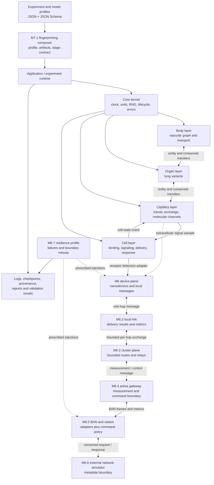
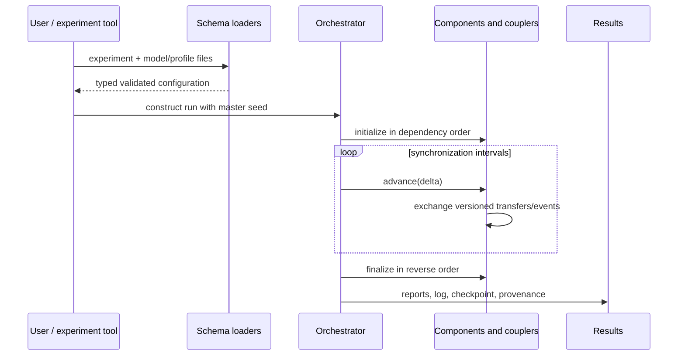

<!--
SPDX-FileCopyrightText: 2026 MEHLISSA contributors
SPDX-License-Identifier: CC-BY-4.0
-->

# MEHLISSA Next Software Architecture and Developer Guide

## 1. Purpose and status

This document is the entry point for developers who want to understand,
integrate, or extend MEHLISSA Next. It describes the implemented architecture
through the accepted M6 gate and the implemented M7.1 composition contract, the public C++
and command-line interfaces, the data contracts, and the workflow for adding a
module such as a new organ model. It also explains
which forms of personalization are possible today and which remain roadmap
work.

MEHLISSA is a research simulation platform for studying how entities,
substances, molecular signals, nanodevices, and cellular responses interact
across several biological scales. It is not a clinical simulator or medical
device. A technically executable model is not automatically physiologically or
clinically valid; every model card defines its own evidence and validity scope.

The active implementation is the independently developed C++20 code in
`core/`, `experiment/`, `models/`, `scenarios/`, `apps/`, and `benchmarks/`. The directories
`mehlissa/` and `mehlissa2.0/` contain historical implementations and are
references, not parts of the default Next build.

## 2. Architectural overview

MEHLISSA separates a neutral runtime kernel from four biological model layers.
Layers exchange versioned messages through explicit couplers instead of
modifying one another's internal state.



The solid biological paths are implemented as typed C++ APIs through M5. M6.1
adds the independent device and local-message foundation. M6.2 adds the solid
cell-detection adapter and replaceable local-link path with explicit outcomes
and communication metrics. M6.3 composes those links into a solid bounded
cluster/relay path. M6.4 adds the solid active-gateway boundary. M6.5 closes the
solid BAN/station round trip with explicit command governance and a local
actuator delivery. M6.6 adds the solid, metadata-only request/response boundary
through which an optional external network simulator can supply BAN outcomes
and communication costs. The dotted path from capillary tissue to a dedicated
detector remains future composition. M6.7 exercises transport failures and
boundary misuse against the solid M6 components and closes Gate M6. M7.1 now
adds a separate scenario-owned composer that schema-validates one selected
artifact for every M2-M6 role, checks FP9/lung/timer identity, and fixes the
complete causal stage order. It returns a typed plan; only the historical timer
is executed at this increment. The general CLI and M7.1 composer do not yet
advance all parts together in one run.

### 2.1 Governing principles

1. **Layer independence.** Body, organ, capillary, and cell models are separate
   libraries with explicit boundaries.
2. **Replaceable resolution.** A layer may provide coarse, detailed,
   deterministic, stochastic, single-entity, or population variants behind a
   stable contract.
3. **Explicit ownership.** An entity or conserved quantity has one owner at a
   time. Couplers check identities, ports, time ordering, and balances.
4. **Dimension-safe internals.** Public numerical APIs use typed SI quantities;
   raw JSON values name their units at the system boundary.
5. **Reproducibility.** Each run owns its clock, master seed, named random
   streams, provenance, log, and checkpoint metadata.
6. **Strict inputs.** Versioned JSON Schemas reject unknown properties and
   semantically invalid combinations.
7. **Evidence before claims.** Verification, calibration, validation,
   historical regression, and sensitivity analysis remain distinct.
8. **Bounded output.** Large populations use aggregates or cohort compression;
   detailed traces have explicit retention limits.

The binding decisions are recorded in the
[Architecture Decision Records](README.md).

## 3. Repository and build structure

| Path | Responsibility | Primary CMake target |
|---|---|---|
| `core/` | lifecycle, clock, typed quantities, geometry, random streams, stable errors | `MEHLISSA::core` |
| `experiment/` | experiment manifests, provenance, JSONL logs, checkpoints, reference workflows | `MEHLISSA::experiment` |
| `models/body/` | vascular graphs, whole-body transport, observations, body-state overlays | `MEHLISSA::body_model` |
| `models/coupling/` | cross-layer entities, conserved quantities, signals, events, base model interface | `MEHLISSA::model_coupling` |
| `models/organ/` | replaceable lung models and pulmonary validation utilities | `MEHLISSA::organ_model` |
| `models/capillary/` | capillary bed, exchange, recruitment, entity disposition, molecular channels | `MEHLISSA::capillary_model` |
| `models/cell/` | receptor binding, intracellular networks, delivery, apoptosis, populations | `MEHLISSA::cell_model` |
| `models/iot/` | nanodevice capabilities, local/cluster communication, active gateway, BAN adapters, external station policy, and communication metrics | `MEHLISSA::iot_model` |
| `models/cosimulation/` | body–organ, organ–capillary, capillary–cell, feedback, and cell-detection adapters | `MEHLISSA::cosimulation`, `MEHLISSA::cell_cosimulation`, `MEHLISSA::iot_cosimulation` |
| `apps/` | `mehlissa` command-line executable | `mehlissa` |
| `benchmarks/` | reproducible benchmark and campaign drivers | benchmark-specific targets |
| `data/schemas/` | authoritative versioned JSON contracts | data, no target |
| `data/` | reviewed reference models, states, validation data, and reports | data, no target |
| `examples/` | runnable or developer-facing example profiles | data, no target |
| `tests/` | Catch2 unit, contract, integration, regression, and CLI tests | `mehlissa_tests` and CTest entries |
| `docs/` | model cards, architecture, evidence, roadmap, and user documentation | documentation |

The top-level CMake options can exclude layers. Dependencies are deliberately
one-directional: model libraries depend on the kernel and contracts; the kernel
does not depend on medical models. The cell library currently depends directly
on the kernel because its evaluation APIs are not lifecycle components. The
capillary and organ libraries implement the common coupling interface.

Use namespaced CMake aliases when linking from new code, for example:

```cmake
target_link_libraries(my_target PRIVATE MEHLISSA::organ_model MEHLISSA::cosimulation)
```

Build instructions and quality presets are in
[Developing MEHLISSA Next](../DEVELOPMENT.md).

## 4. Runtime kernel

### 4.1 Lifecycle API

`mehlissa::core::SimulationComponent` defines the neutral runtime lifecycle:

```cpp
class SimulationComponent {
  public:
    virtual std::string_view name() const noexcept = 0;
    virtual void initialize(SimulationContext&) = 0;
    virtual void advance(SimulationContext&, SimulationClock::Duration delta) = 0;
    virtual void finalize(SimulationContext&) noexcept = 0;
};
```

`ComponentHost` exclusively owns components through `std::unique_ptr`. It
initializes them in registration order, advances all components over the same
interval, and finalizes them in reverse order. The shared clock is committed
only after every component has advanced successfully.

Current limitation: `ComponentHost` is a lifecycle host, not yet the complete
multi-rate/event orchestrator required for the end-to-end M7 scenario.

### 4.2 Time, units, randomness, and errors

- `SimulationClock` stores monotonic integer nanoseconds and rejects invalid or
  overflowing advances.
- `quantity.hpp` provides `Length`, `Area`, `Volume`, `Time`, `FlowRate`,
  `Pressure`, `Concentration`, `Amount`, resistance, compliance, and conversion
  helpers such as `liters_per_minute` and `millimeters_of_mercury`.
- `SimulationContext` owns the master seed and persistent random streams.
  Calling `random_stream("stable.name")` gives a deterministic stream derived
  from the seed and the name. New stochastic modules must use stable names and
  must not use global random state.
- `MehlissaError` carries a stable `MEHLISSA-Edddd` identifier. Extend
  `ErrorCode` for a genuinely new failure meaning; do not silently reuse an
  existing code.

## 5. Model layers

### 5.1 Body layer

The body layer represents systemic transport as a validated vascular graph.
`VascularGraph` contains typed geometry, hemodynamics, probabilistic
transitions, evidence quality, uncertainty, provenance, population, and
physiological-state metadata.

Main APIs:

- `load_vascular_graph(request)` and `validate_vascular_graph(graph)` load and
  check a graph against `vascular-graph/1.0.0` plus semantic invariants;
- `write_vascular_graph(graph, path)` serializes a derived graph;
- `CompartmentTransport` advances individual entities and exposes bounded
  trajectories, measurements, population snapshots, and extraction results;
- `load_body_state_profile` and `apply_body_state_profile` apply a compatible,
  topology-preserving physiological-state overlay;
- BVS reference and legacy migration APIs reproduce and qualify the historical
  95-segment data independently from the kernel.

### 5.2 Organ layer

The organ layer currently uses the lung as its reference organ. All runtime
variants are created through:

```cpp
std::unique_ptr<coupling::ModelComponent> make_lung_model(LungModelConfig config);
```

Available variants are:

- `LungCompartment`: one effective transit compartment;
- `PulmonaryCirculation`: serial pulmonary regions;
- `PulmonaryZeroDimensionalModel`: mean pressure, flow, resistance, compliance,
  age, and optional flow or pressure-distensibility behavior;
- `PulmonaryParallelBedsModel`: parallel lobar beds while preserving aggregate
  hemodynamics.

`load_lung_model_definition` converts a schema-validated model card into a
typed definition containing configuration, evidence, validity, sources,
uncertainty, derivations, and limitations. `make_lung_model` is the single
composition boundary and rejects incompatible variant fields.

### 5.3 Capillary layer

`CapillaryBed` is both a `ModelComponent` and a source of non-consuming
extracellular signal observations. Its optional profiles cover:

- dynamic recruitment and precapillary sphincter groups;
- balanced substance exchange and tissue inventories;
- bounded entity-residence and interaction observations; and
- terminal entity dispositions with explicit ownership transfer.

`MolecularChannel` is the replaceable calculation boundary for signal
propagation:

```cpp
class MolecularChannel {
  public:
    virtual std::string_view kind() const noexcept = 0;
    virtual std::string_view model_id() const noexcept = 0;
    virtual MolecularChannelResponse evaluate(const MolecularChannelRequest&) const = 0;
};
```

Implemented channel families include analytical diffusion, deterministic
Brownian endpoint comparisons, trajectory-resolving Brownian motion, and a
conservative radial finite-volume field. They share typed requests and
responses so callers do not depend on one numerical method.

### 5.4 Cell layer

The cell layer currently consists mainly of request/response models rather
than `SimulationComponent` instances. It provides:

- exact analytical reversible receptor–ligand binding;
- bounded time-varying ODE binding;
- exact stochastic finite-receptor binding and population statistics;
- a shared intracellular ODE/SSA reaction network;
- conservative drug release and uptake;
- synthetic irreversible apoptosis commitment; and
- cohort-compressed apoptosis populations.

`ReceptorLigandModel` is the principal polymorphic cell boundary. The
capillary–cell adapter supplies a typed extracellular concentration and obtains
a `ReceptorLigandResponse`. Later stages consume explicit response or event
objects rather than reaching into model state.

The apoptosis equations are synthetic software-contract models. Their
parameters are configurable, but they are not yet biological or patient
calibrations.

### 5.5 Nano-IoT communication plane

M6.1 introduces an independent device and message library above the biological
layers. `Nanodevice` has a freely named type, target, composable capabilities,
payload inventory, dimension-safe energy, bounded message resources, and a
checked dormant/active/depleted/failed lifecycle. `LocalMessage` preserves
message, device, correlation, source-event, timing, hop, size, and content
identity.

M6.2 adds a neutral `MolecularDetectionEvent`, a detection-message adapter, the
replaceable `OneHopLinkModel`, and `OneHopCommunicationSession`. The scheduled
reference implementation explicitly distinguishes delivery, prescribed loss,
corruption, and validity expiry. `CommunicationMetrics` keeps message/byte
counts, delivered latency, and transmitter/receiver/link energy separate from
biological results.

M6.3 adds `NanodeviceCluster`, two deterministic `ClusterRouteStrategy`
variants, and `BoundedMultiHopSession`. A strict directed topology binds each
edge to an M6.2 link. Route selection is loop-free and bounded by both cluster
and message hop limits. Immediate store-and-forward relays preserve payload,
correlation, source-event identity, and absolute expiry while exposing unique
per-hop messages and aggregate metrics.

M6.4 adds `ActiveGateway`, versioned `GatewayMeasurement` and
`GatewayCommand` contracts, and a strict gateway profile. The gateway owns a
normal M6.1 endpoint for local reception and transmission. It publishes one
accepted buffered local message to an implementation-neutral upper boundary
and maps one validated command back to a traceable local `control` request.
M6.3 supplies the routed transport on both sides of this boundary.

M6.5 adds versioned `BanFrame` and `GovernedGatewayCommand` contracts,
`GatewayBanAdapter`, `ExternalAnalysisControlStation`, the replaceable
`BanTransportAdapter`, and `BanCommunicationSession`. The station stores
received measurements and returns normal typed allow/deny decisions based on
configured gateway, causal time order, target, content type, exact correlation,
uniqueness, and capacity. The gateway adapter accepts a returned command only
when its station, gateway, decision, validity, source measurement, and
correlation match the previous uplink. The scheduled transport reference
reports BAN outcomes and costs independently from the local cluster.

M6.6 adds `ExternalNetworkSimulatorAdapter`, a typed
`NetworkSimulatorClient`, and `JsonNetworkSimulatorClient`. The adapter exports
only frame identity, direction, endpoints, causal trace identifiers, time,
deadline, and byte count. It validates a versioned simulator response and maps
delivery, loss, corruption, completion time, and transmitter/receiver/link
energy into the unchanged `BanTransferResult`. The JSON exchange is deliberately
narrow so an in-process library, child process, or remote service can be
attached without introducing simulator types into MEHLISSA.

M6.7 adds the typed `ResilienceScenarioProfile` and a strict twelve-case
catalog. Prescribed loss, corruption, and expiry remain communication results
and metrics. Misrouted, disallowed, replayed, identity-mismatched, or excess
input is rejected at the owning production boundary before protected
downstream state changes. The profile records its threat model and explicitly
excludes authentication, cryptography, adaptive-attacker resistance, clinical
authorization, and medical-device safety claims.

`MEHLISSA::iot_cosimulation` alone maps an M5 `ReceptorLigandResponse` to the
neutral event. Body, organ, capillary, and cell libraries do not depend on the
IoT library. Scheduled links and declared topology have no anatomical
placement, physical channel, range, throughput capacity, queue,
retransmission, or calibrated protocol behavior. The checked M6.6 exchange
uses a synthetic fixture and does not itself implement a radio, protocol, or
network model. M6.5 policy is a simulation
transport allow-list and causal check; it is not authentication, cryptographic
authorization, clinical policy, or an actuation effect.

## 6. Cross-layer APIs and ownership

`mehlissa::models::coupling::ModelComponent` extends the core lifecycle with a
stable `model_id`, named ports, and transfer queues:

- `EntityTransfer` moves one uniquely identified entity;
- `PopulationTransfer` moves an integer population;
- `SubstanceAmountTransfer` moves a dimension-safe molar amount;
- `VolumeFlowTransfer` moves a flow over a defined interval;
- `ConservationLedger` verifies that sent and received conserved transfers
  balance exactly;
- `ExtracellularSignalSample` carries a non-consuming amount/volume snapshot
  from capillary tissue to a cell model;
- `CellStateEvent` carries an observable cell response to a higher layer; and
- entity dispositions represent an explicit final or retryable owner.

All contract objects contain stable identities, source and target locations,
and simulation timestamps. Their version constants currently use `1.0.0`.

The implemented couplers are:

| Coupler | Responsibility |
|---|---|
| `BodyOrganCoupler` | removes an entity from body transport, sends it through an organ, and returns it without duplication |
| `OrganCapillaryCoupler` | performs bidirectional entity and conserved-quantity transfers and terminal disposition hand-off |
| `CapillaryCellSignalCoupler` | converts a non-consuming capillary inventory sample into a receptor–ligand request |
| `make_cell_state_feedback_event` | converts committed apoptosis into a neutral higher-layer event |

Couplers coordinate synchronization; they do not perform hidden unit
conversion, biological calibration, or direct mutation of another component.

## 7. Configuration and data contracts

MEHLISSA uses two related APIs at every configurable boundary:

1. a strict, versioned JSON Schema under `data/schemas/<contract>/<version>`;
2. a typed C++ load request and result in the owning model library.

The loader first validates structure and then checks semantic rules that JSON
Schema cannot express conveniently, such as conservation, uniqueness,
cross-field compatibility, supported time ranges, and evidence references.

New schema versions are additive when practical. An old version remains
immutable; changing its meaning in place would make archived experiments
irreproducible. A model or data file must have stable identity, version,
validity, sources, limitations, and a matching `.license` sidecar when required
by [Data Licensing](../DATA_LICENSING.md).

### 7.1 Experiment manifest versus model profiles

The generic experiment manifest currently selects duration, master seed, model-name
strings, and output directory. The CLI `run` command creates provenance, a
checkpoint manifest, and a JSONL run log. It does **not** yet resolve the model
strings, instantiate the four layers, or wire their couplers. Current
multilayer scenarios are therefore executable developer APIs and dedicated
reference/benchmark drivers, not one declarative general run. M7.1 adds a
separate strict fingerprinting scenario profile and `LevelAPlan`: it resolves
and validates all selected artifacts plus the timer target/cohort, but it does
not yet instantiate and advance the non-timer components. This explicit
selection/execution boundary is the input to M7.2.

This distinction is important for both extension and personalization: new
models should use the existing loaders, factories, and coupling contracts so
that M7 can compose them without introducing a second architecture.

## 8. Public API map

Public headers live below each library's `include/mehlissa/` tree. The table
below identifies the stable developer-facing entry points; specialized model
headers add typed configurations, states, and verification functions.

| Namespace | Representative public headers | Main API and use |
|---|---|---|
| `mehlissa::core` | `core/include/mehlissa/core/*.hpp` | `ComponentHost`, `SimulationComponent`, `SimulationContext`, `SimulationClock`, quantities, and `MehlissaError`; runtime foundation |
| `mehlissa::experiment` | `experiment/include/mehlissa/experiment/*.hpp` | experiment loader, checkpoint, provenance, run-log, and fingerprint timer APIs; reproducible run I/O |
| `mehlissa::models::body` | `models/body/include/mehlissa/models/body/*.hpp` | vascular graph loader/writer, `CompartmentTransport`, body-state profile, and reports; whole-body transport |
| `mehlissa::models::coupling` | `models/coupling/include/mehlissa/models/coupling/*.hpp` | `ModelComponent`, transfer contracts, ledgers, signals, events, and dispositions; layer-neutral exchange |
| `mehlissa::models::organ` | `models/organ/include/mehlissa/models/organ/*.hpp` | lung definition loader, `make_lung_model`, pulmonary variants, and state; organ simulation |
| `mehlissa::models::capillary` | `models/capillary/include/mehlissa/models/capillary/*.hpp` | capillary definition/profile loaders, `CapillaryBed`, and `MolecularChannel` variants; microvascular and molecular transport |
| `mehlissa::models::cell` | `models/cell/include/mehlissa/models/cell/*.hpp` | profile loaders, binding models, intracellular network, delivery, and apoptosis; cellular response |
| `mehlissa::models::iot` | `models/iot/include/mehlissa/models/iot/*.hpp` | nanodevice runtime, detection/message translation, local and multihop transport, active gateway, replaceable BAN and external-simulator adapters, station policy, strict resilience-scenario profile, outcomes, and communication metrics |
| `mehlissa::models::cosimulation` | `models/cosimulation/include/mehlissa/models/cosimulation/*.hpp` | explicit body/organ/capillary/cell/IoT adapters; synchronization and dependency-safe routing |
| `mehlissa::scenarios::fingerprinting` | `scenarios/fingerprinting/include/mehlissa/scenarios/fingerprinting/*.hpp` | M7 scenario profile, artifact/stage roles, safe resolution, all-artifact schema validation, and typed Level-A composition plan |

These are in-process C++ APIs. There is no stable C ABI, REST API, plugin ABI,
or Python API yet. The roadmap reserves a Python experiment/analysis API for a
later phase. Until a public release policy says otherwise, semantic changes to
headers still require tests, schema review where applicable, and an ADR if they
alter an architectural contract.

### 8.1 Command-line API

The current executable supports:

| Command | Purpose |
|---|---|
| `mehlissa validate` | validate an experiment manifest |
| `mehlissa run` | exercise the M1 reproducible runtime envelope |
| `mehlissa validate-body` | load and validate a vascular graph |
| `mehlissa migrate-legacy-95` | reproducibly convert approved historical BVS95 inputs |
| `mehlissa reference-bvs` | execute the M2 BVS reference regression |
| `mehlissa apply-body-state` | derive a vascular graph from a compatible body-state profile |

Detailed commands are maintained in the [User Guide](../USER_GUIDE.md).

## 9. How to add a module

### 9.1 Decide what is being added

Before writing code, define:

- layer and scientific question;
- state variables, inputs, outputs, units, and synchronization behavior;
- coarse or detailed resolution and expected population scale;
- deterministic or stochastic semantics;
- ownership and conservation rules at every boundary;
- validity population and physiological state;
- evidence role for every parameter; and
- analytical, regression, or independent validation target.

If the work changes an existing boundary or establishes a lasting policy,
write the next ADR and update requirements, traceability, and roadmap together.

### 9.2 Implement the typed model

For a new independent calculation model:

1. add public typed configuration/request/response types under the layer's
   `include/mehlissa/models/<layer>/` directory;
2. put implementation in the matching `src/` directory;
3. use `core::Quantity` types at public numerical boundaries;
4. reject invalid identifiers, ranges, combinations, and non-finite values;
5. use a stable named `SimulationContext` random stream if stochastic; and
6. add the source to the layer's CMake target.

For a runtime layer component, derive from `coupling::ModelComponent`, implement
the lifecycle and transfer queues, and make accepted and emitted ports explicit.
Do not retain references to another layer or mutate it directly.

### 9.3 Add configuration

1. create a new versioned schema directory;
2. add a typed loader request and result;
3. validate JSON structure before semantic conversion;
4. keep units explicit at the JSON boundary and convert to typed SI values;
5. add one small synthetic example and, separately, evidence-qualified data;
6. preserve identity, version, source, uncertainty, validity, and limitations;
7. add the appropriate SPDX header and data sidecar; and
8. never change the meaning of an already released schema or reference card.

### 9.4 Add composition and tests

- Introduce or extend a factory when callers need interchangeable variants.
- Use an existing coupling contract; add a new versioned contract only when the
  exchanged meaning is genuinely new.
- Add a coupler for synchronization/routing logic instead of embedding it in a
  model.
- Test constructors/loaders, lifecycle, ports, time ordering, ownership,
  conservation, determinism, overflow, invalid inputs, and step-size behavior.
- Add an analytical or synthetic oracle before using physiological evidence.
- Add integration tests for the complete boundary round trip.
- Run formatting, Clang-Tidy, sanitizers, all CTest tests, and the three CI
  compiler families.
- Update the layer guide, model card, evidence qualification, User Guide when
  user-visible, roadmap gate, and traceability matrix.

### 9.5 Worked outline: adding a kidney model

A kidney implementation should follow the lung pattern without copying
pulmonary assumptions:

1. define `KidneyModelConfig` and suitable variants, for example an effective
   compartment first and a regional filtration model later;
2. name arterial entry, venous return, and any explicitly modeled urinary or
   tissue ports;
3. decide which inputs are entities, populations, substance amounts, or volume
   flows and define what is conserved or deliberately removed;
4. implement each runtime variant as `ModelComponent`;
5. provide one `make_kidney_model` factory returning
   `std::unique_ptr<ModelComponent>`;
6. create a strict kidney-model-definition schema and typed loader;
7. couple body to kidney with the generic body–organ contract and kidney to a
   detailed bed through the organ–capillary contract;
8. begin with a software-test surrogate and exact ownership/balance tests;
9. add physiological parameters only with a model card, sources, uncertainty,
   calibration/validation separation, and limitations; and
10. prove that the caller and coupler need no kidney-specific branch beyond
    choosing the factory and declared route.

### 9.6 Adding a BAN transport or external network-simulator integration

A wholly internal upper-network implementation can derive from
`BanTransportAdapter` and implement `kind`, `adapter_id`, and `transfer`. It
must:

1. accept only a validated `BanFrame` and preserve its identity and payload;
2. return one internally consistent `BanTransferResult` with explicit delivery
   or drop reason, timestamps, bytes, and nonnegative energy categories;
3. represent modeled loss, corruption, or expiry as a result rather than a
   software exception;
4. keep protocol configuration and external-library types behind the adapter;
5. avoid dependencies from core, physiology, cell, local-message, gateway, or
   station-policy code back to that implementation;
6. add conformance tests using `BanCommunicationSession`, including malformed
   result rejection and deterministic replay where the external engine allows
   it; and
7. add a new profile/schema only for configuration that is not already covered
   by the M6.5 contract.

Do not bypass `ExternalAnalysisControlStation` or `GatewayBanAdapter` for the
reference command path. Those objects own the visible policy and causal/replay
checks; the transport owns delivery behavior only.

For an external simulator, prefer the M6.6 boundary instead of creating a
second direct BAN adapter:

1. implement `NetworkSimulatorClient::simulate` for a typed in-process
   integration, or `NetworkSimulatorJsonExchange::exchange` for a process or
   service integration;
2. configure the stable simulator, version, and scenario identity with the
   strict external-adapter profile;
3. accept the versioned metadata-only request and return the versioned response
   without requiring or exposing measurement or command payload content;
4. echo all request, adapter, simulator, scenario, and frame identities exactly;
5. return modeled non-delivery as `lost`, `corrupted`, or `expired`, reserving
   exceptions for malformed or unavailable integrations; and
6. run the existing conformance tests plus deterministic replay and scientific
   validation appropriate to the chosen external model.

The request/response schemas and integration details are documented in
[External Network-Simulator Adapter](../m6/EXTERNAL_NETWORK_SIMULATOR_ADAPTER.md).
A concrete ns-3 or other engine remains a separately selected and validated
integration; M6.6 standardizes its MEHLISSA-facing boundary.

## 10. Personalization

### 10.1 What is possible now

MEHLISSA already supports **parameterized research profiles**, but not a
complete virtual person.

| Scope | Current capability | Access path |
|---|---|---|
| Whole-body anatomy/flow graph | load any schema-valid vascular graph without recompiling | `load_vascular_graph`; CLI `validate-body` |
| Physiological body state | scale cardiac output and optionally replace topology-preserving transition probabilities | body-state profile; CLI `apply-body-state` |
| Pulmonary physiology | configure flow, left-atrial pressure boundary, PVR, compliance, transit, right/left split, supported age band, distensibility, and parallel-bed shares | versioned lung model definition and C++ loader/factory |
| Capillary behavior | configure geometry, flow, recruited paths, exchange, observations, and disposition | capillary profiles and loaders |
| Molecular/cell behavior | configure diffusion/channel parameters, receptor kinetics, thresholds, reaction rates, delivery, and response parameters | model-specific profiles and C++ APIs |
| Reproducibility | fix duration, seed, input versions, checksums, log, and output location | experiment/provenance APIs |

Some existing values describe populations rather than a person. For example,
the age field in a pulmonary model selects a literature-derived age band; it
does not infer all age-dependent anatomy or physiology. Likewise, editing a
cell threshold creates a sensitivity scenario unless the value has been
calibrated and independently validated for the represented person.

### 10.2 A safe first personalization workflow

For non-sensitive research data, a developer can already create a transparent
person- or cohort-conditioned scenario as follows:

1. Choose the closest qualified base model and read its validity and
   limitations.
2. Create a new derived file; never overwrite the checked-in reference card.
3. Assign a new stable ID and version and state whether the values are measured,
   literature-derived, calibrated, assumed, or a sensitivity hypothesis.
4. Change only parameters supported by the current schema and model. Preserve
   explicit units, source links, derivations, uncertainty, and limitations.
5. Validate the file with its exact schema and typed loader.
6. Keep calibration observations separate from validation observations.
7. Run the baseline and personalized variant with the same seed where a paired
   comparison is intended.
8. Archive the input hashes, software revision, outputs, and interpretation
   limits through the provenance/report path.

For a body-state overlay, the executable path is already available:

```powershell
build/windows-msvc/apps/Debug/mehlissa.exe apply-body-state `
  --model data/body-models/bvs95-dissertation-rest-v1.json `
  --profile path/to/derived-body-state.json `
  --output results/personalized-body-model.json `
  --schema data/schemas/vascular-graph/1.0.0.schema.json `
  --profile-schema data/schemas/body-state-profile/1.0.0.schema.json
```

The output is a validated derived vascular graph. It is not yet automatically
consumed by the general multilayer `run` command.

For the lung, a developer can derive a model card from an appropriate file in
`data/lung-models/` and load it with `load_lung_model_definition`, then pass its
typed `model` to `make_lung_model`. The present CLI has no `validate-lung` or
general model-composition command, so this remains a C++ developer/test path.

### 10.3 What is not implemented yet

The following are planned for the M7/M8 path and must not be implied by current
profiles:

- one canonical patient manifest connecting anatomy, physiology, biochemistry,
  observations, uncertainty, and consent/provenance;
- automatic composition of a person-specific body, organs, capillaries, cells,
  nanodevices, and communication in `mehlissa run`;
- production import and verification of segmented patient anatomy or
  SimVascular/CFD outputs;
- parameter estimation, identifiability analysis, and separation of personal
  calibration from independent validation;
- disease-specific and sex-specific model families with validated ranges;
- longitudinal updates from vital signs, laboratory results, imaging, or
  wearables;
- quantitative propagation of input uncertainty through a complete run;
- privacy, consent, pseudonymization, retention, and access-control workflows;
  and
- clinical interpretation or treatment recommendations.

Do not commit identifiable patient data to this repository. Processing such
data requires the documented governance and data-protection work of Gate M8 in
addition to appropriate institutional approval.

## 11. Execution and output lifecycle

A mature declarative run is intended to follow this sequence:



Through M6, the individual lifecycle, exchange, and communication mechanisms
exist. M7.1 implements the schema-loader and initial composition portion of
this sequence for FP9: the complete candidate stack is selected and validated,
and the historical timer is run deterministically. The general component
initialization, synchronization loop, cross-layer event trace, and result
report remain incomplete. M7.2 begins that runtime coordination; later M7
increments replace timer-only stages with increasingly detailed models. M8
adds the canonical and governed personalization layer.

## 12. Developer definition of done

A module is ready for review only when:

- its public contract and units are explicit;
- invalid inputs and lifecycle misuse fail with stable errors;
- identity, time ordering, ownership, and conservation invariants pass;
- random behavior is seed- and stream-reproducible;
- output volume is bounded for the declared scale;
- schemas, loaders, examples, and sidecar licenses agree;
- software verification is separate from calibration and validation;
- validity, evidence, uncertainty, and limitations are documented;
- unit, integration, regression, and relevant numerical tests pass;
- all supported compiler and analysis CI jobs pass;
- requirements, traceability, roadmap, architecture/model documentation, and
  the User Guide have been reviewed for impact; and
- no clinical or patient-specific claim exceeds the supplied evidence.

## 13. Where to go next

- [Development environment and quality commands](../DEVELOPMENT.md)
- [User Guide](../USER_GUIDE.md)
- [Roadmap and milestone gates](../ROADMAP.md)
- [System requirements](../requirements/SYSTEM_REQUIREMENTS.md)
- [Traceability matrix](../requirements/TRACEABILITY_MATRIX.md)
- [Architecture decisions](README.md)
- [M5 technical gate review](../m5/M5_GATE_REVIEW.md)
