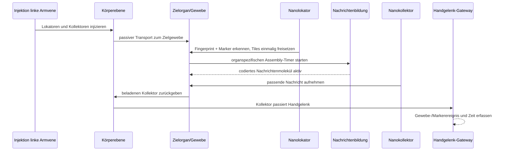

<!--
SPDX-FileCopyrightText: 2026 MEHLISSA contributors
SPDX-License-Identifier: CC-BY-4.0
-->

# Referenzszenario: Proteom-Fingerprinting

**Szenario-ID:** `FP-VERTICAL-001`  
**Status:** fachliche Baseline für den ersten vertikalen Demonstrator  
**Primärquellen:** Dissertation Kapitel 6, insbesondere S. 161–192; FP23  
**Zugehörige Anforderung:** `SCN-001`

## 1. Ziel und Forschungsfrage

Das Szenario untersucht, ob im Blutstrom transportierte Nanogeräte einen Krankheitsmarker einem Gewebe zuordnen und die codierte Detektion in sinnvoller Zeit an ein externes Gerät melden können.

Der erste Nachbau reproduziert bewusst die in der Dissertation verwendete Timerabstraktion. Spätere Modellstufen ersetzen einzelne Abstraktionen durch organspezifische Perfusion, Konzentrationen, Bindungsmodelle, DNA-Tile-Assembly und ein explizites Gateway. Abweichungen von der publizierten Baseline werden erklärt, nicht auf sie zurückskaliert.

## 2. Fachlicher Ablauf

Die fachliche Nachricht entsteht nur, wenn beide organspezifischen Fingerprint-Genprodukte **und** der zu lokalisierende Marker vorhanden sind. Das entspricht einer logischen UND-Verknüpfung. In der Baseline wird die Erkennung als gegeben angenommen; in späteren Stufen wird sie stochastisch aus Konzentration und Bindung abgeleitet.

## 3. Rollen und Zustände

### 3.1 Nanolokator

Ein Nanolokator besitzt:

- eine stabile Entitäts-ID;
- genau ein Zielgewebe beziehungsweise eine Zielorgan-Klasse;
- die Kennung des 2-Gen-Fingerprints;
- einen Marker- oder Regelbezug;
- eine einmalig freisetzbare Tile-Nutzlast;
- Zustände `loaded`, `released`, `expired`;
- Zeit und Ort der Freisetzung.

Beim ersten qualifizierenden Besuch des Zielgewebes setzt er seine Tiles einmalig frei. Ein späteres probabilistisches Modell darf auch erfolglose Besuche und falsch-negative Erkennung darstellen.

### 3.2 Nachrichtenmolekül

Eine aktive Nachricht besitzt:

- Zielgewebe/Fingerprint;
- Marker-ID;
- Freisetzungs- und Fertigstellungszeit;
- Assembly-Modell und Parameterprovenienz;
- Anzahl oder Konzentration verfügbarer Nachrichten;
- Verfallszeit beziehungsweise Stabilität, sobald Daten dafür vorliegen.

Die Baseline verwendet eine gewebespezifische feste Assembly-Dauer von ungefähr 11 bis 33 Sekunden. Detailmodelle können NetTAS-Ergebnisse oder stochastische Surrogate verwenden.

### 3.3 Nanokollektor

Ein Nanokollektor besitzt:

- eine stabile Entitäts-ID;
- genau ein Zielgewebe beziehungsweise eine Zielorgan-Klasse;
- Zustände `searching`, `carrying-message`, `reported`, `expired`;
- eine Sammlungskapazität;
- ein Mobilitätsmodell, in der historischen Baseline mit Verzögerungsfaktor 0,5;
- Zeit und Ort von Aufnahme und Meldung.

Er nimmt nur eine zum Ziel passende aktive Nachricht auf. Eine Meldung wird registriert, wenn ein beladener Kollektor den Messort am Handgelenk passiert.

## 4. Baseline-Gewebe

Die Dissertation bildet 18 untersuchte Fingerprint-Gewebe auf neun ohne Änderung direkt repräsentierte MEHLISSA-Regionen ab:

| Fingerprint | Gewebe | historischer Organindex | MEHLISSA-Region |
|---|---|---:|---|
| FP3 | Speiseröhre | 24 | Brust und Rücken |
| FP5 | Herz | 58 und 2 | Herz |
| FP6 | Darm | 39 | Darm |
| FP7 | Niere | 40 | Niere |
| FP8 | Leber | 36 | Leber |
| FP9 | Lunge | 61 | Lunge |
| FP12 | Hypophyse | 9 | Kopf |
| FP15 | Magen | 30 | Magen |
| FP18 | Harnblase | 51 und 47 | Becken/Genitalien |

Historische Indizes sind Migrationsinformationen, keine dauerhaft fest codierten IDs der neuen Architektur. Neue Datenmodelle verwenden stabile externe Kennungen und explizite Mappingtabellen.

## 5. Referenzkonfiguration

| Parameter | Baselinewert |
|---|---|
| Injektionsort | linke Armvene, historisch Gefäß 64 |
| Simulationsdauer | 3 Stunden |
| Nanolokatoren | 1.000, möglichst gleichmäßig auf neun Ziele verteilt |
| Nanokollektoren A | 1.000, möglichst gleichmäßig auf neun Ziele verteilt |
| Nanokollektoren B | 10.000, möglichst gleichmäßig auf neun Ziele verteilt |
| Transport | passiv im Blutstrom |
| Locator-Freisetzung | einmalig beim qualifizierenden Zielgewebebesuch |
| Assembly | fester gewebespezifischer Timer |
| Auslesen | Ereignis beim Passieren des Handgelenks; physischer Auslesevorgang in der Baseline ohne Zusatzlatenz |

Da 1.000 nicht durch neun teilbar ist, muss das Manifest die exakte Verteilung und die Regel für Restgeräte speichern. Die historische Beschreibung verwendet näherungsweise 111 Geräte pro Gewebe.

## 6. Publizierte Referenzwerte

| Region | erste Lokalisation (s) | Assembly (s) | Erfassung 1.000 NC (s) | Erfassung 10.000 NC (s) |
|---|---:|---:|---:|---:|
| Brust | 40 | 16,47 | 559 | 223 |
| Herz | 24 | 19,40 | 90 | 91 |
| Darm | 41 | 11,75 | 231 | 152 |
| Niere | 40 | 26,90 | 240 | 177 |
| Leber | 40 | 21,71 | 489 | 182 |
| Lunge | 25 | 15,99 | 209 | 91 |
| Kopf | 41 | 13,43 | 351 | 158 |
| Magen | 39 | 17,18 | 250 | 220 |
| Becken | 46 | 17,74 | 944 | 245 |

Diese Werte sind **Regressionserwartungen der historischen Modellabstraktion**, keine klinischen Zielwerte. Die Dissertation berichtet bei 10.000 Kollektoren Erfassungszeiten von ungefähr 1,5 bis gut 4 Minuten. Eine weitere Erhöhung auf 20.000 brachte nur geringe zusätzliche Verbesserung. Nach einer Stunde waren bis auf 34 Lokatoren alle entladen; nach fünf Stunden waren alle Fingerprints freigesetzt.

## 7. Messgrößen

Jeder Lauf muss mindestens ausgeben:

- Zeit bis zur ersten Ankunft eines passenden Lokators je Gewebe;
- Zeit und Anzahl der Tile-Freisetzungen;
- Zeit bis zur Fertigstellung aktiver Nachrichten;
- Zeit bis zur ersten Aufnahme durch einen Kollektor;
- End-to-End-Zeit von Injektion bis externer Meldung;
- Anteil entladener Lokatoren und meldender Kollektoren über der Zeit;
- Anzahl vollständiger Kreisläufe bis zum jeweiligen Ereignis;
- falsch-positive, falsch-negative und mehrdeutige Erkennungen, sobald die Baseline verlassen wird;
- Laufzeit, Speicher und Ausgabevolumen;
- Seeds, Modell-, Daten- und Parameterprovenienz.

Ergebnisse werden je Replikat und als Verteilung über Replikate berichtet. Median, Quantile und Konfidenzintervall sind einer einzelnen Mittelwertzahl vorzuziehen.

## 8. Akzeptanzstufen

### Stufe A – historische Timerbaseline

- neun Zielregionen sind datengetrieben konfiguriert;
- Locator- und Collector-Zustandsautomaten sind getestet;
- keine Gewebe- oder Gefäß-ID ist im Kern hart codiert;
- die Rangfolge und Größenordnung der Referenzzeiten ist reproduzierbar;
- numerische/statistische Toleranzen werden nach ersten Replikaten begründet festgelegt.

### Stufe B – organspezifische Erkennung

- Fingerprints bestehen standardmäßig aus zwei risikoreduzierten Genprodukten;
- Konzentration, Nachweisgrenze und Bindung bestimmen die Erkennungswahrscheinlichkeit;
- `risk = 0` des Auswahlalgorithmus und simulierte falsch-positive Rate werden getrennt ausgewiesen;
- Krankheitsmarker kann unabhängig vom Organfingerprint ein- oder ausgeschaltet werden.

### Stufe C – Nachrichtenbildung

- feste Timer können durch ein NetTAS-basiertes Surrogat oder Detailmodell ersetzt werden;
- Assembly-Dauer hängt nachvollziehbar von Tilezahl/Konzentration und Modellparametern ab;
- die historische Timerbaseline bleibt als Regression erhalten.

### Stufe D – Gateway und Nano-IoT

- Handgelenk-Gateway ist ein explizites Modell mit Reichweite, Kontaktzeit und Lesewahrscheinlichkeit;
- Auslese- und externe Kommunikationslatenz werden ergänzt;
- biologische und kommunikative Fehler werden getrennt gemessen.

### Stufe E – Robustheit und Evidenz

- Sensitivität gegenüber Gerätezahl, Injektionsort, Perfusion, Assembly, Verfall und Bindung;
- Vergleich von Ruhe- und Belastungszustand;
- Unsicherheitsfortpflanzung und Parameteridentifizierbarkeit;
- dokumentierte Wetlab-/Biologiedatenlücken und Gültigkeitsgrenzen.

## 9. Automatisierte Tests

Mindestens folgende Tests werden vor M7 erwartet:

1. Ein Lokator setzt seine Nutzlast höchstens einmal frei.
2. Ein Lokator reagiert nicht auf ein falsches Gewebe.
3. Eine Nachricht wird nicht vor Ende ihrer Assembly-Dauer aktiv.
4. Ohne Marker oder bei fehlendem Fingerprint-Teil entsteht keine vollständige Nachricht.
5. Ein Kollektor sammelt nur passende, aktive Nachrichten.
6. Ein unbeladener Kollektor erzeugt am Gateway keine positive Meldung.
7. Ereigniszeiten sind monoton und kausal geordnet.
8. Entitäten gehen bei Übergaben zwischen Ebenen nicht verloren und werden nicht dupliziert.
9. Gleiche Konfiguration und Seeds reproduzieren denselben Ereignisstrom.
10. Steigende Kollektorzahl verschlechtert die erwartete Erfassungszeit nicht systematisch; statistische Ausreißer werden über Replikate bewertet.

## 10. Offene Forschungsfragen

- Werden mRNA, Proteine oder beide als physisches Ziel detektiert?
- Wie stabil sind die ausgewählten 2-Gen-Fingerprints zwischen Personen, Alter, Geschlecht, Krankheit und Aktivität?
- Welche Bindungsaffinitäten, Nachweisgrenzen und Freisetzungswahrscheinlichkeiten sind realistisch?
- Wie lange bleiben Nachrichtenmoleküle im Gewebe verfügbar und wie werden sie abgebaut?
- Welche Größe, Geschwindigkeit, Lebensdauer und Immuninteraktion besitzen Lokatoren und Kollektoren?
- Wie realistisch ist ein gewebespezifisch vorkonfigurierter Kollektor gegenüber einem universellen Decoder?
- Welche Gateway-Reichweite und Kontaktzeit sind am Handgelenk erreichbar?
- Wie ändern detaillierte Organ-/Kapillarmodelle die bisher nur aus dem Ganzkörpergraphen resultierenden Zeiten?

Diese Fragen sind Teil des Forschungsprogramms und dürfen in Stufe A als explizit markierte Annahmen behandelt werden. Sie dürfen nicht als empirisch bestätigt dargestellt werden.
