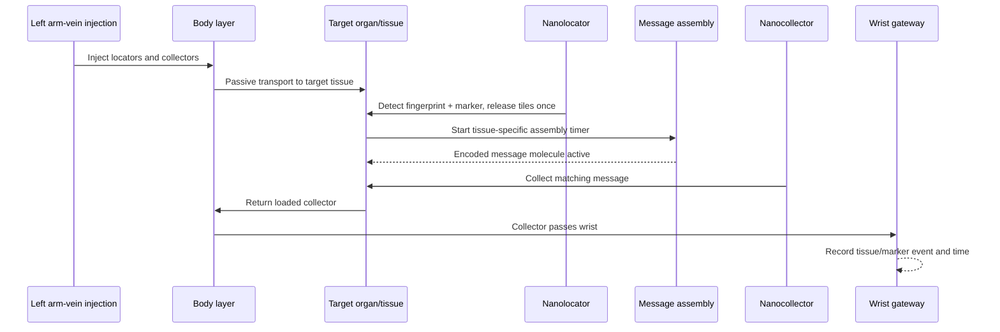

<!--
SPDX-FileCopyrightText: 2026 MEHLISSA contributors
SPDX-License-Identifier: CC-BY-4.0
-->

# Reference Scenario: Proteome Fingerprinting

**Scenario ID:** `FP-VERTICAL-001`

**Status:** domain baseline for the first vertical demonstrator

**Primary sources:** dissertation Chapter 6, especially pp. 161–192; FP23

**Associated requirement:** `SCN-001`

**Implementation status (1 September 2026):** M3.19 executes the historical
Level-A timer. M7.1 now selects and validates the complete M2–M6 candidate stack
and fixes the causal stage/identity contract in a separate scenario package;
it does not yet advance those components together. See
[the M7.1 composition contract](../m7/LEVEL_A_COMPOSITION_CONTRACT.md).

## 1. Purpose and research question

The scenario investigates whether nanodevices transported in the bloodstream
can assign a disease marker to a tissue and report the encoded detection to an
external device within a meaningful time.

The first reconstruction deliberately reproduces the timer abstraction used in
the dissertation. Later model levels replace individual abstractions with
organ-specific perfusion, concentrations, binding models, DNA-tile assembly,
and an explicit gateway. Deviations from the published baseline are explained,
not rescaled back to it.

## 2. Domain workflow

The domain message is created only when both tissue-specific fingerprint gene
products **and** the marker to be localized are present. This is a logical AND.
The baseline assumes successful detection; later levels derive it
stochastically from concentration and binding.

## 3. Roles and states

### 3.1 Nanolocator

A nanolocator has:

- a stable entity ID;
- exactly one target tissue or target-organ class;
- the identifier of the two-gene fingerprint;
- an association with a marker or rule;
- a tile payload that can be released once;
- states `loaded`, `released`, `expired`;
- release time and location.

On its first qualifying visit to the target tissue, it releases its tiles once.
A later probabilistic model may also represent unsuccessful visits and
false-negative detection.

### 3.2 Message molecule

An active message has:

- target tissue/fingerprint;
- marker ID;
- release and completion time;
- assembly model and parameter provenance;
- number or concentration of available messages;
- decay time or stability once data becomes available.

The baseline uses a tissue-specific fixed assembly duration of approximately
11 to 33 seconds. Detailed models can use NetTAS results or stochastic
surrogates.

### 3.3 Nanocollector

A nanocollector has:

- a stable entity ID;
- exactly one target tissue or target-organ class;
- states `searching`, `carrying-message`, `reported`, `expired`;
- a collection capacity;
- a mobility model, with retardation factor 0.5 in the historical baseline;
- time and location of collection and reporting.

It collects only an active message matching its target. A report is registered
when a loaded collector passes the measurement site at the wrist.

## 4. Baseline tissues

The dissertation maps 18 investigated fingerprint tissues to nine MEHLISSA
regions that are represented directly without modification:

| Fingerprint | Tissue | Historical organ index | MEHLISSA region |
|---|---|---:|---|
| FP3 | esophagus | 24 | chest and back |
| FP5 | heart | 58 and 2 | heart |
| FP6 | intestine | 39 | intestine |
| FP7 | kidney | 40 | kidney |
| FP8 | liver | 36 | liver |
| FP9 | lung | 61 | lung |
| FP12 | pituitary gland | 9 | head |
| FP15 | stomach | 30 | stomach |
| FP18 | urinary bladder | 51 and 47 | pelvis/genitals |

Historical indices are migration information, not permanently hard-coded IDs
in the new architecture. New data models use stable external identifiers and
explicit mapping tables.

## 5. Reference configuration

| Parameter | Baseline value |
|---|---|
| injection site | left arm vein, historically vessel 64 |
| simulation duration | 3 hours |
| nanolocators | 1,000, distributed as evenly as possible across nine targets |
| nanocollectors A | 1,000, distributed as evenly as possible across nine targets |
| nanocollectors B | 10,000, distributed as evenly as possible across nine targets |
| transport | passive in the bloodstream |
| locator release | once at a qualifying target-tissue visit |
| assembly | fixed tissue-specific timer |
| readout | event when passing the wrist; physical readout in the baseline has no additional latency |

Because 1,000 is not divisible by nine, the manifest must store the exact
distribution and rule for residual devices. The historical description uses
approximately 111 devices per tissue.

## 6. Published reference values

| Region | First localization (s) | Assembly (s) | Collection with 1,000 NC (s) | Collection with 10,000 NC (s) |
|---|---:|---:|---:|---:|
| chest | 40 | 16.47 | 559 | 223 |
| heart | 24 | 19.40 | 90 | 91 |
| intestine | 41 | 11.75 | 231 | 152 |
| kidney | 40 | 26.90 | 240 | 177 |
| liver | 40 | 21.71 | 489 | 182 |
| lung | 25 | 15.99 | 209 | 91 |
| head | 41 | 13.43 | 351 | 158 |
| stomach | 39 | 17.18 | 250 | 220 |
| pelvis | 46 | 17.74 | 944 | 245 |

These values are **regression expectations of the historical model
abstraction**, not clinical targets. For 10,000 collectors, the dissertation
reports collection times from about 1.5 to just over 4 minutes. Increasing the
number to 20,000 brought only minor additional improvement. After one hour, all
but 34 locators had unloaded; after five hours, all fingerprints had been
released.

## 7. Measures

Every run shall report at least:

- time to first arrival of a matching locator per tissue;
- time and count of tile releases;
- time to completion of active messages;
- time to first collection by a collector;
- end-to-end time from injection to external report;
- fraction of unloaded locators and reporting collectors over time;
- number of complete circulations before each event;
- false-positive, false-negative, and ambiguous detections once the baseline is extended;
- runtime, memory, and output volume;
- seeds, model, data, and parameter provenance.

Results are reported per replicate and as a distribution across replicates.
Median, quantiles, and a confidence interval are preferable to a single mean.

## 8. Acceptance levels

### Level A – historical timer baseline

- nine target regions are configured through data;
- locator and collector state machines are tested;
- no tissue or vessel ID is hard-coded in the kernel;
- rank order and magnitude of the reference times are reproducible;
- numerical/statistical tolerances are justified after initial replicates.

### Level B – organ-specific detection

- fingerprints consist of two risk-reduced gene products by default;
- concentration, detection limit, and binding determine detection probability;
- `risk = 0` from the selection algorithm and simulated false-positive rate are reported separately;
- the disease marker can be enabled or disabled independently of the organ fingerprint.

### Level C – message assembly

- fixed timers can be replaced with a NetTAS-based surrogate or detailed model;
- assembly duration depends traceably on tile count/concentration and model parameters;
- the historical timer baseline remains as a regression.

### Level D – gateway and nano-IoT

- the wrist gateway is an explicit model with range, contact time, and read probability;
- readout and external communication latency are added;
- biological and communication errors are measured separately.

### Level E – robustness and evidence

- sensitivity to device count, injection site, perfusion, assembly, decay, and binding;
- comparison of rest and exercise states;
- uncertainty propagation and parameter identifiability;
- documented wet-lab/biology data gaps and validity limitations.

## 9. Automated tests

At least the following tests are expected before M7:

1. A locator releases its payload at most once.
2. A locator does not react to the wrong tissue.
3. A message does not become active before its assembly duration has elapsed.
4. Without the marker or with one fingerprint component missing, no complete message is created.
5. A collector collects only matching, active messages.
6. An unloaded collector produces no positive report at the gateway.
7. Event times are monotonic and causally ordered.
8. Entities are neither lost nor duplicated during exchanges between layers.
9. Identical configuration and seeds reproduce the same event stream.
10. Increasing collector count does not systematically worsen expected collection time; statistical outliers are assessed across replicates.

## 10. Open research questions

- Are mRNA, proteins, or both detected as the physical target?
- How stable are the selected two-gene fingerprints across persons, age, sex, disease, and activity?
- Which binding affinities, detection limits, and release probabilities are realistic?
- How long do message molecules remain available in tissue and how are they degraded?
- What size, velocity, lifetime, and immune interaction do locators and collectors have?
- How realistic is a tissue-specific preconfigured collector compared with a universal decoder?
- What gateway range and contact time are achievable at the wrist?
- How do detailed organ/capillary models change times that currently result only from the whole-body graph?

These questions are part of the research program and may be treated as
explicitly labeled assumptions in Level A. They must not be presented as
empirically confirmed.
